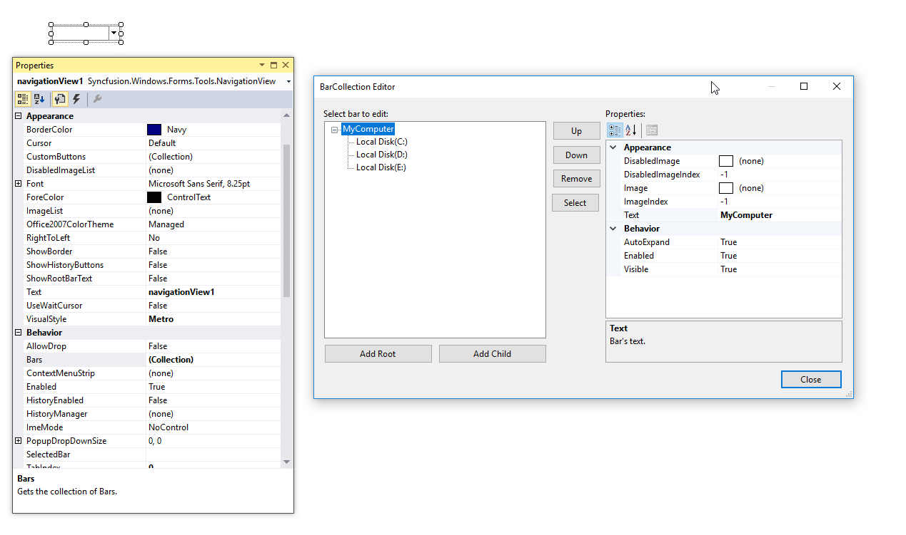

# Getting started

This section describes how to add `NavigationView` control in a Windows Forms application and overview of its basic functionalities.

## Assembly deployment

The following list of assemblies should be added as reference to use the NavigationView in any application:

<table>
<tr>
<td>
{{'**Required assemblies**'| markdownify }}
</td>
<td>
{{'**Description**'| markdownify }}
</td>
</tr>
<tr>
<td>
Syncfusion.Grid.Base.dll
</td>
<td>
Syncfusion.Grid.Base contains classes that contains fundamentals and base classes of GridControl.
</td>
</tr>
<tr>
<td>
Syncfusion.Grid.Windows.dll
</td>
<td>
Syncfusion.Grid.Windows contains classes that handles all UI operations, fundamentals and base classes of GridControl which are used in the NavigationView control.
</td>
</tr>
<tr>
<td>
Syncfusion.Shared.Base.dll
</td>
<td>
Syncfusion.Shared.Base contains style related properties of NavigationView and various editor controls.
</td>
</tr>
<tr>
<td>
Syncfusion.Shared.Windows.dll
</td>
<td>
Syncfusion.Shared.Windows contains style related properties of NavigationView and various editor controls.
</td>
</tr>
<tr>
<td>
Syncfusion.Tools.Base.dll
</td>
<td>
Syncfusion.Tools.Base contains base class which used for NavigationView control.
</td>
</tr>
<tr>
<td>
Syncfusion.Tools.Windows.dll
</td>
<td>
Syncfusion.Tools.Windows contains the class that handles all UI operations and contains helper class of NavigationView control.
</td>
</tr>
</table>

## Installing NuGet Packages

To use NavigationView control in Windows Forms application via nuget, the following packages should be installed.
 
<table>
<tr>
<td>{{'**S.No**'| markdownify }}
</td>
<td>{{'**Framework version**'| markdownify }}
</td>
<td>{{'**NuGet Packages**'| markdownify }}
</td>
</tr>
<tr>
<td> 1
</td>
<td> 2.0
</td>
<td> Syncfusion.Tools.Windows20
</td>
</tr>
<tr>
<td> 2
</td>
<td> 3.5
</td>
<td> Syncfusion.Tools.Windows35
</td>
</tr>
<tr>
<td> 3
</td>
<td> 4.0
</td>
<td> Syncfusion.Tools.Windows40
</td>
</tr>
<tr>
<td> 4
</td>
<td> 4.5
</td>
<td> Syncfusion.Tools.Windows45
</td>
</tr>
<tr>
<td> 5
</td>
<td> 4.5.1
</td>
<td>Syncfusion.Tools.Windows451
</td>
</tr>
<tr>
<td> 6
</td>
<td> 4.6
</td>
<td>Syncfusion.Tools.Windows46
</td>
</tr>
</table>
 
Please find more details regarding how to install the nuget packages in windows form application in the below link:
 
[How to install nuget packages](https://help.syncfusion.com/windowsforms/nuget-packages)

# Creating simple application with NavigationView

You can create the Windows Forms application with NavigationView control as follows:

1. [Creating project](#creating-the-project)
2. [Adding control via Form Designer](#adding-control-via-Form-designer)
3. [Adding control manually using code](#adding-control-manually-using-code)

### Creating the project

Create a new Windows Forms project in the Visual Studio to display the NavigationView with functionalities.

## Adding control via Form designer

The NavigationView control can be added to the application by dragging it from the toolbox and dropping it in a designer view. The following required assembly references will be added automatically:

* Syncfusion.Grid.Base.dll
* Syncfusion.Grid.Windows.dll
* Syncfusion.Shared.Base.dll
* Syncfusion.Shared.Windows.dll
* Syncfusion.Tools.Base.dll
* Syncfusion.Tools.Windows.dll

**Adding Bars into NavigationView**

Add Bars into NavigationView using `Bars` collection property in PropertyGrid window of NaviagtionView.

## Adding control manually using code

To add control manually in C#, follow the given steps:

**Step 1** - Add the following required assembly references to the project:

* Syncfusion.Grid.Base.dll
* Syncfusion.Grid.Windows.dll
* Syncfusion.Shared.Base.dll
* Syncfusion.Shared.Windows.dll
* Syncfusion.Tools.Base.dll
* Syncfusion.Tools.Windows.dll

**Step 2** - Include the namespaces **Syncfusion.Tools.Windows**.





using Syncfusion.Tools.Windows;





Imports Syncfusion.Tools.Windows



 

**Step 3** - Create `NaviagtionView` control instance and add it to the form.





NaviagtionView navigationView1 = new NaviagtionView();

this.navigationView1.VisualStyle = Syncfusion.Windows.Forms.Tools.Navigation.VisualStyles.Metro;

this.Controls.Add(naviagtionView1);





Dim navigationView1 As NaviagtionView = New NaviagtionView()

Me.navigationView1.VisualStyle = Syncfusion.Windows.Forms.Tools.Navigation.VisualStyles.Metro

Me.Controls.Add(navigationView1)





**Adding Bars into NavigationView**

To add root Bar, create a new instance for Bar and add it to `Bars` collection property in NavigationView class. To add child Bar, create an instance and add it to `Bars` collection property in its root Bar.





Bar bar1 = new Bar();
Bar bar2 = new Bar();
Bar bar3 = new Bar();
Bar bar4 = new Bar();

bar1.Text = "MyComputer"
bar2.Text = "Local Disk(C:)"
bar3.Text = "Local Disk(D:)"
bar4.Text = "Local Disk(E:)"

// Adding root Bars

this.navigationView1.Bars.AddRange(new Bar[] { bar1 });

// Adding child Bars

bar1.Bars.AddRange(new Bar[] {bar2, bar3, bar4});

// Set selected Bar

this.navigationView1.SelectedBar = bar1;





Dim bar1 As Bar = New Bar()
Dim bar2 As Bar = New Bar()
Dim bar3 As Bar = New Bar()
Dim bar4 As Bar = New Bar()

bar1.Text = "MyComputer"
bar2.Text = "Local Disk(C:)"
bar3.Text = "Local Disk(D:)"
bar4.Text = "Local Disk(E:)"

' Adding root Bars

Me.navigationView1.Bars.AddRange(New Bar[] { bar1 })

' Adding child Bars

bar1.Bars.AddRange(New Bar[] {bar2, bar3, bar4})

' Set selected Bar 

Me.navigationView1.SelectedBar = bar1





