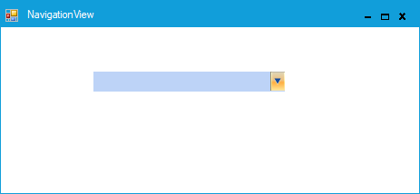
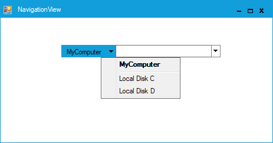

# Getting started

## Through designer

Syncfusion UI for Windows Forms are added automatically to the Visual Studio Toolbox during installation. The following steps helps to add required Essential Windows Forms control through drag and drop from Toolbox.

* Create a Windows Forms project in Visual Studio.

* Find NavigationView by typing the name of the NavigationView in the search box.

* Drag-and-drop a `NavigationView` control from the VS.NET toolbox onto the form. This will create an instance of the NavigationView control on the form.

* 	The NavigationView is populated with the collection of BarCollection Editor using the `Bars` property in the property window.

## Through code-behind

Syncfusion UI for Windows Forms can added at runtime using C#/VB. The following steps helps to add required Essential Windows Forms control through code.

* Create a Windows Forms project in Visual Studio and refer to the following assemblies.
	* Syncfusion.Tools.Base.dll
	* Syncfusion.Tools.Windows.dll
	* Syncfusion.Shared.Base.dll
	* Syncfusion.Shared.Windows.dll
	* Syncfusion.Grid.Base
	* Syncfusion.Grid.Windows.dll

* Create an instance of the NavigationView control and add it to the Form.





//Creates NavigationDrawer instance

this.navigationView1 = new Syncfusion.Windows.Forms.Tools.NavigationView();





‘Creates NavigationDrawer instance

Me.navigationView1 = New Syncfusion.Windows.Forms.Tools.NavigationView()





1. Add DrawMenuItem to the NavigationDrawer control using the following code example.





Syncfusion.Windows.Forms.Tools.Navigation.Bar bar1 = new Syncfusion.Windows.Forms.Tools.Navigation.Bar();

Syncfusion.Windows.Forms.Tools.Navigation.Bar bar2 = new Syncfusion.Windows.Forms.Tools.Navigation.Bar();

Syncfusion.Windows.Forms.Tools.Navigation.Bar bar3 = new Syncfusion.Windows.Forms.Tools.Navigation.Bar();

// 
// navigationView1
// 
bar2.Text = "Local Disk C";
bar3.Text = "Local Disk D";
bar1.Bars.AddRange(new Syncfusion.Windows.Forms.Tools.Navigation.Bar[] {
            bar2,
            bar3});
            bar1.Text = "MyComputer";
this.navigationView1.Bars.AddRange(new Syncfusion.Windows.Forms.Tools.Navigation.Bar[] {
            bar1
});
            
this.navigationView1.BeforeTouchSize = new System.Drawing.Size(270, 22);
           
this.navigationView1.Location = new System.Drawing.Point(98, 46);
            
this.navigationView1.Name = "navigationView1";
            
this.navigationView1.SelectedBar = bar1;
            
this.navigationView1.Size = new System.Drawing.Size(270, 22);
            
this.navigationView1.TabIndex = 0;
            
this.navigationView1.Text = "navigationView1";

// Set the NavigationView Visual Style 
            
this.navigationView1.VisualStyle = Syncfusion.Windows.Forms.Tools.Navigation.VisualStyles.Metro;

this.Controls.Add(this.navigationView1);





Dim bar1 As New Syncfusion.Windows.Forms.Tools.Navigation.Bar()

Dim bar2 As New Syncfusion.Windows.Forms.Tools.Navigation.Bar()

Dim bar3 As New Syncfusion.Windows.Forms.Tools.Navigation.Bar()

' 
' navigationView1
' 
bar2.Text = "Local Disk C"
bar3.Text = "Local Disk D"
bar1.Bars.AddRange(New Syncfusion.Windows.Forms.Tools.Navigation.Bar() { bar2, bar3})
			
bar1.Text = "MyComputer"

Me.navigationView1.Bars.AddRange(New Syncfusion.Windows.Forms.Tools.Navigation.Bar() { bar1 })

Me.navigationView1.BeforeTouchSize = New System.Drawing. Size (270, 22)

Me.navigationView1.Location = New System.Drawing. Point (98, 46)

Me.navigationView1.Name = "navigationView1"

Me.navigationView1.SelectedBar = bar1

Me.navigationView1.Size = New System.Drawing. Size (270, 22)

Me.navigationView1.TabIndex = 0

Me.navigationView1.Text = "navigationView1"

' Set the NavigationView Visual Style 

Me.navigationView1.VisualStyle = Syncfusion.Windows.Forms.Tools.Navigation. VisualStyles.Metro

Me.Controls.Add(Me.navigationView1)





