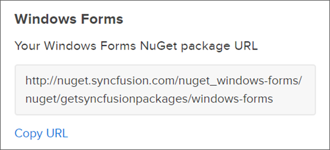
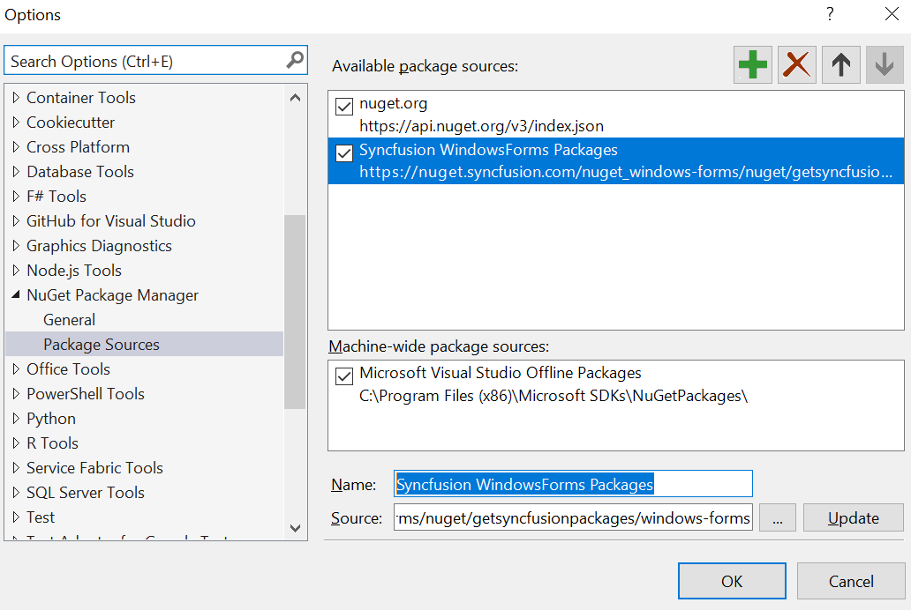
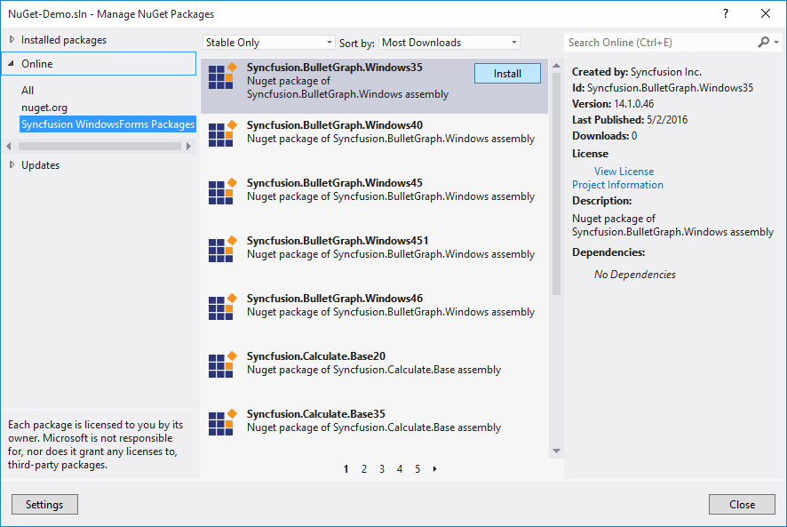

# NuGet Packages

NuGet is a package manager for the .NET framework. The NuGet client tools simplify the process of installing and upgrading packages. This can be used to automatically add files and references to your Visual Studio projects.

N> You can use the Syncfusion Windows Forms NuGet packages without installing the Essential Studio or Windows Forms platform installation to implement the Syncfusion Windows Forms controls.

## Get the Syncfusion NuGet feed URL

You should get the private Syncfusion Windows Forms NuGet feed URL to install or upgrade the Syncfusion Windows Forms NuGet packages. To get the URL from Syncfusion website use the following steps:

1. Navigate to [nuget.syncfusion.com](https://nuget.syncfusion.com/), and select **DESKTOP** tab.     

2. Click the Copy URL label under Windows Forms platform to copy the Syncfusion Windows Forms platform NuGet feed to clipboard or directly use the following URL: 

    [http://nuget.syncfusion.com/nuget_windowsforms/nuget/getsyncfusionpackages/windows-forms](http://nuget.syncfusion.com/nuget_windowsforms/nuget/getsyncfusionpackages/windows-forms) 

    

3. Now, use this NuGet feed URL to access the Syncfusion NuGet Packages in Visual Studio. 

## Add the Syncfusion NuGet feed URL

1.	Open your Visual Studio application. 

2.	On the **Tools** menu, select **Options**.

3.	Expand the **NuGet Package Manager** and select **Package Sources**.

4.	Click the **Add** button (green plus), and enter the ‘Package Name’ and ‘Package Source URL’ of the Syncfusion Windows Forms NuGet packages.

    **Name:** Name of the package listed in the available package sources.
    **Source:** Syncfusion Windows Forms NuGet Feed URL      
    [http://nuget.syncfusion.com/nuget_windowsforms/nuget/getsyncfusionpackages/windows-forms](http://nuget.syncfusion.com/nuget_windowsforms/nuget/getsyncfusionpackages/windows-forms).

5.	Click the **Update** button to add the name and source details to package sources. 

    

## Installing NuGet Packages

### Using NuGet Package Manager

The NuGet Package Manager can be used to search and install NuGet packages in the Visual Studio solution or project:
1.	On the **Tools**, menu, NuGet `Package Manager | Manage NuGet Packages for Solution...`
    
    Alternatively, right-click on the project/solution in Solution Explorer tab, and choose **Manage NuGet Packages…**

2.	By default, the NuGet.org package is selected in the **Package source** drop-down. Select your appropriate feed name that you configured. 

                  

3.	The NuGet Packages are listed and available in the package source feed URL. Search and install the required packages in your application, by clicking **Install** button.

### Using Package Manager Console

To reference the Syncfusion Windows Forms component using the Package Manager Console as NuGet packages, 

1.	On the **Tools** menu, select **NuGet Package Manager** and then **Package Manager Console**. 

2.	Run the following NuGet installation commands: 

    ~~~
    #install specified package in default project
    Install-Package <Package Name>

    #install specified package in default project with specified package source
    Install-Package <Package Name> -Source <Source Location>

    #install specified package in specified project 
    Install-Package <Package Name> - ProjectName <Project Name>
    ~~~

    **For example:**

    ~~~
    #install specified package in default project
    Install-Package Syncfusion.Chart.Windows46

    #install specified package in default project with specified Package Source
    Install-Package Syncfusion.Chart.Windows46-Source “http://nuget.syncfusion.com/nuget_windowsforms/nuget/getsyncfusionpackages/windows-forms”

    #install specified package in specified project 
    Install-Package Syncfusion.Chart.Windows46 -ProjectName SyncfusionDemoApplication
    ~~~

## Managing NuGet package using NuGet CLI

The NuGet Command Line Interface (CLI), nuget.exe, provides the full extent of NuGet functionality to install, create, publish, and manage packages without making any change to the project files.

### Configure NuGet feed URL 

1.	Download the latest NuGet CLI from [here](https://dist.nuget.org/win-x86-commandline/latest/nuget.exe).

    N> To update the existing nuget.exe to latest version use the following command:

    ~~~
    nuget update -self
    ~~~

2.	Open the downloaded executable location in the command window, and run the following commands to configure the Syncfusion Windows Forms NuGet packages: 

    ~~~
    #Add specified Package Source in NuGet.config file 
    nuget.exe Sources Add –Name <Source name> –Source <Source location>  
    ~~~

    **For example:**

    ~~~
    nuget.exe Sources Add –Name “Syncfusion Source” –Source “http://nuget.syncfusion.com/nuget_windowsforms/nuget/getsyncfusionpackages/windows-forms”
    ~~~

### NuGet installation

Download and install the required NuGet packages to a project specified in the package.config.

~~~
#install specified package in default project from specified Package Source 
nuget.exe install <Package name | ConfigFilePath > [Options]
~~~

N> configPath is optional. This identifies the packages.config or solutions file that lists the packages utilized in the project. 

**For example:**

~~~
#install specific package 
nuget.exe install “Syncfusion.Chart.Windows46”

#install all package which mention in package.config path 
nuget.exe install “C:\Users\SyncfusionApplication\package.config”

#install specific Syncfusion NuGet package with specific Syncfusion Package Source
nuget.exe install “Syncfusion.Chart.Windows46”  –Source “http://nuget.syncfusion.com/nuget_windowsforms/nuget/getsyncfusionpackages/windows-forms”
~~~

## Upgrading NuGet packages

### Using NuGet Package Manger 

NuGet packages can be updated to their specific version or latest version available in the Visual Studio solution or project:

1. On the **Tools** menu, `NuGet Package Manager | Manage NuGet Packages for Solution...`
Alternatively, right-click on project/solution in the Solution Explorer tab, and choose **Manage NuGet Packages…**

2. Select the **Updates** tab to see the packages available for update from the desired package sources. Select the required packages and the specific version from the dropdown, and click the **Update** button.

### Using Package Manger Console

To update the installed Syncfusion Windows Forms NuGet packages using the Package Manager Console: 

1.	On the **Tools** menu, select **NuGet Package Manager**, and then **Package Manager Console.** 

2.	Run the following NuGet installation commands:

    ~~~ 
    #Update specific NuGet package in default project
    Update-Package <Package Name>

    #Update all the packages in default project
    Update-Package 

    #Update specified package in default project with specified package source
    Update-Package <Package Name> -Source <Source Location>

    #Update specified package in specified project 
    Update-Package <Package Name> - ProjectName <Project Name>
    ~~~

    **For example:**

    ~~~
    #Update specified Syncfusion Windows Forms NuGet package 
    Update-Package Syncfusion.Chart.Windows46

    #Update specified package in default project with specified Package Source
    Update-Package Syncfusion.Chart.Windows46 –Source “http://nuget.syncfusion.com/nuget_windowsforms/nuget/getsyncfusionpackages/windows-forms”

    #Update specified package in specified project 
    Update-Package Syncfusion.Chart.Windows46 -ProjectName SyncfusionDemoApplication
    ~~~

### Using NuGet CLI

Using the NuGet CLI, all the NuGet packages in the project can be updated to the available latest version: 

1.	Download the latest NuGet CLI from [here](https://dist.nuget.org/win-x86-commandline/latest/nuget.exe).

    N> To update the existing nuget.exe to latest version use the following command: 

    ~~~
    nuget update -self
    ~~~

2.	Open the downloaded executable location in the command window. Run the following “update commands” to update the Syncfusion Windows Forms NuGet packages.

    ~~~ 
    #update all NuGet packages from config file
    nuget update <configPath> [options]

    #update all NuGet packages from specified Packages Source
    nuget update -Source <Source Location> [optional]
    ~~~      

    N> configPath is optional. This identifies the packages.config or solutions file lists the packages utilized in the project. 
	
    **For example:**
    
    ~~~          
    #Update all NuGet packages from config file
    nuget update “C:\Users\SyncfusionApplication\package.config”

    #Update all NuGet packages from specified Packages Source
    nuget update -Source “http://nuget.syncfusion.com/nuget_windowsforms/nuget/getsyncfusionpackages/windows-forms”
    ~~~

   

