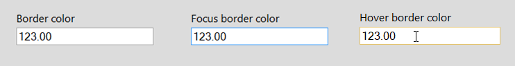

# Fore color for positive, negative and zero color

SfNumericTextBox UI can be customized with the following properties. It helps in differentiating the values easily.

*	[NegativeForeColor](https://help.syncfusion.com/cr/windowsforms/Syncfusion.WinForms.Input.Styles.NumericTextBoxVisualStyle.html#Syncfusion_WinForms_Input_Styles_NumericTextBoxVisualStyle_NegativeForeColor) – Assign the foreground color to the control, when Value is negative.
*	[PositiveForeColor](https://help.syncfusion.com/cr/windowsforms/Syncfusion.WinForms.Input.Styles.NumericTextBoxVisualStyle.html#Syncfusion_WinForms_Input_Styles_NumericTextBoxVisualStyle_PositiveForeColor) - Assign the foreground color to the control, when Value is positive.
*	[ZeroForeColor](https://help.syncfusion.com/cr/windowsforms/Syncfusion.WinForms.Input.Styles.NumericTextBoxVisualStyle.html#Syncfusion_WinForms_Input_Styles_NumericTextBoxVisualStyle_ZeroForeColor) - Assign the foreground color to the control, when Value is zero.





this.numericTextBox.Style.PositiveForeColor = Color.Green;
this.numericTextBox.Style.NegativeForeColor = Color.Red;
this.numericTextBox.Style.ZeroForeColor = Color.Blue;





Me.numericTextBox.Style.PositiveForeColor = Color.Green
Me.numericTextBox.Style.NegativeForeColor = Color.Red
Me.numericTextBox.Style.ZeroForeColor = Color.Blue





## WatermarkForeColor

Assign the fore color to the watermark text using the [WatermarkForeColor](https://help.syncfusion.com/cr/windowsforms/Syncfusion.WinForms.Input.Styles.NumericTextBoxVisualStyle.html#Syncfusion_WinForms_Input_Styles_NumericTextBoxVisualStyle_WatermarkForeColor) property. The Watermark text will be displayed in the control when the Value is null.





this.numericTextBox.Style.WatermarkForeColor = Color.IndianRed;





Me.numericTextBox.Style.WatermarkForeColor = Color.IndianRed





## BorderColor

We can customize the UI of the control by changing border color in different states like Focus, Disabled and mouse hover. The properties available to customize are

*	[BorderColor](https://help.syncfusion.com/cr/windowsforms/Syncfusion.WinForms.Input.Styles.NumericTextBoxVisualStyle.html#Syncfusion_WinForms_Input_Styles_NumericTextBoxVisualStyle_BorderColor)- Assign the border color to the control.
*	[FocusBorderColor](https://help.syncfusion.com/cr/windowsforms/Syncfusion.WinForms.Input.Styles.NumericTextBoxVisualStyle.html#Syncfusion_WinForms_Input_Styles_NumericTextBoxVisualStyle_FocusBorderColor)  - Assign the border color to the control, when the control gets its focus.
*	[HoverBorderColor](https://help.syncfusion.com/cr/windowsforms/Syncfusion.WinForms.Input.Styles.NumericTextBoxVisualStyle.html#Syncfusion_WinForms_Input_Styles_NumericTextBoxVisualStyle_HoverBorderColor) - Assign the border color to the control, when the mouse is hover on it.
*   [DisabledBorderColor](https://help.syncfusion.com/cr/windowsforms/Syncfusion.WinForms.Input.Styles.NumericTextBoxVisualStyle.html#Syncfusion_WinForms_Input_Styles_NumericTextBoxVisualStyle_DisabledBorderColor) - Assign the border color to the control, when the control gets disabled.

> Note :
>
> BorderColor, FocusBorderColor, DisabledBorderColor and HoverBorderColor will be applied only when BorderStyle property set as “FixedSingle”. 





this.numericTextBox.Style.BorderColor = ColorTranslator.FromHtml("#ababab");
this.numericTextBox.Style.FocusBorderColor = SystemColors.MenuHighlight;
this.numericTextBox.Style.HoverBorderColor = ColorTranslator.FromHtml("#e5c365");





Me.numericTextBox.Style.BorderColor = ColorTranslator.FromHtml("#ababab")
Me.numericTextBox.Style.FocusBorderColor = SystemColors.MenuHighlight
Me.numericTextBox.Style.HoverBorderColor = ColorTranslator.FromHtml("#e5c365")





