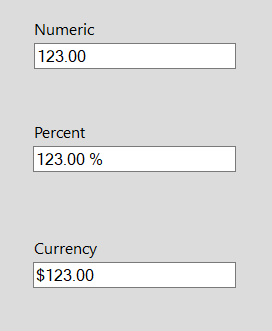
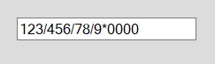
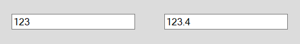
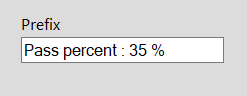
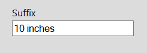
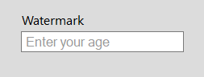

# Formatting in WinForms Numeric TextBox

## FormatMode

The formatting functionality allows formatting the value based on the `FormatString`. You can format the value in different modes, of which three specific formats are supported: Numeric, Currency, and Percent. In Currency and Percent modes, the value is displayed with its symbol.

The three supported formats are explained below:

* **Numeric** - Used for displaying values in numeric format. The number may contain different decimal symbol, decimal separator, decimal digits, and group size in different cultures. All these can be customized using the `NumberFormatInfo` property.

* **Currency** – The Currency format specifier converts a number to a string and is used for displaying currency values in currency format. The currency text may contain currency symbol, currency decimal separator, currency decimal digit, and currency group size. This can be customized by using `NumberFormatInfo`.

* **Percent** - The Percent format specifier converts a number to a string and is used for displaying percentage values in percent format. The percentage text may contain percent symbol, percent decimal separator, percent decimal digit, and percent group size. This can be customized by using `NumberFormatInfo`.

>**NOTE**: If [NumberFormatInfo](https://help.syncfusion.com/cr/windowsforms/Syncfusion.WinForms.Input.SfNumericTextBox.html#Syncfusion_WinForms_Input_SfNumericTextBox_NumberFormatInfo) is null, the `Text` will be parsed based on `CurrentUICulture`.

Numeric FormatMode





this.numericTextBox.FormatMode = Syncfusion.WinForms.Input.Enums.FormatMode.Numeric;





Me.numericTextBox.FormatMode = Syncfusion.WinForms.Input.Enums.FormatMode.Numeric





Percent FormatMode





this.numericTextBox.FormatMode = Syncfusion.WinForms.Input.Enums.FormatMode.Percent;





Me.numericTextBox.FormatMode = Syncfusion.WinForms.Input.Enums.FormatMode.Percent





Currency FormatMode





this.numericTextBox.FormatMode = Syncfusion.WinForms.Input.Enums.FormatMode.Currency;





Me.numericTextBox.FormatMode = Syncfusion.WinForms.Input.Enums.FormatMode.Currency





## Format using NumberFormatInfo

The [NumberFormatInfo](https://help.syncfusion.com/cr/windowsforms/Syncfusion.WinForms.Input.SfNumericTextBox.html#Syncfusion_WinForms_Input_SfNumericTextBox_NumberFormatInfo) class contains culture-specific information that is used when you format and parse numeric values. This NumberFormatInfo includes
 
*	Currency symbol
*	Decimal symbol
*	Percent symbol
*	Group separator symbol and 
*	Symbols for negative signs.

Using this [NumberFormatInfo](https://help.syncfusion.com/cr/windowsforms/Syncfusion.WinForms.Input.SfNumericTextBox.html#Syncfusion_WinForms_Input_SfNumericTextBox_NumberFormatInfo), you can define how the values can be formatted and displayed. You can also format based on the culture by specifying it in `NumberFormatInfo`.





NumberFormatInfo numberFormat = new NumberFormatInfo();
 numberFormat.NumberDecimalSeparator = "*";
 numberFormat.NumberDecimalDigits = 4;
 numberFormat.NumberGroupSeparator = "/";
 numberFormat.NumberGroupSizes = new int[3] { 1, 2, 3 };
 numericTextBox.NumberFormatInfo = numberFormat;





 Dim numberFormat As New NumberFormatInfo()
 numberFormat.NumberDecimalSeparator = "*"
 numberFormat.NumberDecimalDigits = 4
 numberFormat.NumberGroupSeparator = "/"
 numberFormat.NumberGroupSizes = New Integer(2) { 1, 2, 3 }
 Me.numericTextBox.NumberFormatInfo = numberFormat





>**NOTE**: The `Value` in the WinForms Numeric TextBox can be parsed by using the [NumberFormatInfo](https://help.syncfusion.com/cr/windowsforms/Syncfusion.WinForms.Input.SfNumericTextBox.html#Syncfusion_WinForms_Input_SfNumericTextBox_NumberFormatInfo) property. If the `NumberFormatInfo` is not initialized, the `Value` will be parsed based on `CurrentUICulture`.

## Hiding trailing zeros

Trailing zeros are a sequence of 0s in the decimal representation of a number, after which no other digits follow. Trailing zeros to the right of the decimal point do not affect the value of a number; they can be removed by enabling the [HideTrailingZeros](https://help.syncfusion.com/cr/windowsforms/Syncfusion.WinForms.Input.SfNumericTextBox.html#Syncfusion_WinForms_Input_SfNumericTextBox_HideTrailingZeros) property.





// Hides the trailing zeros.
this.numericTextBox.HideTrailingZeros = true;





' Hides the trailing zeros.
Me.numericTextBox.HideTrailingZeros = True





## Prefix and Suffix

Additional details about the value will always improve the meaning of the value. Such details can be displayed along with the `Value` using the [Prefix](https://help.syncfusion.com/cr/windowsforms/Syncfusion.WinForms.Input.SfNumericTextBox.html#Syncfusion_WinForms_Input_SfNumericTextBox_Prefix) and [Suffix](https://help.syncfusion.com/cr/windowsforms/Syncfusion.WinForms.Input.SfNumericTextBox.html#Syncfusion_WinForms_Input_SfNumericTextBox_Suffix) properties. For example, values for speed, weight, and length can be displayed with units such as Km/h, Kg, and m.





this.numericTextBox.Prefix = "Pass percent :";





Me.numericTextBox.Prefix = "Pass percent :"









this.numericTextBox.Suffix = "inches";





Me.numericTextBox.Suffix = "inches"





## WatermarkText

The watermark is the placeholder content displayed in the WinForms Numeric TextBox when the value is null. It can be used for providing instructions or guidelines for the control.





this.numericTextBox.WatermarkText = "Enter your age";





Me.numericTextBox.WatermarkText = "Enter your age"





>**NOTE**: The [WatermarkText](https://help.syncfusion.com/cr/windowsforms/Syncfusion.WinForms.Input.SfNumericTextBox.html#Syncfusion_WinForms_Input_SfNumericTextBox_WatermarkText) will be visible when the value is null and the control does not have the focus.
