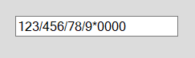
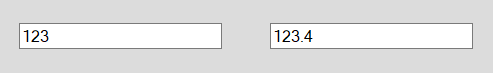
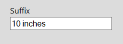
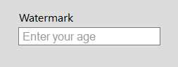

# Formatting in Windows Forms Numeric TextBox (SfNumericTextBox)

## FormatMode

Formatting functionality allows formatting the value based on the FormatString. We can format the value in different mode, in which we picked the specific three formats. They are Numeric, Currency, Percent. In this Currency and Percent mode display the value with its symbol.
The three specified formats are explained below

*	**Numeric** - It used for displaying values in numeric without specific format. The number may contain different decimal symbol, decimal separator, decimal digits and group size in different culture. All this can be customized using the NumberFormatInfo property. 

*	**Currency** – The Currency format specifier converts a number to string and it is used for displaying currency values in currency format.  The currency text may contain currency symbol, currency decimal separator, currency decimal digit and currency group size. This symbol can be customized by using NumberFormatInfo.

*	**Percent** - The Currency format specifier converts a number to string and it is used for displaying percentage values in percent format. The percentage text may contain percent symbol, percent decimal separator, percent decimal digit and percent group size. This symbol can be customized by using NumberFormatInfo.

N> If [NumberFormatInfo](https://help.syncfusion.com/cr/windowsforms/Syncfusion.WinForms.Input.SfNumericTextBox.html#Syncfusion_WinForms_Input_SfNumericTextBox_NumberFormatInfo) is null then the Text will be parsed based on CurrentUICulture.

Numeric FormatMode





this.numericTextBox.FormatMode = Syncfusion.WinForms.Input.Enums.FormatMode.Numeric;





Me.numericTextBox.FormatMode = Syncfusion.WinForms.Input.Enums.FormatMode.Numeric





Percent FormatMode





this.numericTextBox.FormatMode = Syncfusion.WinForms.Input.Enums.FormatMode.Percent;





Me.numericTextBox.FormatMode = Syncfusion.WinForms.Input.Enums.FormatMode.Percent





Currency FormatMode





this.numericTextBox.FormatMode = Syncfusion.WinForms.Input.Enums.FormatMode.Currency;





Me.numericTextBox.FormatMode = Syncfusion.WinForms.Input.Enums.FormatMode.Currency





## Format using NumberFormatInfo

The [NumberFormatInfo](https://help.syncfusion.com/cr/windowsforms/Syncfusion.WinForms.Input.SfNumericTextBox.html#Syncfusion_WinForms_Input_SfNumericTextBox_NumberFormatInfo) class contains culture-specific information that is used when you format and parse numeric values. This NumberFormatInfo includes
 
*	Currency symbol
*	Decimal symbol
*	Percent symbol
*	Group separator symbol and 
*	Symbols for negative signs.

Using this [NumberFormatInfo](https://help.syncfusion.com/cr/windowsforms/Syncfusion.WinForms.Input.SfNumericTextBox.html#Syncfusion_WinForms_Input_SfNumericTextBox_NumberFormatInfo), we can define how the values can be formatted and display. We can also format based on culture by specifying in NumberFormatInfo. 





NumberFormatInfo numberFormat = new NumberFormatInfo();
 numberFormat.NumberDecimalSeparator = "*";
 numberFormat.NumberDecimalDigits = 4;
 numberFormat.NumberGroupSeparator = "/";
 numberFormat.NumberGroupSizes = new int[3] { 1, 2, 3 };
 numericTextBox.NumberFormatInfo = numberFormat;





 Dim numberFormat As New NumberFormatInfo()
 numberFormat.NumberDecimalSeparator = "*"
 numberFormat.NumberDecimalDigits = 4
 numberFormat.NumberGroupSeparator = "/"
 numberFormat.NumberGroupSizes = New Integer(2) { 1, 2, 3 }
 Me.numericTextBox.NumberFormatInfo = numberFormat





N> The Value in the SfNumericTextBox can be parsed by using the [NumberFormatInfo](https://help.syncfusion.com/cr/windowsforms/Syncfusion.WinForms.Input.SfNumericTextBox.html#Syncfusion_WinForms_Input_SfNumericTextBox_NumberFormatInfo) property. If the NumberFormatInfo is not initialized, then the Value will be parsed based on the CurrentUICulture.

## Hiding trailing zeros

Trailing zeros are a sequence of 0 in the decimal representation of a number, after which no other digits follow. Trailing zeros to the right of the decimal point do not affect value of a number, it can be removed by enabling [HideTrailingZeros](https://help.syncfusion.com/cr/windowsforms/Syncfusion.WinForms.Input.SfNumericTextBox.html#Syncfusion_WinForms_Input_SfNumericTextBox_HideTrailingZeros) property.





// Hides the trailing zeros.
this.numericTextBox.HideTrailingZeros = true;





' Hides the trailing zeros.
Me.numericTextBox.HideTrailingZeros = True





## Prefix and Suffix

Addition details about the value will always improve the meaning of the value. This type of details can be displayed along with Value using [Prefix](https://help.syncfusion.com/cr/windowsforms/Syncfusion.WinForms.Input.SfNumericTextBox.html#Syncfusion_WinForms_Input_SfNumericTextBox_Prefix) and [Suffix](https://help.syncfusion.com/cr/windowsforms/Syncfusion.WinForms.Input.SfNumericTextBox.html#Syncfusion_WinForms_Input_SfNumericTextBox_Suffix) property. For eg: Values for speed, weight, length can be displayed with units as Km/h, Kg, m 





this.numericTextBox.Prefix = "Pass percent :";





Me.numericTextBox.Prefix = "Pass percent :"









this.numericTextBox.Suffix = "inches";





Me.numericTextBox.Suffix = "inches"





## WatermarkText

Watermark is the dummy content displayed in the SfNumericTextBox when the value is null. It can be used for giving instruction or guideline to the control. 





this.numericTextBox.WatermarkText = "Enter your age";





Me.numericTextBox.WatermarkText = "Enter your age"





N> The [WatermarkText](https://help.syncfusion.com/cr/windowsforms/Syncfusion.WinForms.Input.SfNumericTextBox.html#Syncfusion_WinForms_Input_SfNumericTextBox_WatermarkText) will be visible when value is null and the control doesn’t have the focus.
