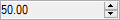

# Windows Forms NumericUpDown (NumericUpDownExt) Overview

The NumericUpDownExt control enables XP Themes look and feel for the UpDown controls that are missing in the corresponding .NET control.

## Key Features

The NumericUpDownExt is an advanced NumericUpdown control, and it contains the following features:

**Value settings** - Provides options to set the value to be displayed by the NumericUpDownExt control and increments or decrements the value.

**Display settings** - Provides options to set the decimal places with integer to the control.

**Appearance settings** - Supports to set the background and foreground color of the control. The foreground color can be set separately for the negative values of the control.

**Behavior settings** - The `InterceptArrowKeys` property allows users to change values using the up and down arrow key apart from the standard up and down buttons.

**Alignment settings** - Provides options to align the text of the control to the left, right or center. It also supports to align the up and down buttons to the left and right.

**Border settings** - Provides different sets of border styles to the control. The styles are FixedSingle, Fixed3D, and None. Themed border can be provided to the control using the `ThemedBorder` property.

**Layout settings** - Provides options to set the maximum and minimum sizes of the control.

**Key support** - Provides support for entering the large values using keyboard.

**Themes and visual styles** - Supports a set of visual styles to customize the look and feel of the control.
