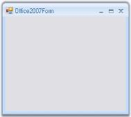

# Overview

Office2007 Form which does not have any dependency in RibbonControlAdv is now available in Essential suite. It supports all three color schemes, help button, Right To left feature everything similar to the normal form with the Office2007 look and feel.

