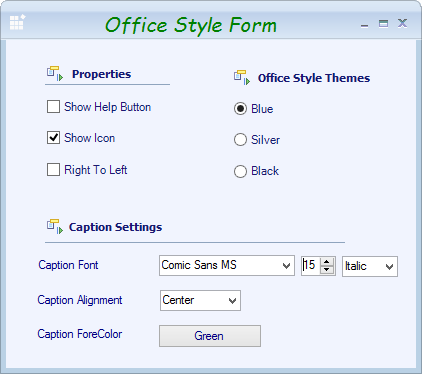
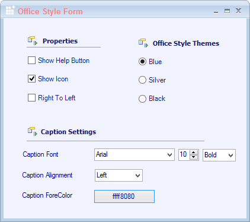
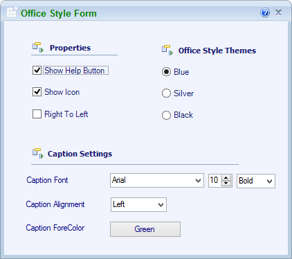

## Caption Alignment 

The Office2010Form's caption can be aligned to the left, right, or center by using the `CaptionAlign` property. 





this.CaptionAlign = System.Windows.Forms.HorizontalAlignment.Center;





Me.CaptionAlign = System.Windows.Forms.HorizontalAlignment.Center 





## Caption Font 

Office2010Form's caption Font can be customized through `CaptionFont` property.





this.CaptionFont = new System.Drawing.Font("Comic Sans MS", 15F, System.Drawing.FontStyle.Bold, System.Drawing.GraphicsUnit.Point, ((byte)(0)));





Me.CaptionFont = New System.Drawing.Font("Comic Sans MS", 15F, System.Drawing.FontStyle.Bold, System.Drawing.GraphicsUnit.Point, CByte((0))) 





## Caption Fore Color

The color of the caption text can be customized using the `CaptionForeColor` property.





// Applies the color to caption text.

this.CaptionForeColor = Color.Pink;





‘Applies the color to caption text.

Me.CaptionForeColor = Color.Pink





## Help Button Support

Help Button property is used to show the `HelpButton` in the caption box of the form. 





// Displays the HelpButton in the caption box of the Form.

 this.HelpButton = true;





‘Displays the HelpButton in the caption box of the Form.

 Me.HelpButton = true





# Disabling Office2010Style

Office2010 look and feel can be disabled using `DisableOffice2010Style` property.





this.DisableOffice2010Style = true;





Me.DisableOffice2010Style = true
 




