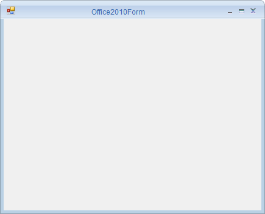

# Overview

The `Office2010Form` is an advanced standard Form that offers Microsoft Office2010 like UI and appearance. It allows the end-user to create Microsoft Office2010 like appealing User Interface in their application. It also supports various built-in Color Schemes and customization options that helps user to control its behavior and appearance.

## Key features

* **Alignment** - Provides options to aligns the form's title to the left, right, or center by using the `CaptionAlign` property.
* **Color schemes** - Supports various office color schemes like blue, black, silver and much more.
* **Button support** - Provides options to show / hide the Help button in Office2010Form through which the user can perform their required action.
* **Customization** - Supports for customizing appearance of CaptionBar.
* **Right-to-left** - Supports to align the control elements in right-to-left layout.

 
