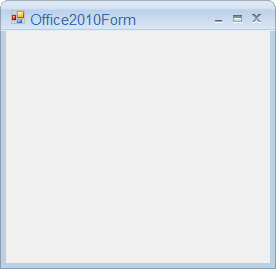

# Overview

Office2010Form is an advanced standard Form that offers Microsoft Office2010 like UI and appearance. With this user can create Microsoft Office2010 like appealing User Interface in their application. It also supports various built in Color Schemes and customization options that helps user to control its behavior and appearance.

## Features

* Supports various color schemes customization.
* Help button support.
* Supports Caption customization.
* Right to left support.

 
