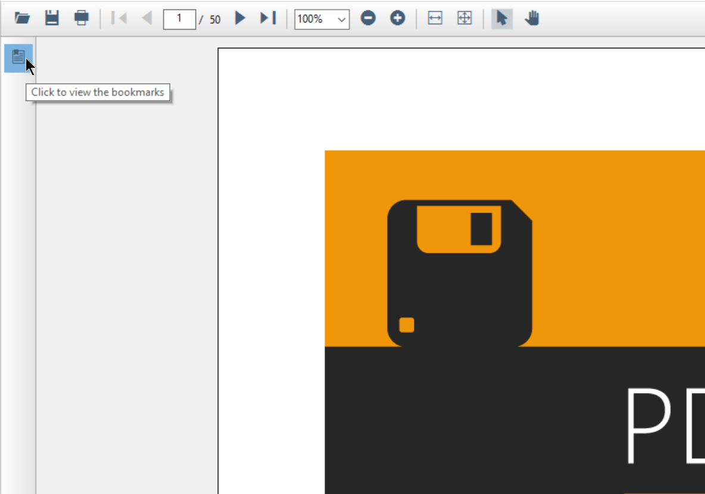
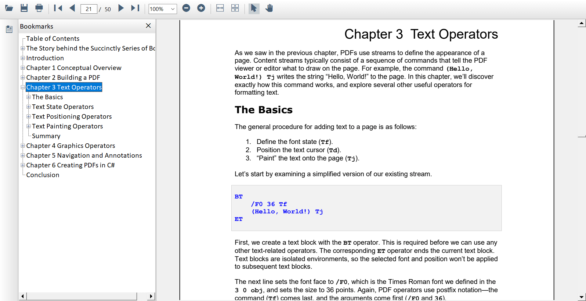

# Bookmark Navigation in Windows Forms PDF Viewer (PdfViewerControl)

[WinForms PDF Viewer](https://www.syncfusion.com/winforms-ui-controls/pdf-viewer) control allows users to navigate to the bookmarks present in the loaded PDF document at the UI level. 

## Steps to perform bookmark navigation in PdfViewerControl.

1.	Open the bookmarks contained PDF document to enable the bookmark button in [PdfViewerControl](https://help.syncfusion.com/cr/windowsforms/Syncfusion.Windows.Forms.PdfViewer.PdfViewerControl.html).
2.	Clicking on the bookmark button from the left pane will list the bookmarks present in the PDF document.
3.	To jump to a specific section, click its name in the bookmark pane.
4.	If the bookmark has some children, you can explore them by clicking on the “+” button to the left of it.

  

## Programmatically navigate to a bookmark destination

You can navigate to the desired bookmark destination using the [GoToBookmark](https://help.syncfusion.com/cr/windowsforms/Syncfusion.Windows.Forms.PdfViewer.PdfViewerControl.html#Syncfusion_Windows_Forms_PdfViewer_PdfViewerControl_GoToBookmark_Syncfusion_Pdf_Interactive_PdfBookmark_) method of PDF Viewer after the document has loaded. The target/destination bookmark should be provided as the parameter to this method. Refer to the following code sample to retrieve the bookmarks collection in the document and navigate to a bookmark.




void GoToBookmark()
{
	PdfLoadedDocument pdfLoadedDocument = pdfViewer.LoadedDocument;

	//Get the complete bookmarks in the PDF.
	PdfBookmarkBase bookmarks = pdfLoadedDocument.Bookmarks;

	//In this example, we get the first bookmark in the PDF bookmarks collection at the index of 0.
	PdfBookmark firstBookmark = bookmarks[0];

	//Navigates to the first bookmark present in the PDF.
	pdfViewer.GoToBookmark(firstBookmark);
}




You can also navigate to the child bookmarks. Refer to the following code sample to retrieve the child bookmarks in the document and navigate to the bookmark.




void GoToChildBookmark()
{
	PdfLoadedDocument pdfLoadedDocument = pdfViewer.LoadedDocument;

	//Get the complete bookmarks in the PDF.
	PdfBookmarkBase bookmarks = pdfLoadedDocument.Bookmarks;

	//Gets the fourth bookmark in the PDF bookmarks collection at the index of 3.
	PdfBookmark fourthBookmark = bookmarks[3];

	//Check whether it has child bookmarks.
	if (fourthBookmark.Count > 0)
	{
		//Navigates to the first child of the fourth bookmark in the PDF.
		pdfViewer.GoToBookmark(bookmarks[3][0]);
	}
}




You need to call the above methods after the document is loaded. The [DocumentLoaded](https://help.syncfusion.com/cr/windowsforms/Syncfusion.Windows.Forms.PdfViewer.PdfViewerControl.html#Syncfusion_Windows_Forms_PdfViewer_PdfViewerControl_DocumentLoaded) event of PDF Viewer can be wired to notify when the document is loaded as shown in the following code sample.




// wire the document loaded event.
pdfViewer.DocumentLoaded += PdfViewer_DocumentLoaded;

// load the PDF.
pdfViewer.Load("../../Data/C_Sharp_Succinctly.pdf");




After the document is loaded, you can execute the bookmark navigation logic as shown in the following code sample.




private void PdfViewer_DocumentLoaded(object sender, EventArgs args)
{
	//Call the logic to go to bookmark
	GoToBookmark();
}




N> The sample project to perform the operation is available in the [GitHub](https://github.com/SyncfusionExamples/WinForms-PDFViewer-Examples/tree/master/Bookmarks Navigation/PDFBookmarks).

## Enabling and disabling bookmark feature

You can enable and disable the bookmark button from the built-in toolbar using the [IsBookmarkEnabled](https://help.syncfusion.com/cr/windowsforms/Syncfusion.Windows.Forms.PdfViewer.PdfViewerControl.html#Syncfusion_Windows_Forms_PdfViewer_PdfViewerControl_IsBookmarkEnabled) property of [PdfViewerControl](https://help.syncfusion.com/cr/windowsforms/Syncfusion.Windows.Forms.PdfViewer.PdfViewerControl.html).

<table>
<tr>
<th>
Property</th><th>
Action</th></tr>
<tr>
<td>
{{'[IsBookmarkEnabled](https://help.syncfusion.com/cr/windowsforms/Syncfusion.Windows.Forms.PdfViewer.PdfViewerControl.html#Syncfusion_Windows_Forms_PdfViewer_PdfViewerControl_IsBookmarkEnabled)'| markdownify }}</td><td>
Enables or disables the bookmark feature.</td></tr>
</table>

This property removes the bookmark button and disables the bookmark feature when it is set to false and vice versa.




//Bookmark feature is disabled
pdfViewerControl.IsBookmarkEnabled = false;




'Bookmark feature is disabled
pdfViewerControl.IsBookmarkEnabled = false




The following screenshot shown the Bookmark navigation in PDF Viewer.

