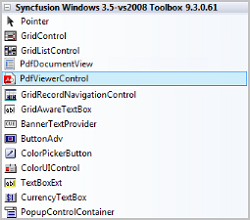
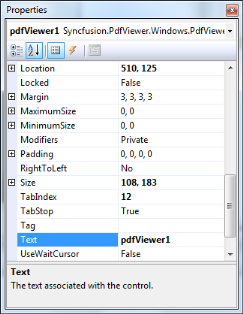
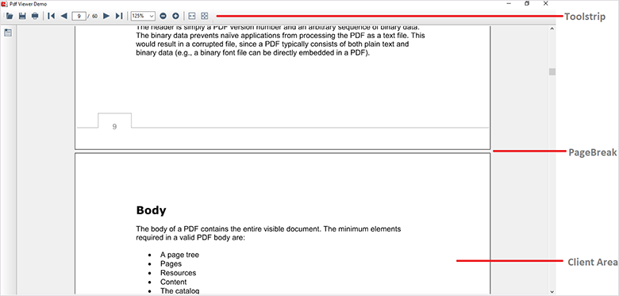

# Getting Started with Windows Forms PDF Viewer (PdfViewerControl)

## Adding reference to PdfViewerControl and dependent assemblies

Refer to the [Control Dependencies](https://help.syncfusion.com/windowsforms/control-dependencies#pdf-viewer) section to get the list of assemblies.

### Installing NuGet packages

Adding reference to Syncfusion assemblies through NuGet packages is illustrated in the [NuGet Packages](https://help.syncfusion.com/windowsforms/installation/install-nuget-packages) section. 

N> Starting with v16.2.0.x, if you reference Syncfusion assemblies from trial setup or from the NuGet feed, you also have to include a license key in your projects. Please refer to [this link](https://help.syncfusion.com/common/essential-studio/licensing/overview) to know about registering Syncfusion license key in your Windows Forms application to use our components.

### Adding from the installed location

The [WinForms PDF Viewer](https://www.syncfusion.com/winforms-ui-controls/pdf-viewer) (PdfViewerControl) and dependent assemblies can be found from the below location in your machine. 

system drive:\Program Files (x86)\Syncfusion\Essential Studio\{{ site.releaseversion }}\precompiledassemblies\{{ site.releaseversion }}\

## Adding PdfViewerControl to an Application

From v16.3.0x onwards, PDF Viewer uses PDFium as a default rendering engine to render the PDF pages, which is a more robust and promising rendering engine. Refer to this [link](https://help.syncfusion.com/windowsforms/pdf-viewer/pdf-rendering-engines) for more details.

### Adding in designer

1. Open your form in the designer. Add the Syncfusion controls to your .NET toolbox in Visual Studio if you haven't done so already (the install would have automatically done this unless you selected not to complete toolbox integration during installation).
   
   

2. Drag the PdfViewerControl from the toolbox onto the form. Appearance and behavior related aspects of the PdfViewerControl can be controlled by setting the appropriate properties through the properties grid. 

   
 
3. This will add the instance 'pdfViewerControl1' to the Designer cs file. The PDF can be loaded in the Form cs file using the [Load](https://help.syncfusion.com/cr/windowsforms/Syncfusion.Windows.Forms.PdfViewer.PdfViewerControl.html#Syncfusion_Windows_Forms_PdfViewer_PdfViewerControl_Load_System_String_) method. 





//Loading the document in the PdfViewerControl
pdfViewerControl1.Load("Sample.pdf");




'Loading the document in the PdfViewerControl
pdfViewerControl1.Load("Sample.pdf")




{{ codesnippet1 | OrderList_Indent_Level_1 }}
	
### Adding manually in code

1. Add Syncfusion.Windows.Forms.PdfViewer namespace.





using Syncfusion.Windows.Forms.PdfViewer;




Imports Syncfusion.Windows.Forms.PdfViewer




{{ codesnippet2 | OrderList_Indent_Level_1 }}

2. Create PdfViewerControl instance and load the PDF





//Initializing the PdfViewerControl
PdfViewerControl pdfViewerControl1 = new PdfViewerControl();

//Loading the document in the PdfViewerControl
pdfViewerControl1.Load("Sample.pdf");
//Add PdfViewerControl to the Form
Controls.Add(pdfViewerControl1);




'Initializing the PdfViewerControl
Dim pdfViewerControl1 As PdfViewerControl = New PdfViewerControl()

'Loading the document in the PdfViewerControl
pdfViewerControl1.Load("Sample.pdf")
'Add PdfViewerControl to the Form
Controls.Add(pdfViewerControl1)




{{ codesnippet3 | OrderList_Indent_Level_1 }}

## Adding PdfDocumentView to an Application

The [PdfDocumentView](https://help.syncfusion.com/cr/windowsforms/Syncfusion.Windows.Forms.PdfViewer.PdfDocumentView.html) control allows you to view the PDF files without toolbar. Other features are similar to PdfViewerControl.

### Adding in designer

1. Open your form in the designer. Add the Syncfusion controls to your .NET toolbox in Visual Studio if you haven't done so already (the install would have automatically done this unless you selected not to complete toolbox integration during installation).
   
   

2. Drag the PdfDocumentView from the toolbox onto the form. Appearance and behavior related aspects of the PdfDocumentView can be controlled by setting the appropriate properties through the properties grid. 

   
 
3. This will add the instance 'pdfDocumentView1' to the Designer cs file. The PDF can be loaded in the Form cs file using the [Load](https://help.syncfusion.com/cr/windowsforms/Syncfusion.Windows.Forms.PdfViewer.PdfDocumentView.html#Syncfusion_Windows_Forms_PdfViewer_PdfDocumentView_Load_System_String_) method. 





//Loading the document in the PdfViewerControl
pdfDocumentView1.Load("Sample.pdf");




'Loading the document in the PdfViewerControl
pdfDocumentView1.Load("Sample.pdf")




{{ codesnippet1 | OrderList_Indent_Level_1 }}
	
### Adding manually in code

1. Add Syncfusion.Windows.Forms.PdfViewer namespace.





using Syncfusion.Windows.Forms.PdfViewer;




Imports Syncfusion.Windows.Forms.PdfViewer




{{ codesnippet2 | OrderList_Indent_Level_1 }}

2. Create PdfDocumentView instance and load the PDF





//Initializing the PdfViewerControl
PdfDocumentView pdfDocumentView1 = new PdfDocumentView();

//Loading the document in the PdfViewerControl
pdfDocumentView1.Load("Sample.pdf");
//Add PdfViewerControl to the Form
Controls.Add(pdfDocumentView1);




'Initializing the PdfViewerControl
Dim pdfDocumentView1 As PdfDocumentView = New PdfDocumentView()

'Loading the document in the PdfViewerControl
pdfDocumentView1.Load("Sample.pdf")
'Add PdfViewerControl to the Form
Controls.Add(pdfDocumentView1)




{{ codesnippet3 | OrderList_Indent_Level_1 }}

Refer to [Viewing PDF files](/windowsforms/pdf-viewer/working-with-pdf-viewer#viewing-pdf-files) for more information.

N> You can also explore our [WinForms PDF Viewer example](https://github.com/syncfusion/winforms-demos/tree/master/pdfviewer) that shows you how to render and configure the PDF Viewer.