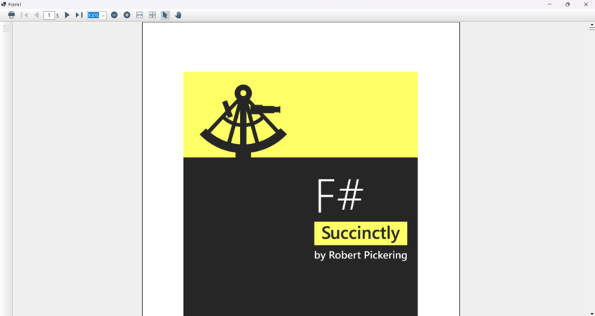

# Hide or disable the Toolbar Button

In Order to hide the toolbar button.You can use the [ToolbarSettings](https://help.syncfusion.com/cr/windowsforms/Syncfusion.Windows.Forms.PdfViewer.DocumentToolbarSettings.html) API. This API allows you to control the visibility of toolbar buttons



//Load the document ot PDFViewer control
 pdfviewerControl.Load("Input.pdf");
 
//Change the visibility of open and save button
pdfviewerControl.ToolbarSettings.OpenButton.IsVisible = false;
pdfviewerControl.ToolbarSettings.SaveButton.IsVisible = false;




' Load the document into the PDFViewer control
pdfviewerControl.Load("Input.pdf")

' Change the visibility of Open and Save buttons
pdfviewerControl.ToolbarSettings.OpenButton.IsVisible = False
pdfviewerControl.ToolbarSettings.SaveButton.IsVisible = False




The following is the image of a PDF document which hides the Open and Save button in Toolbar.

