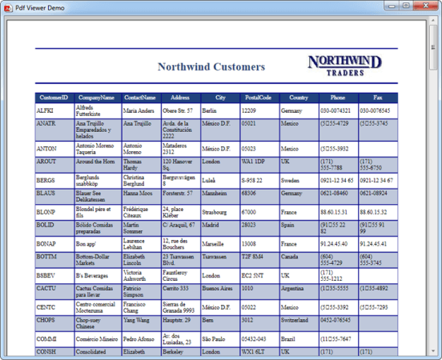

# Load PDF without Toolbar

In order to view PDF without the toolbar, make use of [PdfDocumentView](https://help.syncfusion.com/cr/windowsforms/Syncfusion.Windows.Forms.PdfViewer.PdfDocumentView.html) control instead of PdfViewerControl as described in the [section](https://help.syncfusion.com/windowsforms/pdf-viewer/getting-started#adding-pdfdocumentview-to-an-application). Other features are similar to PdfViewerControl.



PdfDocumentView pdfDocumentView1 = new PdfDocumentView();
pdfDocumentView1.Load("Sample.pdf");




Dim pdfDocumentView1 As New PdfDocumentView()
pdfDocumentView1.Load("Sample.pdf")




The following is the image of a PDF document viewed in PdfDocumentView.

