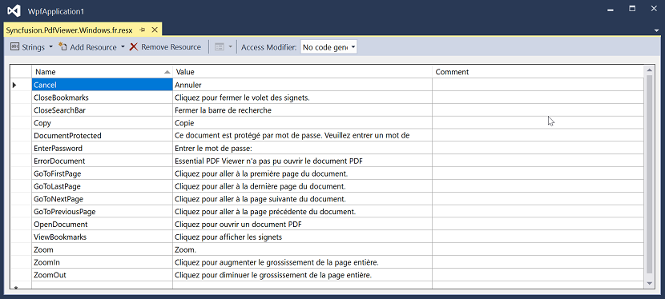

# Localization in Windows Forms PDF Viewer (PdfViewerControl)

Localization is the process of configuring the application to a specific language. PDF Viewer provides support to localize all the static text used for tooltip and context menu contents. Localization can be done by adding resource file (Resx) in the application.
The following table shows the default values for the common text used in the [PdfViewerControl](https://help.syncfusion.com/cr/windowsforms/Syncfusion.Windows.Forms.PdfViewer.PdfViewerControl.html) which is in `en-US` culture:

<table>
<tr>
<th>Name</th>
<th>Value</th>
</tr>
<tr>
<td>Bookmarks</td>
<td>Bookmarks</td>
</tr>
<tr>
<td>Cancel</td>
<td>Cancel</td>
</tr>
<tr>
<td>CloseBookmarks</td>
<td>Click to close the bookmark pane</td>
</tr>
<tr>
<td>CloseSearchBar</td>
<td>Close search bar</td>
</tr>
<tr>
<td>CopyException</td>
<td>Copy exception detail to the clipboard</td>
</tr>
<tr>
<td>DocumentProtected</td>
<td>This document is password protected. Please enter a Document Open Password.</td>
</tr>
<tr>
<td>EnterPassword</td>
<td>Enter Password:</td>
</tr>
<tr>
<td>ErrorDocument</td>
<td>Essential PDF Viewer could not open the PDF document</td>
</tr>
<tr>
<td>EssentialPdfViewer</td>
<td>Essential Pdf Viewer</td>
</tr>
<tr>
<td>FitPage</td>
<td>Click to show one page at a time.</td>
</tr>
<tr>
<td>FitWidth</td>
<td>Click to fill the window with each page and scroll through pages continuously.</td>
</tr>
<tr>
<td>GoToFirstPage</td>
<td>Click to go to first page in the document.</td>
</tr>
<tr>
<td>GoToLastPage</td>
<td>Click to go to last page in the document.</td>
</tr>
<tr>
<td>GoToNextPage</td>
<td>Click to go to next page in the document.</td>
</tr>
<tr>
<td>GoToPreviousPage</td>
<td>Click to go to previous page in the document.</td>
</tr>
<tr>
<td>LoadingPage</td>
<td>Loading Page</td>
</tr>
<tr>
<td>LoadingSeparator</td>
<td>Of</td>
</tr>
<tr>
<td>Next</td>
<td>Next</td>
</tr>
<tr>
<td>NoMatches</td>
<td>Reader has finished searching the document. No more matches were found</td>
</tr>
<tr>
<td>Ok</td>
<td>Ok</td>
</tr>
<tr>
<td>OpenDocument</td>
<td>Click to open a PDF Document</td>
</tr>
<tr>
<td>Password</td>
<td>Password</td>
</tr>
<tr>
<td>Previous</td>
<td>Previous</td>
</tr>
<tr>
<td>PrintDocument</td>
<td>Click to Print this PDF file or pages from it.</td>
</tr>
<tr>
<td>SaveDocument</td>
<td>Click to save the document in the local disk</td>
</tr>
<tr>
<td>Searching</td>
<td>Searching</td>
</tr>
<tr>
<td>Separator</td>
<td>Of</td>
</tr>
<tr>
<td>ViewBookmarks</td>
<td>Click to view the bookmarks</td>
</tr>
<tr>
<td>Zoom</td>
<td>Zoom.</td>
</tr>
<tr>
<td>ZoomIn</td>
<td>Click to increase the magnification of the entire page.</td>
</tr>
<tr>
<td>ZoomOut</td>
<td>Click to decrease the magnification of the entire page.</td>
</tr>
</table>

## Adding Resource file

* Create a folder with name `Resources` in your application.
* Add default English (“en-US”) [Resx](https://www.syncfusion.com/downloads/support/directtrac/general/ze/Syncfusion.PdfViewer.Windows-165170116) (resource) file of [PdfViewerControl](https://help.syncfusion.com/cr/windowsforms/Syncfusion.Windows.Forms.PdfViewer.PdfViewerControl.html) in the `Resources` folder named as Syncfusion.PdfViewer.Windows.resx.
* Create Resx (resource) file and named as Syncfusion.PdfViewer.Windows.[Culture name].resx.For example, Syncfusion.PdfViewer.Windows.fr.resx for French culture. 
* Add the resource key such as `OpenDocument` and its corresponding localized value in Syncfusion.PdfViewer.Windows.fr.resx file. Refer the below screenshot for the same.
* Execute the application in the French culture to see the changes.

The following screenshot shows the [PdfViewerControl](https://help.syncfusion.com/cr/windowsforms/Syncfusion.Windows.Forms.PdfViewer.PdfViewerControl.html) in French language

## Localize Resource File with Different Assembly or Namespace
In general, `PdfViewerControl` try to read the resource file from executing assembly and its default namespace by using [Assembly.GetExecuteAssembly](https://learn.microsoft.com/en-us/dotnet/api/system.reflection.assembly.getexecutingassembly?view=net-5.0) method. When the resource file is located at different assembly or namespace, then it can be set to the `PdfViewerControl` by using [LocalizationManager.SetResources](https://help.syncfusion.com/cr/windowsforms#Syncfusion_Windows_Forms_PdfViewer_LocalizationManager_SetResources_System_Reflection_Assembly_System_String_/Syncfusion.html) method.



public Form1()
{
	Thread.CurrentThread.CurrentCulture = newSystem.Globalization.CultureInfo("ar-AE");
	Thread.CurrentThread.CurrentUICulture = newSystem.Globalization.CultureInfo("ar-AE");

	// Set the Custom assembly and namespace for the localization.
	LocalizationManager.SetResources(typeof(Custom_Form).Assembly, "ClassLibrary");
	InitializeComponent();
}        


