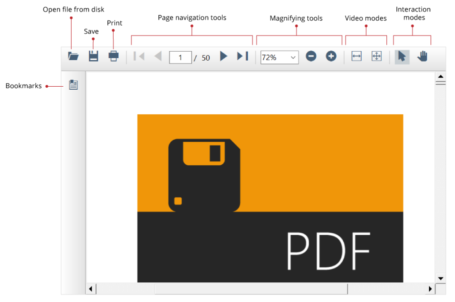

# Windows Forms PDF Viewer (PdfViewerControl) Overview

The [WinForms PDF Viewer](https://www.syncfusion.com/winforms-ui-controls/pdf-viewer) control supports viewing and printing PDF files in WinForms applications. The hyperlink and table of contents support provides easy navigation within and outside the PDF files.

## Key features

* **Open PDF files**: Open and display PDF files, both normal and protected, with AES and RC4 encryption algorithms (password protected). Open PDF files from stream, file path, and PdfLoadedDocument objects.
* **Instant loading**: Loads PDF files with thousands of pages instantly.
* **Less runtime memory**: On-demand loading and virtualization mean the control holds only the minimum required pages at runtime to reduce memory consumption.
* **Virtualized pages**: Render pages on demand to help reduce initial load time when working with large documents.
* **Printing**: Supports both the silent printing as well as printing using the print dialog.
* **Select and copy text**: Allows you to select and copy text from the PDF files.
* **Search text**: Allows you to locate a word or phrase easily in a PDF file.
* **Navigations**: Supports many types of internal and external navigations such as bookmarks, hyperlinks, and table of contents navigations.
* **Exporting**: Supports exporting the PDF pages to image and exporting form data.
* **Customization**: Supports various built-in themes and allows user to create a custom toolbar with all the options that can be performed using the built-in toolbar.
* **Localization**: Supports localization for all the static text used in the PDF Viewer.
* **Right to left (RTL)**: Supports RTL direction rendering for users working in right-to-left languages.

N> You can also explore our [WinForms PDF Viewer example](https://github.com/syncfusion/winforms-demos/tree/master/pdfviewer) that shows you how to render and configure the PDF Viewer.