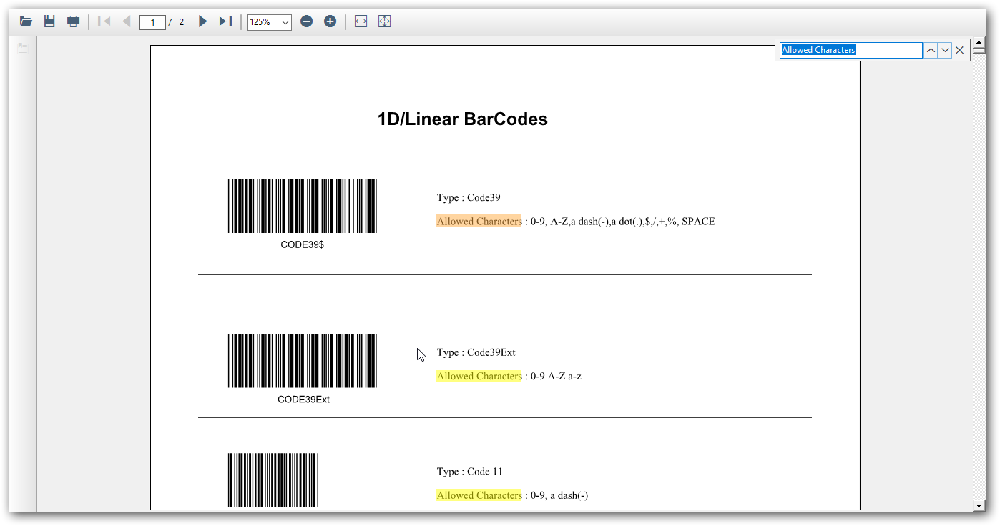

# Searching Text in Windows Forms PDF Viewer (PdfViewerControl)

The Essential `PdfViewerControl` allows users to search a given text in the PDF document. The search box will appear when `Ctrl+F` is pressed and searches the text in the PDF document as shown in the following figure.

## Search next instance of a text

PDF Viewer allows you to search and highlight next instances of a text in the PDF document. The following code snippet illustrates how to search the next instance of a term “time” in the PDF document using the `PdfViewerControl` with respect to the current highlighted instance.




PdfViewerControl pdfViewerControl = new PdfViewerControl();
pdfViewerControl.Load("Sample.pdf");

private void Next_Click(object sender, EventArgs e)
{
    // search next instance of a term "time"
    if (!string.IsNullOrEmpty("time"))
        pdfViewerControl.SearchNextText("time");
}




The following code snippet illustrates how to achieve the same using `PdfDocumentView`.




PdfDocumentView pdfDocumentView = new PdfDocumentView();
pdfDocumentView.Load("Sample.pdf");

private void Next_Click(object sender, EventArgs e)
{
    // search next instance of a term "time"
    if (!string.IsNullOrEmpty("time"))
        pdfDocumentView.SearchNextText ("time");
}




## Search previous instance of a text

PDF Viewer allows you to search and highlight previous instances of a text in the PDF document. The following code snippet illustrates how to search the previous instance of a term “time” in the PDF document using the `PdfViewerControl` with respect to the current highlighted instance.




PdfViewerControl pdfViewerControl = new PdfViewerControl();
pdfViewerControl.Load("Sample.pdf");

private void Previous_Click(object sender, EventArgs e)
{
    // search previous instance of a term "time"
    if (!string.IsNullOrEmpty("time"))
        pdfViewerControl.SearchPreviousText("time");
}




The following code snippet illustrates how to achieve the same using `PdfDocumentView`.




PdfDocumentView pdfDocumentView = new PdfDocumentView();
pdfDocumentView.Load("Sample.pdf");

private void Previous_Click(object sender, EventArgs e)
{
    // search previous instance of a term "time"
    if (!string.IsNullOrEmpty("time"))
        pdfDocumentView.SearchPreviousText("time");
}




## Enable or disable highlighting all the searched text instances

PDF Viewer allows you to enable or disable highlighting all the occurrences of the searched text instance in the PDF pages. 

The following code example illustrates how to disable highlighting all the searched text instance.




//Sets value to disable highlight all the occurrences of the searched text
pdfViewer.TextSearchSettings.HighlightAllInstance = false;





'Sets value to disable highlight all the occurrences of the searched text
pdfViewer.TextSearchSettings.HighlightAllInstance = false




N>
* By default, the PDF Viewer highlights all the occurrences of the searched text instance.

## Customize the highlight color of found text instances

PDF Viewer allows you to customize the color of the current searched text instance and all other occurrences. Refer to the following code example.




//Sets color to highlight current occurrence of the searched text
pdfViewer.TextSearchSettings.CurrentInstanceColor = Color.Red;
//Sets color to highlight all the occurrences of the searched text
pdfViewer.TextSearchSettings.OtherInstanceColor = Color.Yellow;





'Sets color to highlight current occurrence of the searched text
pdfViewer.TextSearchSettings.CurrentInstanceColor = Color.Red
'Sets color to highlight all the occurrences of the searched text
pdfViewer.TextSearchSettings.OtherInstanceColor = Color.Yellow




## Find all the instances of a text and its bounds

The `PdfViewerControl` also supports searching text in the PDF document using the [FindText](https://help.syncfusion.com/cr/windowsforms/Syncfusion.Windows.Forms.PdfViewer.PdfViewerControl.html#Syncfusion_Windows_Forms_PdfViewer_PdfViewerControl_FindText_System_String_System_Collections_Generic_Dictionary_System_Int32_System_Collections_Generic_List_System_Drawing_RectangleF____) method which returns true when the text given is found in the document. The dictionary contains the page indices and the list of rectangular coordinates of the text found in that page. The following code snippet illustrates how text search can be achieved in the `PdfViewerControl`.




bool IsMatchFound;

pdfViewerControl1.Load("Sample.pdf");
//Get the occurrences of the target text and location.
Dictionary<int, List<RectangleF>> 
textSearch = new Dictionary<int, List<RectangleF>>();
IsMatchFound = pdfViewerControl1.FindText("targetText", out textSearch);





Dim IsMatchFound As Boolean

pdfViewerControl1.Load("Sample.pdf")
'Get the occurrences of the target text and location.
Dim textSearch As New Dictionary(Of Integer, List(Of RectangleF))()
IsMatchFound = pdfViewerControl1.FindText("targetText", textSearch)




## Find the total number of instances of a text in the PDF document

PDF viewer allows you to find the total number of instances of a text in the PDF document using the [FindText](https://help.syncfusion.com/cr/windowsforms/Syncfusion.Windows.Forms.PdfViewer.PdfViewerControl.html#Syncfusion_Windows_Forms_PdfViewer_PdfViewerControl_FindText_System_String_System_Collections_Generic_Dictionary_System_Int32_System_Collections_Generic_List_System_Drawing_RectangleF____) method.

The following code snippet illustrates how to find the total number of instances of a term “time” present in the PDF document using `PdfViewerControl`.




PdfViewerControl pdfViewerControl = new PdfViewerControl();
pdfViewerControl.Load("Sample.pdf");

Dictionary<int, List<RectangleF>> matchedTextDetails = new Dictionary<int, List<RectangleF>>();
// total instances of a text
int totalInstances = 0;
pdfViewerControl.FindText("time", out matchedTextDetails);
foreach (KeyValuePair<int, List<RectangleF>> matchedText in matchedTextDetails)
{
    totalInstances += matchedText.Value.Count;
}




The following code snippet illustrates how to achieve the same using `PdfDocumentView`.




PdfDocumentView pdfDocumentView = new PdfDocumentView();
pdfDocumentView.Load("Sample.pdf");

Dictionary<int, List<RectangleF>> matchedTextDetails = new Dictionary<int, List<RectangleF>>();
// total occurrences of a text
int totalInstances = 0;
pdfDocumentView.FindText("time", out matchedTextDetails);
foreach (KeyValuePair<int, List<RectangleF>> matchedText in matchedTextDetails)
{
    totalInstances += matchedText.Value.Count;
}



