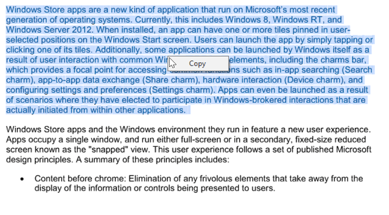

# Working with PdfViewerControl in Windows Forms PDF Viewer

Essential [WinForms PDF Viewer](https://www.syncfusion.com/winforms-ui-controls/pdf-viewer) can display and print PDF files and export the pages as raster images and meta files.

## Viewing PDF Files 

A PDF can be loaded into the WinForms PDF Viewer either through the open file button available in the toolbar or through the [Load](https://help.syncfusion.com/cr/windowsforms/Syncfusion.Windows.Forms.PdfViewer.PdfViewerControl.html#Syncfusion_Windows_Forms_PdfViewer_PdfViewerControl_Load_System_String_) method. It also requests passwords to open encrypted documents.




//Initialize PdfViewerControl.
PdfViewerControl pdfViewerControl1 = new PdfViewerControl();
//Load the PDF.
pdfViewerControl1.Load("Sample.pdf");





'Initialize PdfViewerControl.
Private pdfViewerControl1 As New PdfViewerControl()
'Load the PDF.
pdfViewerControl1.Load("Sample.pdf")




You can load an encrypted document by using the overload in the [Load](https://help.syncfusion.com/cr/windowsforms/Syncfusion.Windows.Forms.PdfViewer.PdfViewerControl.html#Syncfusion_Windows_Forms_PdfViewer_PdfViewerControl_Load_System_String_System_String_) method.




//Initialize PdfViewerControl.
PdfViewerControl pdfViewerControl1 = new PdfViewerControl();
//Load the PDF.
pdfViewerControl1.Load("Sample.pdf", "password");





'Initialize PdfViewerControl.
Private pdfViewerControl1 As New PdfViewerControl()
'Load the PDF.
pdfViewerControl1.Load("Sample.pdf", "password")




## Exporting PDF

### Exporting pages of PDF document as raster images

Essential PdfViewerControl allows selected pages to be exported as raster images. Exporting can be done using the [ExportAsImage](https://help.syncfusion.com/cr/windowsforms/Syncfusion.Windows.Forms.PdfViewer.PdfViewerControl.html#Syncfusion_Windows_Forms_PdfViewer_PdfViewerControl_ExportAsImage_System_Int32_) method. This option helps to convert a PDF into an image.




Bitmap image = pdfViewerControl1.ExportAsImage(0);
// Save the image.
image.Save("Sample.png", ImageFormat.Png);





Dim image As Bitmap = pdfViewerControl1.ExportAsImage(0)
'Save the image.
image.Save("Sample.png", ImageFormat.Png)




You can also specify the page range instead of converting each page.




Bitmap[] image = pdfViewerControl1.ExportAsImage(0, 3);





Dim image() As Bitmap = pdfViewerControl1.ExportAsImage(0, 3)




### Exporting pages of PDF document as Vector Images

Exporting pages of PDF document as vector images can be done using the [ExportAsMetafile](https://help.syncfusion.com/cr/windowsforms/Syncfusion.Windows.Forms.PdfViewer.PdfViewerControl.html#Syncfusion_Windows_Forms_PdfViewer_PdfViewerControl_ExportAsMetafile_System_Int32_) method. The following code sample demonstrates how a PDF document can be exported as a Metafile.




Metafile image = pdfViewerControl1.ExportAsMetafile(0);
// Save the image
image.Save("Sample.emf", ImageFormat.Emf);





Dim image As Metafile = pdfViewerControl1.ExportAsMetafile(0)
' Save the image
image.Save("Sample.emf", ImageFormat.Emf)




You can also specify the page range instead of converting each page individually.




Metafile[] image = pdfViewerControl1.ExportAsMetafile(0, 3);





Dim image() As Metafile = pdfViewerControl1.ExportAsMetafile(0, 3)




## Text selection

In PDF, text can be selected by clicking the mouse left button and dragging the mouse pointer over the text. 

### Detecting the completion of text selection

When the text selection is completed, the `TextSelectionCompleted` event will be raised. The selected text can be retrieved as string from the `args` parameter of the event handler. 




private void PdfViewer_TextSelectionCompleted(object sender, TextSelectionCompletedEventArgs args)
{
    //Get the whole selected text
    string selectedText = args.SelectedText;
    //Get the selected text and its rectangular bounds for each page separately if the selection is made on multiple pages
    Dictionary<int, Dictionary<string, Rectangle>> selectedTextInformation = args.SelectedTextInformation;
}




### Copying the selected text

The selected text can be copied by clicking Copy from the context menu, which appears when clicking right mouse button after the text is selected.

The selected text can also be copied using the keyboard shortcut `Ctrl + C`.