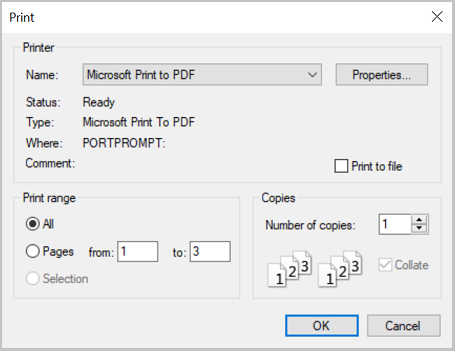

# Printing PDF Files in Windows Forms PDF Viewer (PdfViewerControl)

[WinForms Pdf Viewer](https://www.syncfusion.com/winforms-ui-controls/pdf-viewer) Control allows printing loaded PDFs using the Print button in the toolbar. The following Print dialog will be opened upon clicking the Print button.

## Silent Printing

The [Print](https://help.syncfusion.com/cr/windowsforms/Syncfusion.Windows.Forms.PdfViewer.PdfViewerControl.html#Syncfusion_Windows_Forms_PdfViewer_PdfViewerControl_Print_System_Boolean_) method of [PdfViewerControl](https://help.syncfusion.com/cr/windowsforms/Syncfusion.Windows.Forms.PdfViewer.PdfViewerControl.html) and [PdfDocumentView](https://help.syncfusion.com/cr/windowsforms/Syncfusion.Windows.Forms.PdfViewer.PdfDocumentView.html) allows you to print PDF files silently to the system’s default printer, without any user interaction. You can enable the preferred settings for silent printing using the [PrinterSettings](https://help.syncfusion.com/cr/windowsforms/Syncfusion.Windows.Forms.PdfViewer.PdfViewerControl.html#Syncfusion_Windows_Forms_PdfViewer_PdfViewerControl_PrinterSettings) property. The following code example shows how to perform silent printing in WinForms PDF Viewer.




pdfviewer1.Print(false);





pdfviewer1.Print(False)




## Customizing print size

PdfViewerControl printer settings allows scaling PDF pages to shrink or enlarge while printing.

### Actual Size

Actual size is the default value of print size option in printer settings. This prints the loaded PDF document without any scaling factors. The pages that do not fit on the paper will be cropped. The following code example illustrates how to print the document in Actual Size.




// Prints the document in actual size.

pdfViewerControl1.PrinterSettings.PageSize = PdfViewerPrintSize.ActualSize;





' Prints the document in actual size.

pdfViewerControl1.PrinterSettings.PageSize = PdfViewerPrintSize.ActualSize




### Fit

Fit option enlarges or reduces each page to fit the printable area of the selected paper size. The following code example illustrates the same.




// Prints the document in fit size.

pdfViewerControl1.PrinterSettings.PageSize = PdfViewerPrintSize.Fit;





' Prints the document in fit size.

pdfViewerControl1.PrinterSettings.PageSize = PdfViewerPrintSize.Fit




### Custom Scale

Custom Scale option resizes the page with the specified scale percentage. The following code example illustrates the same.




// Prints the document with custom scaling.

pdfViewerControl1.PrinterSettings.PageSize = PdfViewerPrintSize.CustomScale;

// Scale percentage with the page to be resized and it is applicable only for Custom Scale. The default value is 100.

pdfViewerControl1.PrinterSettings.ScalePercentage = 120;





' Prints the document with custom scaling.

pdfViewerControl1.PrinterSettings.PageSize = PdfViewerPrintSize.CustomScale

' Scale percentage with the page to be resized and it is applicable only for Custom Scale. The default value is 100.

pdfViewerControl1.PrinterSettings.ScalePercentage = 120




## Printing PDF document with orientation settings

PdfViewerControl printer settings allows the user to print the document with a custom orientation.

### Auto Portrait/Landscape

Auto Portrait/Landscape is the default option and it automatically selects the best orientation (Portrait or Landscape) based on the content and selected paper. The following code example illustrates how to print the document in Auto orientation.




// Prints the document in auto orientation.

pdfViewerControl1.PrinterSettings.PageOrientation = PdfViewerPrintOrientation.Auto;





' Prints the document in auto orientation.

pdfViewerControl1.PrinterSettings.PageOrientation = PdfViewerPrintOrientation.Auto




### Portrait

Portrait option prints the PDF document in portrait orientation and it overrides the orientation settings provided in the print dialog. The following code example illustrates the same.




// Prints the document in portrait orientation.

pdfViewerControl1.PrinterSettings.PageOrientation = PdfViewerPrintOrientation.Portrait;





' Prints the document in portrait orientation.

pdfViewerControl1.PrinterSettings.PageOrientation = PdfViewerPrintOrientation.Portrait




### Landscape

Landscape option prints the PDF document in landscape orientation and it overrides the orientation settings provided in print dialog. The following code example illustrates the same.




// Prints the document in landscape orientation.

pdfViewerControl1.PrinterSettings.PageOrientation = PdfViewerPrintOrientation.Landscape;





' Prints the document in landscape orientation.

pdfViewerControl1.PrinterSettings.PageOrientation = PdfViewerPrintOrientation.Landscape




## Events

The [PdfViewerControl](https://help.syncfusion.com/cr/windowsforms/Syncfusion.Windows.Forms.PdfViewer.PdfViewerControl.html) notifies you at the start, progress, and end of the printing through events such as [BeginPrint](https://help.syncfusion.com/cr/windowsforms/Syncfusion.Windows.Forms.PdfViewer.PdfViewerControl.html), [PrintProgress](https://help.syncfusion.com/cr/windowsforms/Syncfusion.Windows.Forms.PdfViewer.PdfViewerControl.html), and [EndPrint](https://help.syncfusion.com/cr/windowsforms/Syncfusion.Windows.Forms.PdfViewer.PdfViewerControl.html) respectively.

### Before Print

The [BeginPrint](https://help.syncfusion.com/cr/windowsforms/Syncfusion.Windows.Forms.PdfViewer.PdfViewerControl.html) event occurs when the print is called and before the first page of the document prints. The following code shows how to wire the event in [PdfViewerControl](https://help.syncfusion.com/cr/windowsforms/Syncfusion.Windows.Forms.PdfViewer.PdfViewerControl.html).




using System.Windows.Forms;
using Syncfusion.Windows.Forms.PdfViewer;

namespace PrintEventsDemo
{
    public partial class Form1 : Form
    {
        #region Constructor
        public Form1()
        {
            InitializeComponent();

            //Wire the `BeginPrint` event,
            pdfViewerControl1.BeginPrint += PdfViewerControl1_BeginPrint;

            //Load the PDF file.
            pdfViewerControl1.Load("../../Data/HTTP Succinctly.pdf");

            //Print the file silently to the default printer. 
            pdfViewerControl1.Print(true);
        }
        #endregion

        #region Events
        private void PdfViewerControl1_BeginPrint(object sender, BeginPrintEventArgs e)
        {
            //Insert your code here
        }
        # endregion
    }
}




### Print Progress

The [PrintProgress](https://help.syncfusion.com/cr/windowsforms/Syncfusion.Windows.Forms.PdfViewer.PdfViewerControl.html) event occurs to provide information on how much printing content was submitted to the printing subsystem. It provides the page information through the [PrintProgressEventArgs](https://help.syncfusion.com/cr/windowsforms/Syncfusion.Windows.Forms.PdfViewer.PrintProgressEventArgs.html). The following code shows how to wire the event in [PdfViewerControl](https://help.syncfusion.com/cr/windowsforms/Syncfusion.Windows.Forms.PdfViewer.PdfViewerControl.html).




using System.Windows.Forms;
using Syncfusion.Windows.Forms.PdfViewer;

namespace PrintEventsDemo
{
    public partial class Form1 : Form
    {
        #region Constructor
        public Form1()
        {
            InitializeComponent();

            //Wire the `PrintProgress` event,
            pdfViewerControl1.PrintProgress += PdfViewerControl1_PrintProgress;

            //Load the PDF file.
            pdfViewerControl1.Load("../../Data/HTTP Succinctly.pdf");

            //Print the file silently to the default printer. 
            pdfViewerControl1.Print(true);
        }
        #endregion

        #region Events
        private void PdfViewerControl1_PrintProgress(object sender, PrintProgressEventArgs e)
        {
            //Find the page number which is currently printing.
            int currentPage = e.PageIndex;

            //Find the total number of pages present in the file.
            int pageCount = e.PageCount;
           
            //Insert your code here
        }
        # endregion
    }
}




### After Print

The [EndPrint](https://help.syncfusion.com/cr/windowsforms/Syncfusion.Windows.Forms.PdfViewer.PdfViewerControl.html) event occurs when the last page of the document has printed. It also occurs if the printing process is canceled or an exception occurs during the printing process. The following code shows how to wire the event in [PdfViewerControl](https://help.syncfusion.com/cr/windowsforms/Syncfusion.Windows.Forms.PdfViewer.PdfViewerControl.html).




using System.Windows.Forms;
using Syncfusion.Windows.Forms.PdfViewer;

namespace PrintEventsDemo
{
    public partial class Form1 : Form
    {
        #region Constructor
        public Form1()
        {
            InitializeComponent();

            //Wire the `EndPrint` event,
            pdfViewerControl1.EndPrint += PdfViewerControl1_EndPrint;

            //Load the PDF file.
            pdfViewerControl1.Load("../../Data/HTTP Succinctly.pdf");

            //Print the file silently to the default printer. 
            pdfViewerControl1.Print(true);
        }
        #endregion

        #region Events
        private void PdfViewerControl1_EndPrint(object sender, EndPrintEventArgs e)
        {
            //Insert your code here
        }
        # endregion
    }
}




N> The complete sample project of the Print Events is available in the [GitHub](https://github.com/SyncfusionExamples/WinForms-PDFViewer-Examples/tree/master/Printing/PrintEventsDemo).
