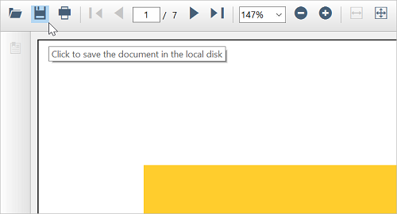

# Saving PDF Files in Windows Forms PDF Viewer (PdfViewerControl)

The Save feature in the [PdfViewerControl](https://help.syncfusion.com/cr/windowsforms/Syncfusion.Windows.Forms.PdfViewer.PdfViewerControl.html) helps you to keep the file up to date with any modifications and prevent your work from being lost by allowing you to save the file in the local disk.

Save can be performed using the following steps.

1.	Open a PDF file in the [PdfViewerControl](https://help.syncfusion.com/cr/windowsforms/Syncfusion.Windows.Forms.PdfViewer.PdfViewerControl.html) and do any modifications to the file.
2.	Click the "Save As" icon on the toolbar as shown in the above picture.
3.	In the save dialog box, enter a name, and select "Save".

## Programmatically Save the Loaded PDF Document

WinForms PDFViewer allows a user to save the loaded PDF file to a specific location using the PDF Viewer [LoadedDocument](https://help.syncfusion.com/cr/windowsforms/Syncfusion.Windows.Forms.PdfViewer.PdfViewerControl.html#Syncfusion_Windows_Forms_PdfViewer_PdfViewerControl_LoadedDocument) object. Refer to the following code sample.  



//Save the loaded document using the LoadedDocument object.  
pdfViewerControl1.LoadedDocument.Save("../../Data/SavedFile.pdf");  



## Events

The [PdfViewerControl](https://help.syncfusion.com/cr/windowsforms/Syncfusion.Windows.Forms.PdfViewer.PdfViewerControl.html) notifies you at the start and end of the save operation through the [BeginSave](https://help.syncfusion.com/cr/windowsforms/Syncfusion.Windows.Forms.PdfViewer.PdfViewerControl.html) and [EndSave](https://help.syncfusion.com/cr/windowsforms/Syncfusion.Windows.Forms.PdfViewer.PdfViewerControl.html) events respectively.

### Before Save

The [BeginSave](https://help.syncfusion.com/cr/windowsforms/Syncfusion.Windows.Forms.PdfViewer.PdfViewerControl.html) event occurs before initiating the save operation of the PDF file. It also allows you to cancel the save operation through the [Cancel](https://help.syncfusion.com/cr/windowsforms/Syncfusion.Windows.Forms.PdfViewer.BeginSaveEventArgs.html#Syncfusion_Windows_Forms_PdfViewer_BeginSaveEventArgs_Cancel) property of [BeginSaveEventArgs](https://help.syncfusion.com/cr/windowsforms/Syncfusion.Windows.Forms.PdfViewer.BeginSaveEventArgs.html). The following code shows how to wire the event in the [PdfViewerControl](https://help.syncfusion.com/cr/windowsforms/Syncfusion.Windows.Forms.PdfViewer.PdfViewerControl.html).



using System.Windows.Forms;
using Syncfusion.Windows.Forms.PdfViewer;

namespace SaveEventsDemo
{
    public partial class Form1 : Form
    {
        #region Constructor
        public Form1()
        {
            InitializeComponent();
            //Wire the `BeginSave` event.
            pdfViewerControl1.BeginSave += PdfViewerControl1_BeginSave;
            //Load the PDF file.
            pdfViewerControl1.Load("../../Data/HTTP Succinctly.pdf");
        }
        #endregion

        #region Events
        private void PdfViewerControl1_BeginSave(object sender, BeginSaveEventArgs e)
        {
            //Insert your code here    
        }
        # endregion
    }
}



### After Save

The [EndSave]([EndSave](https://help.syncfusion.com/cr/windowsforms/Syncfusion.Windows.Forms.PdfViewer.PdfViewerControl.html)) event occurs after the completion of the save operation. The following code shows how to wire the event in the [PdfViewerControl]([PdfViewerControl](https://help.syncfusion.com/cr/windowsforms/Syncfusion.Windows.Forms.PdfViewer.PdfViewerControl.html)).



using System.Windows.Forms;
using Syncfusion.Windows.Forms.PdfViewer;

namespace SaveEventsDemo
{
    public partial class Form1 : Form
    {
        #region Constructor
        public Form1()
        {
            InitializeComponent();
            //Wire the `EndSave` event.
            pdfViewerControl1.EndSave += PdfViewerControl1_EndSave;
            //Load the PDF file.
            pdfViewerControl1.Load("../../Data/HTTP Succinctly.pdf");
        }
        #endregion

        #region Events
        private void PdfViewerControl1_EndSave(object sender, EndSaveEventArgs e)
        {
            //Insert your code here
        }
        # endregion
    }
}



N> The complete sample project of the Save Events is available in the [GitHub](https://github.com/SyncfusionExamples/WinForms-PDFViewer-Examples/tree/master/Save/SaveEventsDemo).
