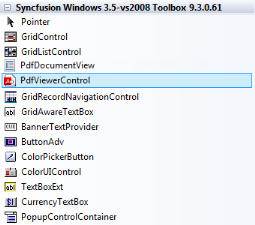
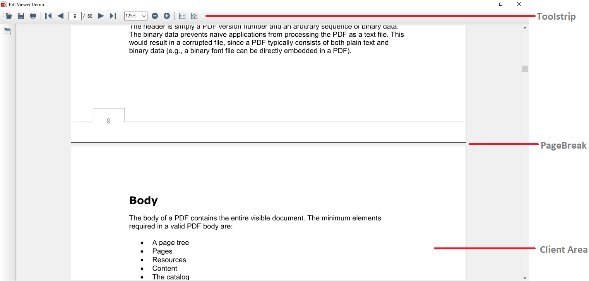

# Getting Started

## Adding PdfViewerControl to an Application

### Adding in designer

1. Open your form in the designer. Add the Syncfusion controls to your .NET toolbox in Visual Studio if you haven't done so already (the install would have automatically done this unless you selected not to complete toolbox integration during installation).
   
   

2. Drag the PdfViewerControl from the toolbox onto the form.

   Appearance and behavior related aspects of the PdfViewerControl can be controlled by setting the appropriate properties through the properties grid. 

   
   

3. This will add the instance 'pdfViewerControl1' to the Designer cs file. The PDF can be loaded in the Form cs file using the [Load](https://help.syncfusion.com/cr/cref_files/windowsforms/pdf%20viewer/Syncfusion.PdfViewer.Windows~Syncfusion.Windows.Forms.PdfViewer.PdfViewerControl~Load(String).html) method. 




//Loading the document in the PdfViewerControl
pdfViewerControl1.Load(@"c:/documents/myPDF.pdf");




'Loading the document in the PdfViewerControl
pdfViewerControl1.Load("c:/documents/myPDF.pdf")



	
###Adding manually in code

1. Add Syncfusion.Windows.Forms.PdfViewer namespace.




using Syncfusion.Windows.Forms.PdfViewer;




Imports Syncfusion.Windows.Forms.PdfViewer



		
		
2. Create PdfViewerControl instance and load the PDF




//Initializing the PdfViewerControl
PdfViewer viewer = new PdfViewer();

//Loading the document in the PdfViewerControl
viewer.Load(@"c:/documents/myPDF.pdf");

//Add PdfViewerControl to the Form
Controls.Add(viewer);




'Initializing the PdfViewerControl
Dim viewer As PdfViewer = New PdfViewer()

'Loading the document in the PdfViewerControl
viewer.Load("c:/documents/myPDF.pdf")

'Add PdfViewerControl to the Form
Controls.Add(viewer)



   
   Refer to [Viewing PDF files](/windowsforms/pdfviewer/working-with-pdf-viewer#viewing-pdf-files) for more information.

## Appearance and Structure of the Control

The following screenshot depicts different sections of the PdfViewerControl.

### Toolbar

1. Open file
2. Bookmark 
3. Save document
4. Print PDF
5. Go to first page
6. Go to previous page
7. Page indicator
8. Go to next page
9. Go to last page
10. Preset magnification
11. Decrease magnification
12. Increase magnification
13. Fill window
14. Fit page to window
