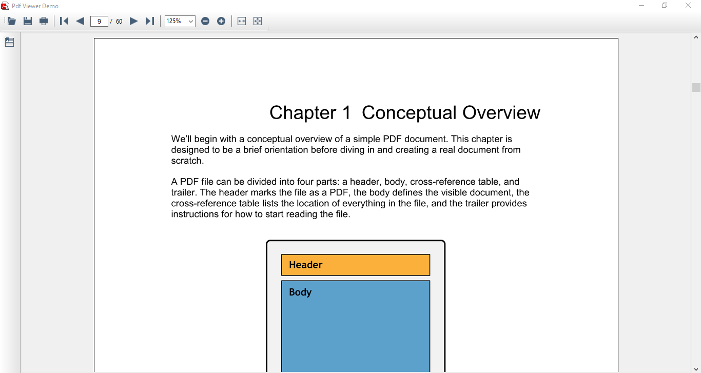

# Overview

## Introduction to PDF Viewer

Essential PDF Viewer for .NET is a 100% managed .NET component that will have the ability to view and print PDF files from your .NET applications.  

## Use Case Scenario

The user can embed the PDF viewer within the .NET application using this feature. The PDF viewer can also be used as a stand-alone application.

## Prerequisites and Compatibility

This section covers the requirements that are mandatory for using Syncfusion Essential PDF Viewer. It also lists operating systems and browsers that are compatible with the product.

Prerequisites

<table>
<tr>
<td>
 Development Environments</td><td>
* Visual Studio 2010 (Ultimate, Premium, Professional and Express)* Visual Studio 2008 (Team System, Professional, Standard & Express)* Visual Studio 2005 (Professional, Standard & Express)* Microsoft Expression Blend </td></tr>
<tr>
<td>
.NET Framework versions</td><td>
* .NET Framework version 3.5 with Service Pack 1*  .NET Framework version 4.0* .NET Framework version 2.0</td></tr>
</table>

Compatibility

<table>
<tr>
<td>
 Operating Systems</td><td>
* Windows Server 2008 (32 bit and 64 bit)* Windows Vista (32 bit and 64 bit)* Windows XP* Windows 2003* Windows 7</td></tr>
</table>

## Documentation

<table>
<tr>
<td>
{{ '**Type of Documentation**' | markdownify }}</td><td>
{{ '**Location**' | markdownify }}</td></tr>
<tr>
<td>
Readme</td><td>
Readme: [drive:]\Program Files\Syncfusion\Essential Studio\x.x.x.x\Infrastructure\Read Me\Reporting_Windows.html</td></tr>
<tr>
<td>
Release Notes</td><td>
ReleaseNotes: [drive:]\Program Files\Syncfusion\Essential Studio\x.x.x.x\Infrastructure\Release Notes\Reporting.html# Windows-PdfViewer</td></tr>
<tr>
<td>
User Guide (this document)</td><td>
Online{{ '<http://docs.syncfusion.com>' | markdownify }} (Navigate to the PDF Viewer for Windows Forms User Guide.)> 

{{ '_Note: Click Download as PDF to access a PDF version._' | markdownify }}Installed DocumentationDashboard -> Documentation -> Installed Documentation. </td></tr>
<tr>
<td>
Class Reference</td><td>
Online{{ '<http://docs.syncfusion.com>' | markdownify }}cr (Navigate to the Windows Forms User Guide. Select {{ '_PDF Viewer_' | markdownify }}, and then click the Class Reference link found in the upper right section of the page.)Installed DocumentationDashboard -> Documentation -> Installed Documentation.</td></tr>
</table>

