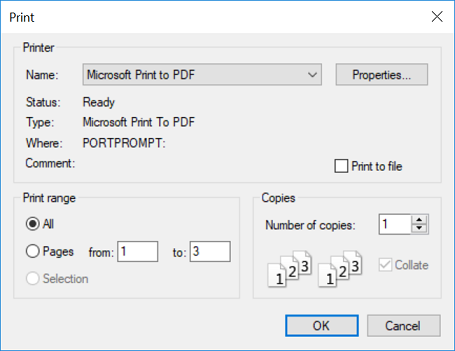
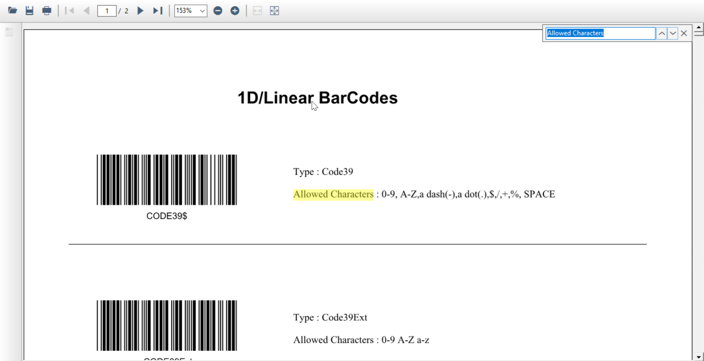

# Working with PdfViewerControl

Essential PdfViewerControl can display and print PDF files and export the pages as raster images and meta files.

## Properties, Methods, and Events Tables

### Properties

<table>
<tr>
<th>
Property</th><th>
Description</th><th>
Type</th><th>
Data Type</th></tr>
<tr>
<td>
EnableNotificationBar</td><td>
Enables the display of the Notification bar on setting it to true.</td><td>
N/A</td><td>
bool</td></tr>
<tr>
<td>
PageCount </td><td>
Returns the number of pages as viewed in the PdfViewerControl.</td><td>
N/A</td><td>
Integer</td></tr>
<tr>
<td>
ShowToolbar</td><td>
Displays the document toolbar when set to true.</td><td>
N/A</td><td>
bool</td></tr>
</table>

### Methods

<table>
<tr>
<th>
Method</th><th>
Description</th><th>
Parameters</th><th>
Type</th><th>
Return Type</th></tr>
<tr>
<td>
Load</td><td>
loads the PDF to the viewer.</td><td>
Overloads: (string filePath) (string filePath, string password)(PdfLoadedDocument doc)(Stream file)</td><td>
N/A </td><td>
Void </td></tr>
<tr>
<td>
Unload</td><td>
Unloads the loaded PDF.</td><td>
-</td><td>
N/A</td><td>
Void</td></tr>
<tr>
<td>
Dispose</td><td>
Unloads the document and releases the resources used by the component.</td><td>
-</td><td>
N/A</td><td>
Void</td></tr>
<tr>
<td>
ExportAsImage</td><td>
Converts the page to a raster image.</td><td>
Overloads:(int pageIndex)(int startIndex, int endIndex)</td><td>
N/A</td><td>
Bitmap</td></tr>
<tr>
<td>
FindText</td><td>
Searches for the occurrence of given input text in the PDF document and returns all the occurrences and its location in all pages of the PDF document.</td><td>
Overloads:(string text, out Dictionary<int, List &lt;System.Drawing.RectangleF&gt;> matchTextPosition)</td><td>
N/A</td><td>
bool</td></tr>
<tr>
<td>
GoToPageAtIndex</td><td>
Navigates to the specified page</td><td>
(int index)</td><td>
N/A</td><td>
Void</td></tr>
<tr>
<td>
ZoomTo</td><td>
Magnifies the document displayed to the specified percentage.</td><td>
(int percentage)</td><td>
N/A</td><td>
Void</td></tr>
</table>

### Events

<table>
<tr>
<th>
Event</th><th>
Description</th><th>
Event</th><th>
Type</th></tr>
<tr>
<td>
DocumentLoaded</td><td>
triggered after the PDF is successfully loaded.</td><td>
N/A</td><td>
N/A</td></tr>
<tr>
<td>
HyperLinkMouseHover</td><td>
triggered when the mouse pointer is placed over the URL.</td><td>
N/A</td><td>
N/A</td></tr>
<tr>
<td>
HyperLinkMouseClicked</td><td>
triggered when the URL in the PDF document is clicked.</td><td>
N/A</td><td>
N/A</td></tr>
</table>

## Viewing PDF Files 

A PDF can be loaded into the PdfViewerControl either through the open file button available in the toolbar or through the [Load](https://help.syncfusion.com/cr/cref_files/windowsforms/pdf%20viewer/Syncfusion.PdfViewer.Windows~Syncfusion.Windows.Forms.PdfViewer.PdfViewerControl~Load(String).html) method. It also requests passwords to open encrypted documents.




//Initialize PdfViewerControl.

PdfViewerControl pdfViewer1 = new PdfViewerControl();

//Load the PDF.

pdfViewer1.Load("Template.pdf");





'Initialize PdfViewerControl.

Private pdfViewer1 As New PdfViewerControl()

'Load the PDF.

pdfViewer1.Load("Template.pdf")




You can load an encrypted document by using the overload in the [Load](https://help.syncfusion.com/cr/cref_files/windowsforms/pdf%20viewer/Syncfusion.PdfViewer.Windows~Syncfusion.Windows.Forms.PdfViewer.PdfViewerControl~Load(String,String).html) method.




//Initialize PdfViewerControl.

PdfViewerControl pdfViewer1 = new PdfViewerControl();

//Load the PDF.

pdfViewer1.Load("Template.pdf", "password");





'Initialize PdfViewerControl.

Private pdfViewer1 As New PdfViewerControl()

'Load the PDF.

pdfViewer1.Load("Template.pdf", "password")




## Printing PDF Files 

PdfViewerControl allows printing loaded PDFs using the Print button in the toolbar. The following Print dialog will be opened upon clicking the Print button.

### Silent Printing

The [PrintDocument](https://help.syncfusion.com/cr/cref_files/windowsforms/pdf%20viewer/Syncfusion.PdfViewer.Windows~Syncfusion.Windows.Forms.PdfViewer.PdfViewerControl~PrintDocument.html) property of PdfViewerControl returns System.Drawing.Printing.PrintDocument that helps to complete printing using PrintDialog. The following code sample demonstrates this:




PrintDialog dialog = new PrintDialog();

dialog.AllowPrintToFile = true;         

dialog.Document = viewer.PrintDocument;

dialog.Document.Print();





Dim dialog As New PrintDialog()

dialog.AllowPrintToFile = True

dialog.Document = viewer.PrintDocument

dialog.Document.Print()




## Customizing print size

PdfViewerControl printer settings allows scaling PDF pages to shrink or enlarge while printing.

### Actual Size

Actual size is the default value of print size option in printer settings. This prints the loaded PDF document without any scaling factors. The pages that do not fit on the paper will be cropped. The following code example illustrates how to print the document in Actual Size.




// Prints the document in actual size.

pdfviewer1.PrinterSettings.PageSize = PdfViewerPrintSize.ActualSize;





' Prints the document in actual size.

pdfviewer1.PrinterSettings.PageSize = PdfViewerPrintSize.ActualSize




### Fit

Fit option enlarges or reduces each page to fit the printable area of the selected paper size. The following code example illustrates the same.




// Prints the document in fit size.

pdfviewer1.PrinterSettings.PageSize = PdfViewerPrintSize.Fit;





' Prints the document in fit size.

pdfviewer1.PrinterSettings.PageSize = PdfViewerPrintSize.Fit




### Custom Scale

Custom Scale option resizes the page with the specified scale percentage. The following code example illustrates the same.




// Prints the document with custom scaling.

pdfviewer1.PrinterSettings.PageSize = PdfViewerPrintSize.CustomScale;

// Scale percentage with the page to be resized and it is applicable only for Custom Scale. The default value is 100.

pdfviewer1.PrinterSettings.ScalePercentage = 120;





' Prints the document with custom scaling.

pdfviewer1.PrinterSettings.PageSize = PdfViewerPrintSize.CustomScale

' Scale percentage with the page to be resized and it is applicable only for Custom Scale. The default value is 100.

pdfviewer1.PrinterSettings.ScalePercentage = 120




## Printing PDF document with orientation settings

PdfViewerControl printer settings allows the user to print the document with a custom orientation.

### Auto Portrait/Landscape

Auto Portrait/Landscape is the default option and it automatically selects the best orientation (Portrait or Landscape) based on the content and selected paper. The following code example illustrates how to print the document in Auto orientation.




// Prints the document in auto orientation.

pdfviewer1.PrinterSettings.PageOrientation = PdfViewerPrintOrientation.Auto;





' Prints the document in auto orientation.

pdfviewer1.PrinterSettings.PageOrientation = PdfViewerPrintOrientation.Auto




### Portrait

Portrait option prints the PDF document in portrait orientation and it overrides the orientation settings provided in the print dialog. The following code example illustrates the same.




// Prints the document in portrait orientation.

pdfviewer1.PrinterSettings.PageOrientation = PdfViewerPrintOrientation.Portrait;





' Prints the document in portrait orientation.

pdfviewer1.PrinterSettings.PageOrientation = PdfViewerPrintOrientation.Portrait




### Landscape

Landscape option prints the PDF document in landscape orientation and it overrides the orientation settings provided in print dialog. The following code example illustrates the same.




// Prints the document in landscape orientation.

pdfviewer1.PrinterSettings.PageOrientation = PdfViewerPrintOrientation.Landscape;





' Prints the document in landscape orientation.

pdfviewer1.PrinterSettings.PageOrientation = PdfViewerPrintOrientation.Landscape




## Exporting PDF

### Exporting pages of PDF document as raster images

Essential PdfViewerControl allows selected pages to be exported as raster images. Exporting can be done using the [ExportAsImage](https://help.syncfusion.com/cr/cref_files/windowsforms/pdf%20viewer/Syncfusion.PdfViewer.Windows~Syncfusion.Windows.Forms.PdfViewer.PdfViewerControl~ExportAsImage(Int32).html) method. This option helps to convert a PDF into an image.




Bitmap image = pdfViewer1.ExportAsImage(0);

// Save the image.

image.Save("Sample.png", ImageFormat.Png);





Dim image As Bitmap = pdfViewer1.ExportAsImage(0)

'Save the image.

image.Save("Sample.png", ImageFormat.Png)




You can also specify the page range instead of converting each page.




Bitmap[] image = pdfViewer1.ExportAsImage(0, 3);





Dim image() As Bitmap = pdfViewer1.ExportAsImage(0, 3)




###Exporting pages of PDF document as Vector Images

Exporting pages of PDF document as vector images can be done using the [ExportAsMetafile](https://help.syncfusion.com/cr/cref_files/windowsforms/pdf%20viewer/Syncfusion.PdfViewer.Windows~Syncfusion.Windows.Forms.PdfViewer.PdfViewerControl~ExportAsMetafile(Int32).html) method. The following code sample demonstrates how a PDF document can be exported as a Metafile.




Metafile image = pdfViewer1.ExportAsMetafile(0);

// Save the image

image.Save("Sample.emf", ImageFormat.Emf);





Dim image As Metafile = pdfViewer1.ExportAsMetafile(0)

' Save the image

image.Save("Sample.emf", ImageFormat.Emf)




You can also specify the page range instead of converting each page individually.




Metafile[] image = pdfViewer1.ExportAsMetafile(0, 3);





Dim image() As Metafile = pdfViewer1.ExportAsMetafile(0, 3)




## Text Search

Essential PdfViewerControl allows end users to search a given text in the PDF document. The search box will appear when Ctrl+F is pressed and searches the text in the PDF document as shown in the following figure.

The PdfViewerControl control also supports searching text in the PDF document with the help of the [FindText](https://help.syncfusion.com/cr/cref_files/windowsforms/pdf%20viewer/Syncfusion.PdfViewer.Windows~Syncfusion.Windows.Forms.PdfViewer.PdfViewerControl~FindText.html) method which returns true when the text given is found in the document. The dictionary contains the page indices and the list of rectangular coordinates of the text found in that page. The following code snippet illustrates how text search can be achieved in the PdfViewerControl control.




bool IsMatchFound;

pdfViewerControl1.Load("../../Data/Barcode.pdf");

//Get the occurrences of the target text and location.

Dictionary<int, List<RectangleF>> 

textSearch = new Dictionary<int, List<RectangleF>>();

IsMatchFound = pdfViewerControl1.FindText("targetText", out textSearch);





Dim IsMatchFound As Boolean

pdfViewerControl1.Load("../../Data/Barcode.pdf")

'Get the occurrences of the target text and location.

Dim textSearch As New Dictionary(Of Integer, List(Of RectangleF))()

IsMatchFound = pdfViewerControl1.FindText("targetText", textSearch)




## Annotations
 
Essential PdfViewerControl provides support for URI annotations in the PDF document, which enables the URI available in the PDF document to be opened in the browser just by clicking it. This also supports a few events which are listed in the events table.

