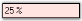
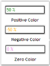

# Appearance Settings in Windows Forms Percent TextBox

## Background settings

The Background settings of the PercentTextBox control are discussed below.

### Background color

The background color of the control can be set using the properties given below.

* [BackColor](https://help.syncfusion.com/cr/windowsforms/Syncfusion.Windows.Forms.Tools.NumberTextBoxBase.html#Syncfusion_Windows_Forms_Tools_NumberTextBoxBase_BackGroundColor)
* [ReadOnlyBackColor](https://help.syncfusion.com/cr/windowsforms/Syncfusion.Windows.Forms.Tools.NumberTextBoxBase.html#Syncfusion_Windows_Forms_Tools_NumberTextBoxBase_ReadOnlyBackColor)



this.percentTextBox1.BackColor = System.Drawing.Color.LightCyan;
this.percentTextBox1.ReadOnly = true;
this.percentTextBox1.ReadOnlyBackColor = System.Drawing.Color.Pink;


Me.percentTextBox1.BackColor = System.Drawing.Color.LightCyan
Me.percentTextBox1.ReadOnly = True
Me.percentTextBox1.ReadOnlyBackColor = System.Drawing.Color.Pink



N> The [ReadOnly](https://learn.microsoft.com/en-us/dotnet/api/system.windows.forms.textboxbase.readonly?redirectedfrom=MSDN&view=netframework-4.7.2#System_Windows_Forms_TextBoxBase_ReadOnly) property must be set to 'True' for the above setting to take effect.

The methods associated with the above properties are given below.

* [ResetBackColor](https://help.syncfusion.com/cr/windowsforms/Syncfusion.Windows.Forms.Tools.NumberTextBoxBase.html#Syncfusion_Windows_Forms_Tools_NumberTextBoxBase_ResetControlBackColor)
* ResetReadOnlyBackColor

## Foreground settings

The Foreground settings of the PercentTextBox control are discussed below.

### Foreground color

The foreground color of the control can be set using the properties given below.

* [PositiveColor](https://help.syncfusion.com/cr/windowsforms/Syncfusion.Windows.Forms.Tools.NumberTextBoxBase.html#Syncfusion_Windows_Forms_Tools_NumberTextBoxBase_PositiveColor)
* [NegativeColor](https://help.syncfusion.com/cr/windowsforms/Syncfusion.Windows.Forms.Tools.NumberTextBoxBase.html#Syncfusion_Windows_Forms_Tools_NumberTextBoxBase_NegativeColor)
* [ZeroColor](https://help.syncfusion.com/cr/windowsforms/Syncfusion.Windows.Forms.Tools.NumberTextBoxBase.html#Syncfusion_Windows_Forms_Tools_NumberTextBoxBase_ZeroColor)



this.percentTextBox1.PositiveColor = System.Drawing.Color.ForestGreen;
this.percentTextBox1.NegativeColor = System.Drawing.Color.Orange;
this.percentTextBox1.ZeroColor = System.Drawing.Color.Orchid;


Me.percentTextBox1.PositiveColor = System.Drawing.Color.ForestGreen
Me.percentTextBox1.NegativeColor = System.Drawing.Color.Orange
Me.percentTextBox1.ZeroColor = System.Drawing.Color.Orchid



 

The methods associated with the above properties are given below.

* [ResetForeColor](https://help.syncfusion.com/cr/windowsforms/Syncfusion.Windows.Forms.Tools.NumberTextBoxBase.html#Syncfusion_Windows_Forms_Tools_NumberTextBoxBase_ResetForeColor)
* ResetPositiveColor
* ResetNegativeColor
* ResetZeroColor
* [SetControlColor](https://help.syncfusion.com/cr/windowsforms/Syncfusion.Windows.Forms.Tools.NumberTextBoxBase.html#Syncfusion_Windows_Forms_Tools_NumberTextBoxBase_SetControlColor)
* ShouldSerializePositiveColor
* ShouldSerializeNegativeColor
* ShouldSerializeZeroColor

## Visual style

Please refer the [TextBoxExt Visual style](/windowsforms/TextBoxExt/Appearance-Settings) to set themes for PercentTextBox.

A sample which demonstrates the Foreground Settings of PercentTextBox control is available in the below sample installation path.

…\My Documents\Syncfusion\EssentialStudio\Version Number\Windows\Tools.Windows\Samples\Advanced Editor Functions\ActionGroupingDemo
