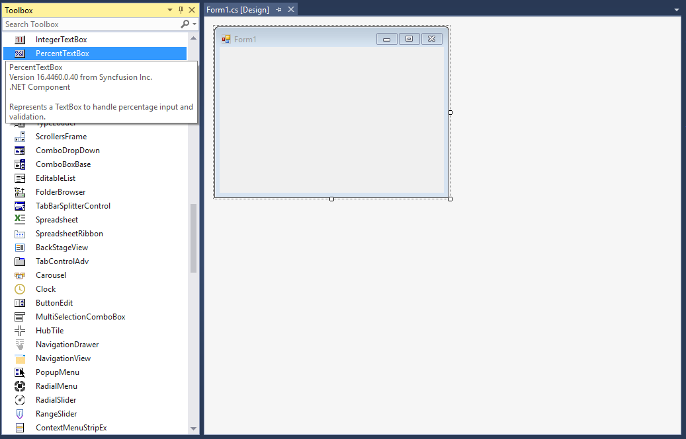
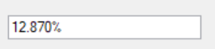

# Getting Started with WinForms Percent TextBox

## Assembly deployment

Refer to the [control dependencies](https://help.syncfusion.com/windowsforms/control-dependencies#percenttextbox) section to get the list of assemblies or NuGet packages that need to be added as a reference to use the control in any application.

Find more details about installing the NuGet packages in a Windows Forms application in the following link:

[How to install NuGet packages](https://help.syncfusion.com/windowsforms/installation/install-nuget-packages)

## Create a simple application with WinForms Percent TextBox

You can create a Windows Forms application with WinForms Percent TextBox using the following steps.

### Create a project

Create a new Windows Forms project in Visual Studio to display the WinForms Percent TextBox control.

### Add control through designer

The WinForms Percent TextBox control can be added to an application by dragging it from the toolbox to a designer view. The `Syncfusion.Shared.Base` assembly reference will be added automatically:

### Add control manually in code

To add the control manually in C# or VB, follow the given steps:

1. Add the **Syncfusion.Shared.Base** assembly reference to the project.
2. Include the **Syncfusion.Windows.Forms.Tools** namespace.

​


using Syncfusion.Windows.Forms.Tools;


Imports Syncfusion.Windows.Forms.Tools



{{ codesnippet1 | OrderList_Indent_Level_1 }}

3. Create a `WinForms Percent TextBox` instance, and add it to the window.

​


PercentTextBox percentTextBox1 = new PercentTextBox();
this.Controls.Add(percentTextBox1);


Dim percentTextBox1 As PercentTextBox = New PercentTextBox()
Me.Controls.Add(percentTextBox1)



{{ codesnippet2 | OrderList_Indent_Level_1 }}

### Maximum and minimum value constraints

You can set the maximum and minimum percentage values using the [MaxValue](https://help.syncfusion.com/cr/windowsforms/Syncfusion.Windows.Forms.Tools.PercentTextBox.html#Syncfusion_Windows_Forms_Tools_PercentTextBox_MaxValue) and [MinValue](https://help.syncfusion.com/cr/windowsforms/Syncfusion.Windows.Forms.Tools.PercentTextBox.html#Syncfusion_Windows_Forms_Tools_PercentTextBox_MinValue) properties of WinForms Percent TextBox.



this.percentTextBox1.MaxValue = 6;
this.percentTextBox1.MinValue = -6;


Me.percentTextBox1.MaxValue = 6
Me.percentTextBox1.MinValue = -6



### Change number format

You can customize the number format using the [PercentDecimalDigits](https://help.syncfusion.com/cr/windowsforms/Syncfusion.Windows.Forms.Tools.PercentTextBox.html#Syncfusion_Windows_Forms_Tools_PercentTextBox_PercentDecimalDigits), [PercentDecimalSeparator](https://help.syncfusion.com/cr/windowsforms/Syncfusion.Windows.Forms.Tools.PercentTextBox.html#Syncfusion_Windows_Forms_Tools_PercentTextBox_PercentDecimalSeparator), [PercentGroupSeparator](https://help.syncfusion.com/cr/windowsforms/Syncfusion.Windows.Forms.Tools.PercentTextBox.html#Syncfusion_Windows_Forms_Tools_PercentTextBox_PercentGroupSeparator), and [PercentGroupSizes](https://help.syncfusion.com/cr/windowsforms/Syncfusion.Windows.Forms.Tools.PercentTextBox.html#Syncfusion_Windows_Forms_Tools_PercentTextBox_PercentGroupSizes) properties of WinForms Percent TextBox.



this.percentTextBox1.PercentValue = 12.873;
this.percentTextBox1.PercentDecimalDigits = 3;
this.percentTextBox1.PercentDecimalSeparator = ".";
this.percentTextBox1.PercentGroupSeparator = ",";
this.percentTextBox1.PercentGroupSizes = new int[] { 2 };


Me.percentTextBox1.PercentValue = 12.873
Me.percentTextBox1.PercentDecimalDigits = 3
Me.percentTextBox1.PercentDecimalSeparator = "."
Me.percentTextBox1.PercentGroupSeparator = ","
Me.percentTextBox1.PercentGroupSizes = New Integer() { 2 }



