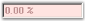

# About Syncfusion® WinForms Percent TextBox Control

The WinForms Percent TextBox is a textbox-derived control that can display double data type values in percentage form.

  

The WinForms Percent TextBox is derived from Windows Forms Framework textbox control. It supports display and collection of percentage values. It handles user keyboard input and percent formatting and uses the globalization features of the .NET platform to provide locale-specific formatting.

## Choose between different textbox controls

You can refer to the different textbox controls [here](https://help.syncfusion.com/windowsforms/numeric-textbox/overview#choose-between-different-textbox-controls).