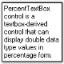
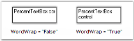
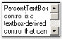
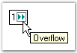

# Text Settings in WinForms Percent TextBox

This section describes the text settings of the WinForms Percent TextBox control.

The text associated with the WinForms Percent TextBox control can be set and customized using the following properties:

* [Text](https://help.syncfusion.com/cr/windowsforms/Syncfusion.Windows.Forms.Tools.PercentTextBox.html#Syncfusion_Windows_Forms_Tools_PercentTextBox_Text) - Gets or sets the text shown in the text field.
* [CharacterCasing](https://help.syncfusion.com/cr/windowsforms/Syncfusion.Windows.Forms.Tools.TextBoxExt.html#Syncfusion_Windows_Forms_Tools_TextBoxExt_CharacterCasing) - Sets the case applied to the text.
* [TextAlign](https://docs.microsoft.com/en-us/dotnet/api/system.windows.forms.textbox.textalign?redirectedfrom=MSDN&view=netframework-4.7.2#System_Windows_Forms_TextBox_TextAlign) - Sets the horizontal alignment of the text.
* [SelectedText](https://help.syncfusion.com/cr/windowsforms/Syncfusion.Windows.Forms.Tools.NumberTextBoxBase.html#Syncfusion_Windows_Forms_Tools_NumberTextBoxBase_SelectedText) - Gets or sets the currently selected text.
* [SelectAllOnFocus](https://help.syncfusion.com/cr/windowsforms/Syncfusion.Windows.Forms.Tools.NumberTextBoxBase.html#Syncfusion_Windows_Forms_Tools_NumberTextBoxBase_SelectAllOnFocus) - When `true`, all text is selected automatically when the control receives focus.
* [SwitchModeOnFocus](https://help.syncfusion.com/cr/windowsforms/Syncfusion.Windows.Forms.Tools.PercentTextBox.html#Syncfusion_Windows_Forms_Tools_PercentTextBox_SwitchModeOnFocus) - When `true`, switches between percent mode and decimal mode on focus.
* [HideSelection](https://docs.microsoft.com/en-us/dotnet/api/system.windows.forms.textboxbase.hideselection?redirectedfrom=MSDN&view=netframework-4.7.2#System_Windows_Forms_TextBoxBase_HideSelection) - When `true`, hides the selection highlight when the control loses focus.
* [ClipText](https://help.syncfusion.com/cr/windowsforms/Syncfusion.Windows.Forms.Tools.PercentTextBox.html#Syncfusion_Windows_Forms_Tools_PercentTextBox_ClipText) - Gets the clipped text without formatting (used for clipboard operations).
* [DrawActiveWhenDisabled](https://help.syncfusion.com/cr/windowsforms/Syncfusion.Windows.Forms.Tools.TextBoxExt.html#Syncfusion_Windows_Forms_Tools_TextBoxExt_DrawActiveWhenDisabled) - When `true`, draws the control as active even when it is disabled.



this.percentTextBox1.CharacterCasing = System.Windows.Forms.CharacterCasing.Upper;
this.percentTextBox1.TextAlign = System.Windows.Forms.HorizontalAlignment.Center;
this.percentTextBox1.SelectedText = "34";
this.percentTextBox1.SelectAllOnFocus = true;
this.percentTextBox1.SwitchModeOnFocus = true;
this.percentTextBox1.HideSelection = true;
this.percentTextBox1.ClipText = "34";
this.percentTextBox1.DrawActiveWhenDisabled = true;


Me.percentTextBox1.CharacterCasing = System.Windows.Forms.CharacterCasing.Upper
Me.percentTextBox1.TextAlign = System.Windows.Forms.HorizontalAlignment.Center
Me.percentTextBox1.SelectedText = "34"
Me.percentTextBox1.SelectAllOnFocus = True
Me.percentTextBox1.SwitchModeOnFocus = True
Me.percentTextBox1.HideSelection = True
Me.percentTextBox1.ClipText = "34"
Me.percentTextBox1.DrawActiveWhenDisabled = True



The methods associated with the above properties are given below.

* [AppendText](https://docs.microsoft.com/en-us/dotnet/api/system.windows.forms.textboxbase.appendtext?redirectedfrom=MSDN&view=netframework-4.7.2#System_Windows_Forms_TextBoxBase_AppendText_System_String_)
* [ResetText](https://help.syncfusion.com/cr/windowsforms/Syncfusion.Windows.Forms.Tools.PercentTextBox.html#Syncfusion_Windows_Forms_Tools_PercentTextBox_ResetText)
* [OnCharacterCasingChanged](https://help.syncfusion.com/cr/windowsforms/Syncfusion.Windows.Forms.Tools.TextBoxExt.html#Syncfusion_Windows_Forms_Tools_TextBoxExt_OnCharacterCasingChanged_System_EventArgs_)
* [GetClipText](https://help.syncfusion.com/cr/windowsforms/Syncfusion.Windows.Forms.Tools.NumberTextBoxBase.html#Syncfusion_Windows_Forms_Tools_NumberTextBoxBase_GetClipText)
* [Cut](https://help.syncfusion.com/cr/windowsforms/Syncfusion.Windows.Forms.Tools.NumberTextBoxBase.html#Syncfusion_Windows_Forms_Tools_NumberTextBoxBase_Cut)
* [Copy](https://help.syncfusion.com/cr/windowsforms/Syncfusion.Windows.Forms.Tools.NumberTextBoxBase.html#Syncfusion_Windows_Forms_Tools_NumberTextBoxBase_Copy)
* [Delete](https://help.syncfusion.com/cr/windowsforms/Syncfusion.Windows.Forms.Tools.NumberTextBoxBase.html#Syncfusion_Windows_Forms_Tools_NumberTextBoxBase_Delete)
* [Paste](https://help.syncfusion.com/cr/windowsforms/Syncfusion.Windows.Forms.Tools.PercentTextBox.html#Syncfusion_Windows_Forms_Tools_PercentTextBox_Paste)
* [SelectAll](https://help.syncfusion.com/cr/windowsforms/Syncfusion.Windows.Forms.Tools.NumberTextBoxBase.html#Syncfusion_Windows_Forms_Tools_NumberTextBoxBase_SelectAll)

## Multiline text settings

The text settings of the WinForms Percent TextBox control can be customized to display multiline text using the following properties:

* [Multiline](https://docs.microsoft.com/en-us/dotnet/api/system.windows.forms.textbox.multiline?redirectedfrom=MSDN&view=netframework-4.7.2#System_Windows_Forms_TextBox_Multiline) - When `true`, the text can span multiple lines.
* [Lines](https://docs.microsoft.com/en-us/dotnet/api/system.windows.forms.textboxbase.lines?redirectedfrom=MSDN&view=netframework-4.7.2#System_Windows_Forms_TextBoxBase_Lines) - Gets or sets the lines of text in a multiline text box.
* [WordWrap](https://docs.microsoft.com/en-us/dotnet/api/system.windows.forms.textboxbase.wordwrap?redirectedfrom=MSDN&view=netframework-4.7.2#System_Windows_Forms_TextBoxBase_WordWrap) - When `true`, wraps the text to the next line at the end of the control width.
* [ScrollBars](https://docs.microsoft.com/en-us/dotnet/api/system.windows.forms.textbox.scrollbars?redirectedfrom=MSDN&view=netframework-4.7.2#System_Windows_Forms_TextBox_ScrollBars) - Sets the scroll bars to display for a multiline text box.



this.percentTextBox1.Multiline = true;
this.percentTextBox1.WordWrap = true;
this.percentTextBox1.ScrollBars = System.Windows.Forms.ScrollBars.Vertical;


Me.percentTextBox1.Multiline = True
Me.percentTextBox1.WordWrap = True
Me.percentTextBox1.ScrollBars = System.Windows.Forms.ScrollBars.Vertical



## Clip mode

The formatting for the text can be enabled or disabled using the [ClipMode](https://help.syncfusion.com/cr/windowsforms/Syncfusion.Windows.Forms.Tools.NumberTextBoxBase.html#Syncfusion_Windows_Forms_Tools_NumberTextBoxBase_ClipMode) property.



this.percentTextBox1.ClipMode = Syncfusion.Windows.Forms.Tools.CurrencyClipModes.IncludeFormatting;


Me.percentTextBox1.ClipMode = Syncfusion.Windows.Forms.Tools.CurrencyClipModes.IncludeFormatting



## Formatted text

The formatted text (for example, with grouping separators applied) can be retrieved or set using the [FormattedText](https://help.syncfusion.com/cr/windowsforms/Syncfusion.Windows.Forms.Tools.PercentTextBox.html#Syncfusion_Windows_Forms_Tools_PercentTextBox_FormattedText) property.



this.percentTextBox1.FormattedText = "1,234";


Me.percentTextBox1.FormattedText = "1,234"



## RightToLeft

The text can be displayed from right to left for RTL languages by setting the [RightToLeft](https://help.syncfusion.com/cr/windowsforms/Syncfusion.Windows.Forms.Tools.NumberTextBoxBase.html#Syncfusion_Windows_Forms_Tools_NumberTextBoxBase_RightToLeft) property to the `RightToLeft.Yes` enum value.

>**NOTE**: The [RightToLeft](https://help.syncfusion.com/cr/windowsforms/Syncfusion.Windows.Forms.Tools.NumberTextBoxBase.html#Syncfusion_Windows_Forms_Tools_NumberTextBoxBase_RightToLeft) property will be automatically set to `Yes` for RTL languages.



this.percentTextBox1.RightToLeft = System.Windows.Forms.RightToLeft.Yes;


Me.percentTextBox1.RightToLeft = System.Windows.Forms.RightToLeft.Yes



>**NOTE**: The [ResetRightToLeft](https://help.syncfusion.com/cr/windowsforms/Syncfusion.Windows.Forms.Tools.NumberTextBoxBase.html#Syncfusion_Windows_Forms_Tools_NumberTextBoxBase_ResetRightToLeft) method can be used to reset the [RightToLeft](https://help.syncfusion.com/cr/windowsforms/Syncfusion.Windows.Forms.Tools.NumberTextBoxBase.html#Syncfusion_Windows_Forms_Tools_NumberTextBoxBase_RightToLeft) property to its default value.

## OverflowIndicatorToolTipText

The tooltip that should be displayed when an overflow of text occurs can be set using the following properties:

* [OverflowIndicatorToolTipText](https://help.syncfusion.com/cr/windowsforms/Syncfusion.Windows.Forms.Tools.TextBoxExt.html#Syncfusion_Windows_Forms_Tools_TextBoxExt_OverflowIndicatorToolTipText) - Sets the tooltip text.
* [ShowOverflowIndicator](https://help.syncfusion.com/cr/windowsforms/Syncfusion.Windows.Forms.Tools.TextBoxExt.html#Syncfusion_Windows_Forms_Tools_TextBoxExt_ShowOverflowIndicator) - When `true`, shows an overflow indicator.
* [ShowOverflowIndicatorToolTip](https://help.syncfusion.com/cr/windowsforms/Syncfusion.Windows.Forms.Tools.TextBoxExt.html#Syncfusion_Windows_Forms_Tools_TextBoxExt_ShowOverflowIndicatorToolTip) - When `true`, shows the tooltip text on the indicator.



this.percentTextBox1.OverflowIndicatorToolTipText = "Overflow";
this.percentTextBox1.ShowOverflowIndicator = true;
this.percentTextBox1.ShowOverflowIndicatorToolTip = true;


Me.percentTextBox1.OverflowIndicatorToolTipText = "Overflow"
Me.percentTextBox1.ShowOverflowIndicator = True
Me.percentTextBox1.ShowOverflowIndicatorToolTip = True



## Banner text support

The WinForms Percent TextBox control can display banner text in the text field at run time. A `BannerTextProvider` component should be available for this purpose. You also need to set the [AllowNull](https://help.syncfusion.com/cr/windowsforms/Syncfusion.Windows.Forms.Tools.PercentTextBox.html#Syncfusion_Windows_Forms_Tools_PercentTextBox_AllowNull), [NullString](https://help.syncfusion.com/cr/windowsforms/Syncfusion.Windows.Forms.Tools.NumberTextBoxBase.html#Syncfusion_Windows_Forms_Tools_NumberTextBoxBase_NullString), and [Text](https://help.syncfusion.com/cr/windowsforms/Syncfusion.Windows.Forms.Tools.PercentTextBox.html#Syncfusion_Windows_Forms_Tools_PercentTextBox_Text) properties as shown below to make this feature effective.



this.percentTextBox1.AllowNull = true;
this.percentTextBox1.NullString = "";
this.percentTextBox1.Text = "";


Me.percentTextBox1.AllowNull = True
Me.percentTextBox1.NullString = ""
Me.percentTextBox1.Text = ""



A sample that demonstrates the Text, Text Align, and Overflow Indicator features of the WinForms Percent TextBox control is available at the following sample installation path:

`%LOCALAPPDATA%\Syncfusion\EssentialStudio\<Version Number>\Windows\Tools.Windows\Samples\Advanced Editor Functions\ActionGroupingDemo`
