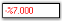

# Display Settings

This section discusses the display settings of the PercentTextBox control.

The PercentTextBox provides a list of properties to set the display characteristics of the percentage.

<table>
<tr>
<th>
PercentTextBox Properties</th><th>
Description</th></tr>
<tr>
<td>
PercentDecimalDigits</td><td>
Gets / sets the maximum number of digits for the decimal portion of the percentage.</td></tr>
<tr>
<td>
PercentDecimalSeparator</td><td>
Gets / sets the decimal separator character that will be used for the display.</td></tr>
<tr>
<td>
PercentGroupSeparator</td><td>
Gets / sets the separator to be used for grouping digits.</td></tr>
<tr>
<td>
PercentGroupSizes</td><td>
Gets / sets the grouping of percent digits in the PercentTextBox.</td></tr>
<tr>
<td>
PercentNegativePattern</td><td>
Gets / sets the pattern to use when the value is negative.</td></tr>
<tr>
<td>
NegativeSign</td><td>
Gets / sets the sign that is to be used to indicate a negative value.</td></tr>
<tr>
<td>
PercentPositivePattern</td><td>
Gets / sets the pattern to use when the value is positive.</td></tr>
<tr>
<td>
PercentSymbol</td><td>
Gets / sets the percent symbol which represents the Percentage.</td></tr>
</table>

The grouping size of the percent digits can be set using the Int32 Collection Editor which will be displayed on selecting thePercentGroupSizes property in the property grid.




this.percentTextBox1.PercentDecimalDigits = 3;
this.percentTextBox1.PercentDecimalSeparator = ".";
this.percentTextBox1.PercentGroupSeparator = ",";
this.percentTextBox1.PercentGroupSizes = new int[] {5};
this.percentTextBox1.PercentNegativePattern = 2;
this.percentTextBox1.NegativeSign = "-";
this.percentTextBox1.PercentPositivePattern = 2;
this.percentTextBox1.PercentSymbol = "%";





Me.percentTextBox1.PercentDecimalDigits = 3
Me.percentTextBox1.PercentDecimalSeparator = "."
Me.percentTextBox1.PercentGroupSeparator = ","
Me.percentTextBox1.PercentGroupSizes = New Integer() {5}
Me.percentTextBox1.PercentNegativePattern = 2
Me.percentTextBox1.NegativeSign = "-";
Me.percentTextBox1.PercentPositivePattern = 2
Me.percentTextBox1.PercentSymbol = "%"




The following screen shot illustrates the above settings.

  

A sample which demonstrates the Display Settings of PercentTextBox control is available in the below sample installation path.

…\My Documents\Syncfusion\EssentialStudio\Version Number\Windows\Tools.Windows\Samples\Advanced Editor Functions\ActionGroupingDemo
