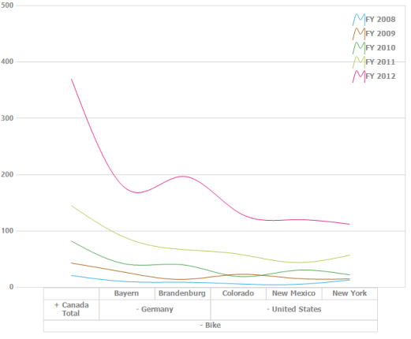
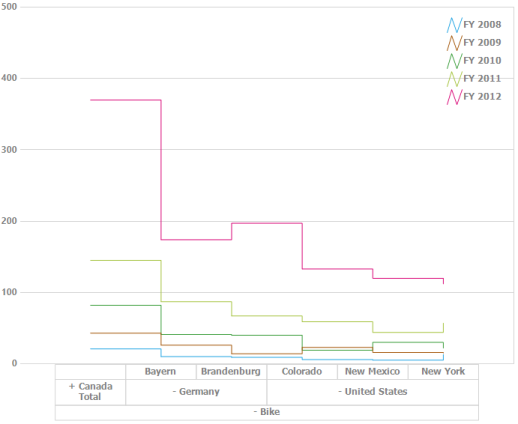
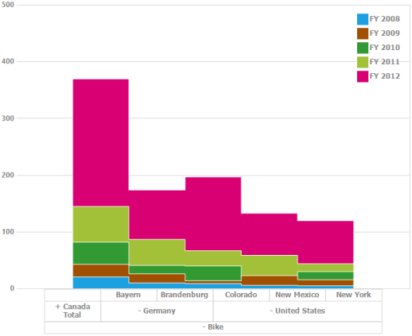

# Chart Types in Windows Forms Pivot Chart

The pivot chart is rendered through different chart types based on the requirement. You can easily switch between different chart types dynamically. Fields bound to the chart is automatically transformed to target chart types.

The following are the supported chart types:

* Line
* Spline
* Column
* Area
* Spline area
* Stacking area
* Stacking column
* Stacking area 100
* Stacking column 100
* Step line
* Step area

The pivot chart types are altered by using the ChartTypes enumeration.



//Changes the Pivot Chart types.
this.pivotChart1.ChartTypes = Syncfusion.Windows.Forms.PivotChart.PivotChartTypes.Line;





' Changes the Pivot Chart types.

Me.pivotChart1.ChartTypes = Syncfusion.Windows.Forms.PivotChart.PivotChartTypes.Line



## Line chart

The line chart joins the data points on a plot by using straight lines that show trends in data at equal intervals.

## Spline chart

The spline chart is similar to line chart except that it connects different data points with curved lines instead of straight lines.

## Step line chart

The step line chart uses horizontal and vertical lines to connect data points resulting in a step like progression.

## Step area chart

The step area chart is similar to the regular area chart except for a straight line tracing the shortest path between data points. The values are connected by continuous vertical and horizontal lines to form a step like progression.

## Spline area chart

The spline area chart is similar to the area chart but differs by connecting data points in a series. This connects each series of points by a smooth spline curve.

## Stacking column chart

The stacking column chart is similar to column charts except for the Y-values. The Y-values stack on top of each other in a specified series order. This helps to visualize the relationship of parts to the whole chart.

## Stacking area 100 chart

The stacking area chart is similar to regular area chart except for the Y-values. The Y-values stack on top of each other in the specified series order. This helps to visualize the relationship of parts to the whole data. The top range is calculated on the basis of 100.

## Stacking area chart

The stacking area chart is similar to the regular area chart except for the Y-values. The Y-values stack on top of each other in the specified series order. This helps to visualize the relationship of parts to the whole data.

