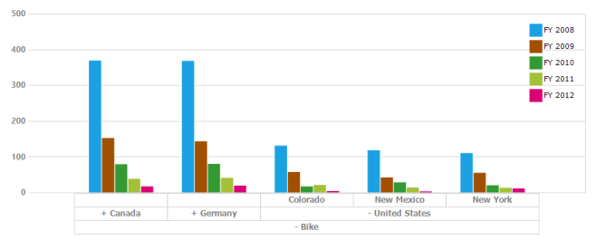

# Drill Operations in Windows Forms Pivot Chart

Pivot charts utilize expanders for efficient navigation of hierarchical data, allowing users to drill down into detailed levels or drill up for aggregated overviews. These interactive elements enable users to transition from broad summaries to intricate details, such as moving from an annual sales overview to quarterly, monthly, or daily trends, thereby uncovering deeper insights within datasets. The complementary drill-up function allows users to return to higher summary levels for comprehensive context, enhancing data exploration.

This navigation capability can be easily activated in the pivot chart control through the `AllowDrillDown` property. By toggling this property, developers can facilitate intuitive hierarchical navigation across the PivotSeries population, providing users with seamless transitions between various data levels. This functionality is crucial for enabling flexible data analysis, ensuring that users can access the appropriate level of detail or summary as needed.



this.pivotChart1.AllowDrillDown = true;





Me.pivotChart1.AllowDrillDown = True



