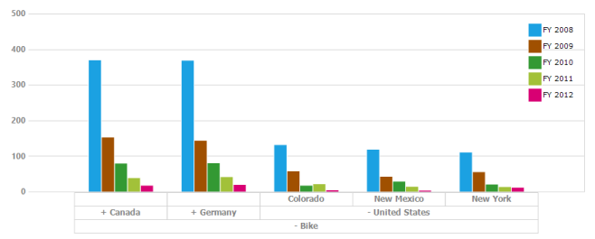

# Drill Operations in Windows Forms Pivot Chart

Through expanders, you can drill down to the next level of the hierarchy and drill up to the previous level. The pivot chart has built-in support to drill up and down the PivotSeries population. This behavior can be achieved by enabling the [AllowDrillDown](https://help.syncfusion.com/cr/windowsforms/Syncfusion.Windows.Forms.PivotChart.PivotChart.html#Syncfusion_Windows_Forms_PivotChart_PivotChart_AllowDrillDown) property.





this.pivotChart1.AllowDrillDown = true;





Me.pivotChart1.AllowDrillDown = True





