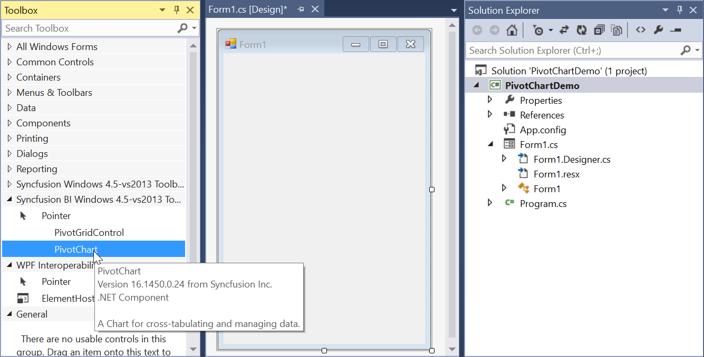
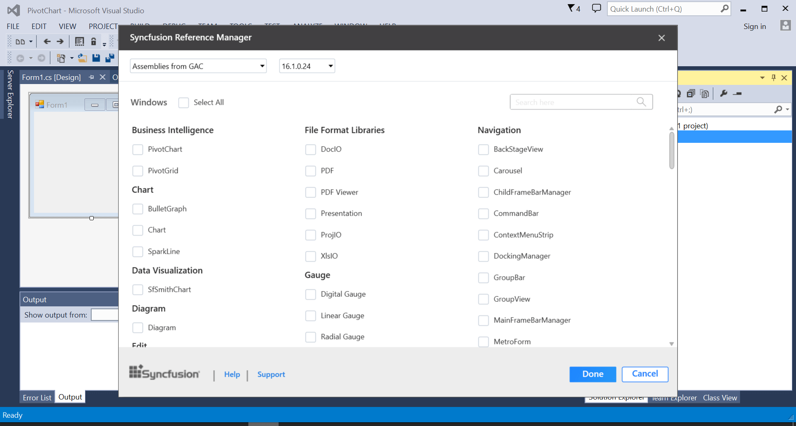
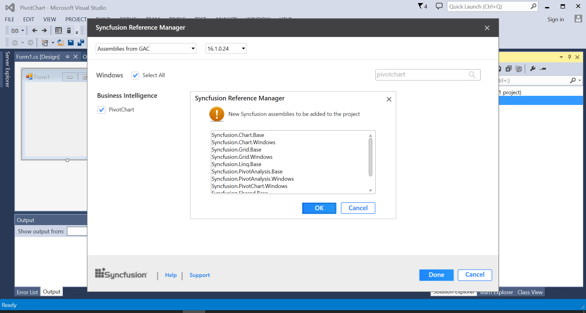
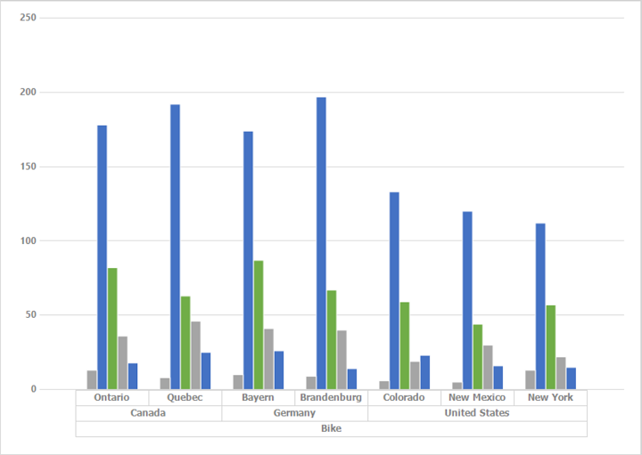

# Getting Started with Windows Forms Pivot Chart

>**Important**
Starting with v16.2.0.x, if you refer to Syncfusion assemblies from trial setup or from the NuGet feed, include a license key in your projects. Refer to this [link](https://help.syncfusion.com/common/essential-studio/licensing/overview) to learn about registering Syncfusion license key in your Windows Forms application to use our components.

This section provides an overview for working with the pivot chart for WinForms. Go through the entire process of creating a simple pivot chart.

## Assembly deployment

Refer to [control dependencies](https://help.syncfusion.com/windowsforms/control-dependencies#pivot-chart) section to get the list of assemblies or NuGet package that should be added as reference to use the pivot chart control in any application.

## Creating application with pivot chart

This section explains how to add the pivot chart control through designer, code, and Syncfusion Reference Manager.

### Adding control via designer

The pivot chart control can be added through designer by following the given steps:

1. Create a new **Windows Forms Application** in Visual Studio.

2. Drag and drop the pivot chart control from the toolbox into the designer page.

3. Then, the pivot chart control will be successfully added to the application along with the required libraries.

### Adding control via code

The pivot chart control can be added through code-behind by following the given steps:

1. Create a new **Windows Forms Application** in Visual Studio.

2. Add the following assembly references to the project.

* Syncfusion.Chart.Windows.dll
* Syncfusion.Grid.Windows.dll
* Syncfusion.PivotAnalysis.Base.dll
* Syncfusion.PivotAnalysis.Windows.dll
* Syncfusion.PivotChart.Windows.dll
* Syncfusion.Shared.Base.dll

3. Then, initialize the pivot chart control by creating an instance and adding it to the form using the following specified code.





//Initialize a new PivotChart. 
Syncfusion.Windows.Forms.PivotChart.PivotChart pivotChart1 = new Syncfusion.Windows.Forms.PivotChart.PivotChart();

// Add the PivotChart control to the parent control. 
this.Controls.Add(pivotChart1);





'Initialize a new PivotChart. 
Dim pivotChart1 As New Syncfusion.Windows.Forms.PivotChart.PivotChart()

' Add the PivotChart control to the parent control. 
Me.Controls.Add(pivotChart1)





### Adding control via Syncfusion reference manager

[Syncfusion reference manager](https://help.syncfusion.com/extension/syncfusion-reference-manager/overview) is a Visual Studio Add-In that helps to add Syncfusion controls. The pivot chart control can be added through Syncfusion reference manager by following the given steps:

1. Create a new **Windows Forms Application** in Visual Studio.

2. Then, right-click the project and select Syncfusion Reference Manager.

3. The Syncfusion Reference Manager wizard will be opened as follows.

4. Select the pivot chart control by searching it through the search box. Then, click the done button to add the selected pivot chart control.

5. The required assemblies will be automatically added to the project by clicking OK.

6. Add the following code snippet in code behind to create a simple pivot chart control.





//Initialize a new PivotChart. 
Syncfusion.Windows.Forms.PivotChart.PivotChart pivotChart1 = new Syncfusion.Windows.Forms.PivotChart.PivotChart();

// Add the PivotChart control to the parent control. 
this.Controls.Add(pivotChart1);





'Initialize a new PivotChart. 
Dim pivotChart1 As New Syncfusion.Windows.Forms.PivotChart.PivotChart()

' Add the PivotChart control to the parent control. 
Me.Controls.Add(pivotChart1)





N>
Syncfusion reference manager supports for specific framework that is shipped (assemblies) in our Syncfusion Essential Studio setup. So, if you try to add Syncfusion assemblies in project and framework that is not supported with selected Syncfusion version assemblies, then the dialog will be appeared by specifying that “Current build v{version} is not supported this framework v{Framework Version}”.

## Binding data

This section guides you how to bind the data source and its appropriate fields to a pivot chart control. The data source assigned to pivot chart control should be an [IEnumerable](https://docs.microsoft.com/en-us/dotnet/api/system.collections.generic.ienumerable-1?redirectedfrom=MSDN&view=net-6.0) list or a [DataView](https://docs.microsoft.com/en-us/dotnet/api/system.data.dataview?redirectedfrom=MSDN&view=net-6.0).

In this example, the `IEnumerable` list is used as data source for the pivot chart control and the sample data source contains properties such as Product, Date, Country, State, Quantity, Amount, UnitPrice, and TotalPrice for demonstration purpose.





public class ProductSales
{
    public string Product { get; set; }

    public string Date { get; set; }

    public string Country { get; set; }

    public string State { get; set; }

    public int Quantity { get; set; }

    public double Amount { get; set; }

    public double UnitPrice { get; set; }

    public double TotalPrice { get; set; }

    public static ProductSalesCollection GetSalesData()
    {
        /// Geography
        string[] countries = new string[] { "Australia", "Germany", "Canada", "United States" };
        string[] states1 = new string[] { "New South Wales", "Queensland", };
        string[] states2 = new string[] { "Ontario", "Quebec" };
        string[] states3 = new string[] { "Bayern", "Brandenburg" };
        string[] states4 = new string[] { "New York", "Colorado", "New Mexico" };

        /// Time
        string[] dates = new string[] { "FY 2008", "FY 2009", "FY 2010", "FY 2011", "FY 20012" };

        /// Products
        string[] products = new string[] { "Bike" };
        Random r = new Random(123345);

        int numberOfRecords = 2000;
        ProductSalesCollection listOfProductSales = new ProductSalesCollection();
        for (int i = 0; i < numberOfRecords; i++)
        {
            ProductSales sales = new ProductSales();
            sales.Country = countries[r.Next(1, countries.GetLength(0))];
            sales.Quantity = r.Next(1, 12);
            /// 1 percent discount for 1 quantity
            double discount = (30000 * sales.Quantity) * (double.Parse(sales.Quantity.ToString()) / 100);
            sales.Amount = (30000 * sales.Quantity) - discount;
            sales.TotalPrice = sales.Amount * sales.Quantity;
            sales.UnitPrice = sales.Amount / sales.Quantity;
            sales.Date = dates[r.Next(r.Next(dates.GetLength(0) + 1))];
            sales.Product = products[r.Next(r.Next(products.GetLength(0) + 1))];
            switch (sales.Country)
            {
                case "Australia":
                    {
                        sales.State = states1[r.Next(states1.GetLength(0))];
                        break;
                    }
                case "Canada":
                    {
                        sales.State = states2[r.Next(states2.GetLength(0))];
                        break;
                    }
                case "Germany":
                    {
                        sales.State = states3[r.Next(states3.GetLength(0))];
                        break;
                    }
                case "United States":
                    {
                        sales.State = states4[r.Next(states4.GetLength(0))];
                        break;
                    }
            }
            listOfProductSales.Add(sales);
        }

        return listOfProductSales;
    }

    public override string ToString()
    {
        return string.Format("{0}-{1}-{2}", this.Country, this.State, this.Product);
    }

    public class ProductSalesCollection : List<ProductSales>
    {
    }
}





Public Class ProductSales

    Public Property Product As String

    Public Property Date As String

    Public Property Country As String

    Public Property State As String

    Public Property Quantity As Integer

    Public Property Amount As Double

    Public Property UnitPrice As Double

    Public Property TotalPrice As Double

    Public Shared Function GetSalesData() As ProductSalesCollection
        Dim countries As String() = New String() {"Australia", "Germany", "Canada", "United States"}
        Dim states1 As String() = New String() {"New South Wales", "Queensland"}
        Dim states2 As String() = New String() {"Ontario", "Quebec"}
        Dim states3 As String() = New String() {"Bayern", "Brandenburg"}
        Dim states4 As String() = New String() {"New York", "Colorado", "New Mexico"}
        Dim dates As String() = New String() {"FY 2008", "FY 2009", "FY 2010", "FY 2011", "FY 20012"}
        Dim products As String() = New String() {"Bike"}
        Dim r As Random = New Random(123345)
        Dim numberOfRecords As Integer = 2000
        Dim listOfProductSales As ProductSalesCollection = New ProductSalesCollection()
        For i As Integer = 0 To numberOfRecords - 1
            Dim sales As ProductSales = New ProductSales()
            sales.Country = countries(r.[Next](1, countries.GetLength(0)))
            sales.Quantity = r.[Next](1, 12)
            Dim discount As Double =(30000 * sales.Quantity) * (Double.Parse(sales.Quantity.ToString()) / 100)
            sales.Amount =(30000 * sales.Quantity) - discount
            sales.TotalPrice = sales.Amount * sales.Quantity
            sales.UnitPrice = sales.Amount / sales.Quantity
            sales.Date = dates(r.[Next](r.[Next](dates.GetLength(0) + 1)))
            sales.Product = products(r.[Next](r.[Next](products.GetLength(0) + 1)))
            Select Case sales.Country
                Case "Australia"
                    sales.State = states1(r.[Next](states1.GetLength(0)))
                    Exit Select
                Case "Canada"
                    sales.State = states2(r.[Next](states2.GetLength(0)))
                    Exit Select
                Case "Germany"
                    sales.State = states3(r.[Next](states3.GetLength(0)))
                    Exit Select
                Case "United States"
                    sales.State = states4(r.[Next](states4.GetLength(0)))
                    Exit Select
            End Select

            listOfProductSales.Add(sales)
        Next

        Return listOfProductSales
    End Function

    Public Overrides Function ToString() As String
        Return String.Format("{0}-{1}-{2}", Me.Country, Me.State, Me.Product)
    End Function

    Public Class ProductSalesCollection
        Inherits List(Of ProductSales)

    End Class
End Class





N>
`ProductSales` is a class that consists of `IList` data. For more information, refer to the *Getting Started* demo sample located under the following location.
&lt;Installed Location&gt;\Syncfusion\Essential Studio\\&lt;Installed_Version&gt;\Windows\PivotChart.Windows\Samples\Getting Started\Getting Started Demo

The pivot chart control requires the following information to populate the data from the data source.

* [ItemSource](https://help.syncfusion.com/cr/windowsforms/Syncfusion.Windows.Forms.PivotChart.PivotChart.html#Syncfusion_Windows_Forms_PivotChart_PivotChart_ItemSource): The data source for the pivot table. This object should be either an    [IEnumerable](https://docs.microsoft.com/en-us/dotnet/api/system.collections.generic.ienumerable-1?redirectedfrom=MSDN&view=net-6.0) list or a [DataTable](https://docs.microsoft.com/en-us/dotnet/api/system.data.datatable?redirectedfrom=MSDN&view=net-6.0).
* [PivotAxis](https://help.syncfusion.com/cr/windowsforms/Syncfusion.Windows.Forms.PivotChart.PivotChart.html#Syncfusion_Windows_Forms_PivotChart_PivotChart_PivotAxis): Elements that should be added to the axis of pivot chart control.
* [PivotLegend](https://help.syncfusion.com/cr/windowsforms/Syncfusion.Windows.Forms.PivotChart.PivotChart.html#Syncfusion_Windows_Forms_PivotChart_PivotChart_PivotLegend): Elements that should be added to legend of pivot chart control.
* [PivotCalculations](https://help.syncfusion.com/cr/windowsforms/Syncfusion.Windows.Forms.PivotChart.PivotChart.html#Syncfusion_Windows_Forms_PivotChart_PivotChart_PivotCalculations): Calculation values that should be added as data points to the pivot chart control.

The following code snippet illustrates how to add the required information to the pivot chart control.





// Specifying the Item Source for Pivot Grid
this.pivotChart1.ItemSource = ProductSales.GetSalesData();
// Adding PivotAxis to the Control
this.pivotChart1.PivotAxis.Add(new PivotItem { FieldMappingName = "Product", TotalHeader = "Total" });
this.pivotChart1.PivotAxis.Add(new PivotItem { FieldMappingName = "Country", TotalHeader = "Total" });
this.pivotChart1.PivotAxis.Add(new PivotItem { FieldMappingName = "State", TotalHeader = "Total" });
// Adding PivotLegend to the Control
this.pivotChart1.PivotLegend.Add(new PivotItem { FieldMappingName = "Date", TotalHeader = "Total" });
// Adding PivotCalculations to the Control
this.pivotChart1.PivotCalculations.Add(new PivotComputationInfo { FieldName = "Quantity", Format = "#,##0" });





' Specifying the Item Source for Pivot Grid
Me.pivotChart1.ItemSource = ProductSales.GetSalesData()
' Adding PivotAxis to the Control
Me.pivotChart1.PivotAxis.Add(New PivotItem With {.FieldMappingName = "Product", .TotalHeader = "Total"})
Me.pivotChart1.PivotAxis.Add(New PivotItem With {.FieldMappingName = "Country", .TotalHeader = "Total"})
Me.pivotChart1.PivotAxis.Add(New PivotItem With {.FieldMappingName = "State", .TotalHeader = "Total"})
' Adding PivotLegend to the Control
Me.pivotChart1.PivotLegend.Add(New PivotItem With {.FieldMappingName = "Date", .TotalHeader = "Total"})
' Adding Pivot Calculations to the Control
Me.pivotChart1.PivotCalculations.Add(New PivotComputationInfo With {.FieldName = "Quantity", .Format = "#,##0"})





Finally, run the application to obtain the following output.

## Real time updates

[PivotChartUpdatingManager](https://help.syncfusion.com/cr/windowsforms/Syncfusion.Windows.Forms.PivotChart.PivotChartUpdatingManager.html) provides support for updating the series values automatically whenever the data gets changed in its underlying collection. This support can be enabled by setting the [EnableUpdating](https://help.syncfusion.com/cr/windowsforms/Syncfusion.Windows.Forms.PivotChart.PivotChart.html#Syncfusion_Windows_Forms_PivotChart_PivotChart_EnableUpdating) property to `true`.





// Updates the PivotChart series values whenever the data gets changed in the underlying data source.
this.pivotChart1.EnableUpdating = true;





' Updates the PivotChart series values whenever the data gets changed in the underlying data source.
Me.pivotChart1.EnableUpdating = True





N>
The default value of the `EnableUpdating` property is false.

### Begin update and end update

When you do more changes in the underlying data source, the pivot chart will be updated for every changes and performance will be degraded. So, to do more changes or more operations, do them between the [BeginUpdate](https://help.syncfusion.com/cr/windowsforms/Syncfusion.Windows.Forms.PivotChart.PivotChart.html#Syncfusion_Windows_Forms_PivotChart_PivotChart_BeginUpdate) and [EndUpdate](https://help.syncfusion.com/cr/windowsforms/Syncfusion.Windows.Forms.PivotChart.PivotChart.html#Syncfusion_Windows_Forms_PivotChart_PivotChart_EndUpdate) methods of pivot chart. The BeginUpdate method will temporarily freeze the painting or refreshing of the control until the EndUpdate method is called. After all the changes have been made, invoke the EndUpdate method to resume painting of the control.





// Suspends the painting until EndUpdate method is invoked
this.pivotChart1.BeginUpdate();

// do your bulk changes here

// Resumes the painting which is suspended
this.pivotChart1.EndUpdate();





' Suspends the painting
Me.pivotChart1.BeginUpdate()

' do your bulk changes here

' Resumes the painting which is suspended
Me.pivotChart1.EndUpdate()



