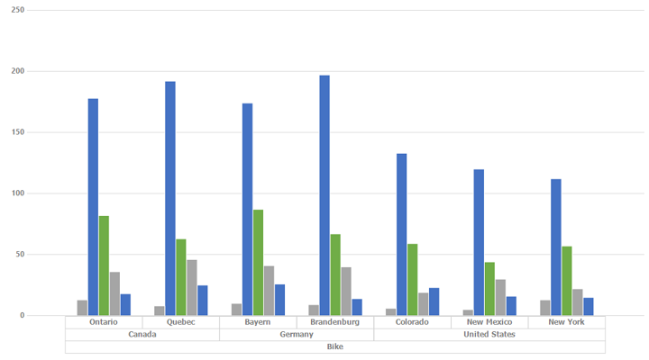
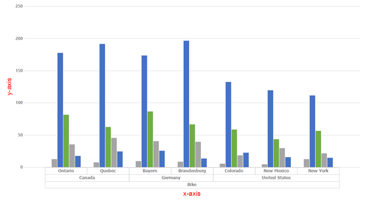
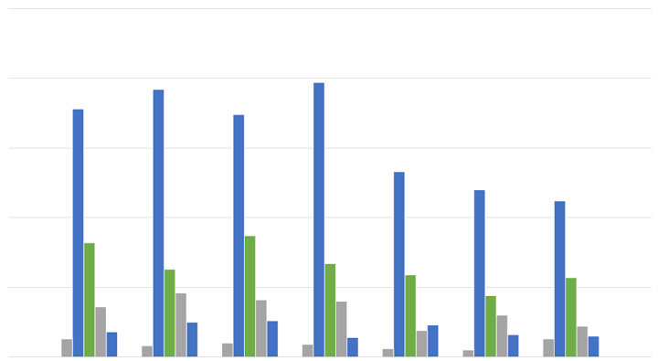

# Pivot Axis in Windows Forms Pivot Chart

Axis is used to locate data points in the chart area. Generally, two axes are required along each direction to locate a data point in the chart, i.e., horizontal and vertical. The pivot charts typically have two axes to measure and categorize data.

* Vertical axis (y-Axis).
* Horizontal axis (x-Axis).

By default, horizontal axis (PrimaryXAxis) and vertical axis (PrimaryYAxis) are added to the pivot chart with axis labels, grid lines, and tick lines. You can customize the axis explicitly by adding axis title or removing grid lines and tick lines that are added to the axis. The following screenshot displays the _PivotChart with Axis_

## Axis title

The pivot chart supports setting the custom title for axis. You can customize the axis by using the following properties.

<table>
<tr>
<th>
Properties</th><th>
Description</th></tr>
<tr>
<td>
Title</td><td>
Specifies the title for axis.</td></tr>
<tr>
<td>
TitleColor</td><td>
Specifies the color for axis title.</td></tr>
<tr>
<td>
TitleFont</td><td>
Specifies the font style for axis title.</td></tr>
</table>

The following code snippet illustrates how to customize the title of both the axes.





//Sets custom title for x-axis.
this.pivotChart1.ChartControl.PrimaryXAxis.Title = "x-axis";
this.pivotChart1.ChartControl.PrimaryXAxis.TitleColor = Color.Red;
this.pivotChart1.ChartControl.PrimaryXAxis.TitleFont = new Font("Arial", 14);

//Sets custom title for y-axis.
this.pivotChart1.ChartControl.PrimaryYAxis.Title = "y-axis";
this.pivotChart1.ChartControl.PrimaryYAxis.TitleColor = Color.Red;
this.pivotChart1.ChartControl.PrimaryYAxis.TitleFont = new Font("Arial", 14);





'Sets custom title for x-axis.
Me.pivotChart1.ChartControl.PrimaryXAxis.Title = "x-axis"
Me.pivotChart1.ChartControl.PrimaryXAxis.TitleColor = Color.Red
Me.pivotChart1.ChartControl.PrimaryXAxis.TitleFont = New Font("Arial", 14)

'Sets custom title for y-axis.
Me.pivotChart1.ChartControl.PrimaryYAxis.Title = "y-axis"
Me.pivotChart1.ChartControl.PrimaryYAxis.TitleColor = Color.Red
Me.pivotChart1.ChartControl.PrimaryYAxis.TitleFont = New Font("Arial", 14)





*PivotChart displays the axis with title*

## Grid line style

The grid lines define the intervals in the axes that can be customized by using the following properties.

<table>
<tr>
<th>
Properties</th><th>
Description</th></tr>
<tr>
<td>
GridLineType.ForeColor</td><td>
Specifies the foreground color of grid lines.</td></tr>
<tr>
<td>
GridLineType.BackColor</td><td>
Specifies the background color of grid lines.</td></tr>
<tr>
<td>
GridLineType.DashStyle</td><td>
Specifies the style of grid lines.</td></tr>
<tr>
<td>
GridLineType.PenType</td><td>
Specifies the type of pen that is to be used with grid lines.</td></tr>
<tr>
<td>
GridLineType.Width</td><td>
Specifies the thickness of grid lines.</td></tr>
</table>

The following code snippet illustrates how to customize the grid lines on both axes.





//Customizes X-Axis Gridlines.
this.chartControl1.PrimaryXAxis.GridLineType.BackColor = System.Drawing.Color.Transparent;
this.chartControl1.PrimaryXAxis.GridLineType.DashStyle = System.Drawing.Drawing2D.DashStyle.DashDotDot;
this.chartControl1.PrimaryXAxis.GridLineType.ForeColor = System.Drawing.Color.DarkBlue;
this.chartControl1.PrimaryXAxis.GridLineType.Width = 2F;

//Customizes Y-Axis Gridlines.
this.chartControl1.PrimaryYAxis.GridLineType.BackColor = System.Drawing.Color.OliveDrab;
this.chartControl1.PrimaryYAxis.GridLineType.ForeColor = System.Drawing.Color.DarkOrange;
this.chartControl1.PrimaryYAxis.GridLineType.PenType = System.Drawing.Drawing2D.PenType.LinearGradient;
this.chartControl1.PrimaryYAxis.GridLineType.Width = 2F;





'Customizes X-Axis Gridlines.
Me.chartControl1.PrimaryXAxis.GridLineType.BackColor = System.Drawing.Color.Transparent
Me.chartControl1.PrimaryXAxis.GridLineType.DashStyle = System.Drawing.Drawing2D.DashStyle.DashDotDot
Me.chartControl1.PrimaryXAxis.GridLineType.ForeColor = System.Drawing.Color.DarkBlue
Me.chartControl1.PrimaryXAxis.GridLineType.Width = 2F

'Customizes Y-Axis Gridlines.
Me.chartControl1.PrimaryYAxis.GridLineType.BackColor = System.Drawing.Color.OliveDrab
Me.chartControl1.PrimaryYAxis.GridLineType.ForeColor = System.Drawing.Color.DarkOrange
Me.chartControl1.PrimaryYAxis.GridLineType.PenType = System.Drawing.Drawing2D.PenType.LinearGradient
Me.chartControl1.PrimaryYAxis.GridLineType.Width = 2F





*PivotChart with customized style*

## Show/Hide axis

The visibility of axis in the pivot chart can be toggled by setting the `IsVisible` property. The following code snippet shows how to hide both the axes of the pivot chart.





this.pivotChart1.ChartControl.PrimaryXAxis.IsVisible = false;
this.pivotChart1.ChartControl.PrimaryYAxis.IsVisible = false;





Me.pivotChart1.ChartControl.PrimaryXAxis.IsVisible = False
Me.pivotChart1.ChartControl.PrimaryYAxis.IsVisible = False





_PivotChart without axis_

A demo sample is available at the following location:

{system drive}:\Users\&lt;User Name&gt;\AppData\Local\Syncfusion\EssentialStudio\&lt;Version Number&gt;\Windows\PivotChart.Windows\Samples\Appearance\PivotChartStyles Demo
