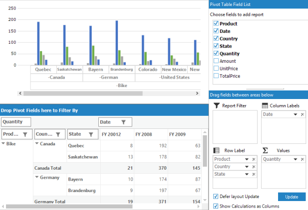

# Pivot Table Field List in Windows Forms Pivot Chart

The pivot chart can be dynamically built and customized by choosing any available fields to display and choose whether those fields should be displayed as column, row, value, or filter fields. The PivotTableFieldList also gives flexibility to wire with both pivot chart and pivot grid. This links the pivot chart and pivot grid.



//Synchronizes the PivotChart with the PivotTableFieldList.
this.pivotTableFieldList1.AssociateWith(this.pivotChart1);

//Generates the PivotGrid by using the assigned pivot engine item source.

this.panel.Controls.Add(this.pivotTableFieldList1.PivotGrid);





'Synchronizes the PivotChart with the PivotTableFieldList.

Me.pivotTableFieldList1.AssociateWith(Me.pivotChart1)

'Generates the PivotGrid by using the assigned pivot engine item source.

Me.panel.Controls.Add(Me.pivotTableFieldList1.PivotGrid



