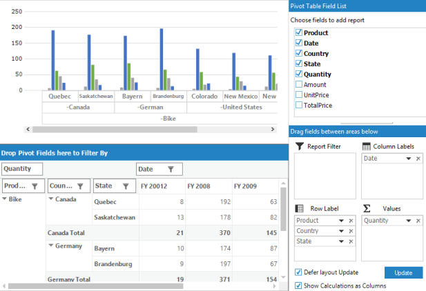

# Table Field List in Windows Forms Pivot Chart

The pivot chart can be dynamically built and customized by choosing any available fields to display and choosing whether those fields should be displayed as column, row, value, or filter fields. The [PivotTableFieldList](https://help.syncfusion.com/cr/windowsforms/Syncfusion.Windows.Forms.PivotChart.PivotTableFieldList.html) also provides flexibility to wire with both the pivot chart and pivot grid. This links the pivot chart and pivot grid.





//Synchronizes the PivotChart with the PivotTableFieldList.
this.pivotTableFieldList1.AssociateWith(this.pivotChart1);

//Generates the PivotGrid by using the assigned pivot engine item source.
this.panel.Controls.Add(this.pivotTableFieldList1.PivotGrid);





'Synchronizes the WinForms Pivot Chart with the PivotTableFieldList.
Me.pivotTableFieldList1.AssociateWith(Me.pivotChart1)

'Generates the PivotGrid by using the assigned pivot engine item source.
Me.panel.Controls.Add(Me.pivotTableFieldList1.PivotGrid)





