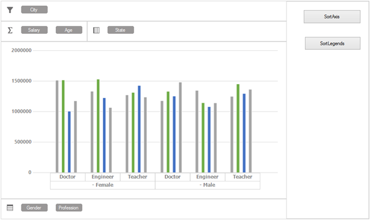

# Sorting in Windows Forms Pivot Chart
The pivot chart supports sorting of both `PivotAxis` and `PivotLegends` programmatically in the ascending and descending order. By default, the pivot chart populates the series in ascending order.

## Sort by pivot axis
The pivot axis can be sorted by adding `PivotSortDescriptor` to the `SortedAxis` collection and `ListSortDirection` to specify the sorting order.

Here "Gender" is an `PivotAxis` item.



//Adding PivotAxis to the SortAxis collection for sorting.
this.pivotChart1.SortedAxis.Add(new PivotSortDescriptor("Gender", ListSortDirection.Ascending));



'Adding PivotAxis to the SortAxis collection for sorting.
Me.pivotChart1.SortedAxis.Add(New PivotSortDescriptor("Gender", ListSortDirection.Ascending))


 
Before applying sorting

 

After applying sorting on `PivotAxis` "Gender"

 

## Sort by pivot legends
`PivotLegends` can be sorted by adding `PivotSortDescriptor` to the `SortedLegends` collection and `ListSortDirection` to specify the sorting order.

Here, the "State" of `PivotLegends` item is `FieldMappingName` and the sorting order is ascending. 



//Adding PivotAxis to the SortLegends collection for sorting.
this.pivotChart1.SortedLegends.Add(new PivotSortDescriptor("State"));



'Adding PivotAxis to the SortAxis collection for sorting.
Me.pivotChart1.SortedLegends.Add(New PivotSortDescriptor("State"))



## Events
There are two events available in both `SortedAxis` and `SortedLegends` of pivot chart to handle or notify the sorting operation.

<table>
<tr>
<th>S.No</th><th>Event name</th><th>Details</th><th>Event arguments</th>
</tr>
<tr>
<td>1</td><td>Changing</td><td>Occurs before a property in a nested element or the collection is changed.</td><td><a href="https://help.syncfusion.com/cr/windowsforms/Syncfusion.Windows.Forms.PivotChart.PivotItemSortingEventArgs.html">PivotItemSortingEventArgs</a></td>
<tr><td>2</td><td>Changed</td><td>Occurs after a property in a nested element or the collection is changed.	</td><td><a href="https://help.syncfusion.com/cr/windowsforms/Syncfusion.Windows.Forms.PivotChart.PivotItemSortedEventArgs.html">PivotItemSortedEventArgs</a></td>
</tr>
</table>

