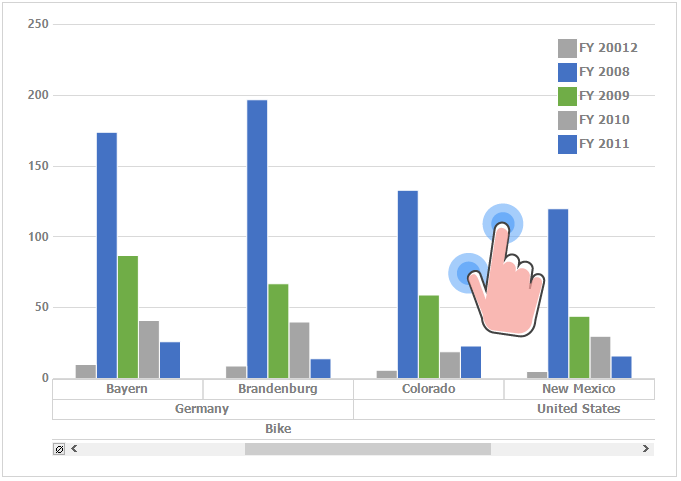

---
layout: post
title: Touch Support in Windows Forms Pivot Chart control | Syncfusion®
description: Learn about Touch Support support in Syncfusion® Windows Forms Pivot Chart control, its elements and more details.
platform: WindowsForms
control: PivotChart
documentation: ug
--- 

# Touch Support in Windows Forms Pivot Chart
The pivot chart provides swipe scrolling, panning, and zooming touch support. The touch support can be enabled by setting the [EnableTouchMode](https://help.syncfusion.com/cr/windowsforms/Syncfusion.Windows.Forms.PivotChart.PivotChart.html#Syncfusion_Windows_Forms_PivotChart_PivotChart_EnableTouchMode) property to `true`. This will enable the pivot chart to support the swiping, panning, and zooming. The default value of the `EnableTouchMode` property is `false`.


//Enable the touch mode for PivotChart
this.pivotChart1.EnableTouchMode = true;


'Enable the touch mode for PivotChart
Me.pivotChart1.EnableTouchMode = True


## Touch swiping
The pivot chart provides the swipe scrolling and panning support in horizontal direction.

## Touch zooming
Touch zooming in both x-axis and y-axis can be enabled by setting the [EnableXZooming](https://help.syncfusion.com/cr/windowsforms/Syncfusion.Windows.Forms.PivotChart.PivotChart.html#Syncfusion_Windows_Forms_PivotChart_PivotChart_EnableXZooming) and [EnableYZooming](https://help.syncfusion.com/cr/windowsforms/Syncfusion.Windows.Forms.PivotChart.PivotChart.html#Syncfusion_Windows_Forms_PivotChart_PivotChart_EnableYZooming) properties to `true`. The default value of `EnableXZooming` is `true` and the default value of `EnableYZooming` is `false`.


//Enable the X axis zooming
this.pivotChart1.EnableXZooming = true;
//Enable the Y axis zooming
this.pivotChart1.EnableYZooming = true;


'Enable the X axis zooming
Me.pivotChart1.EnableXZooming = True
'Enable the Y axis zooming
Me.pivotChart1.EnableYZooming = True



### Disabling X and Y axes zooming
The zooming can be disabled in x-axis and y-axis by setting the `EnableXZooming` and `EnableYZooming` properties to `false`.


//Disable the X axis zooming
this.pivotChart1.EnableXZooming = false;
//Disable the Y axis zooming
this.pivotChart1.EnableYZooming = false;


'Disable the X axis zooming
Me.pivotChart1.EnableXZooming = False
'Disable the Y axis zooming
Me.pivotChart1.EnableYZooming = False


