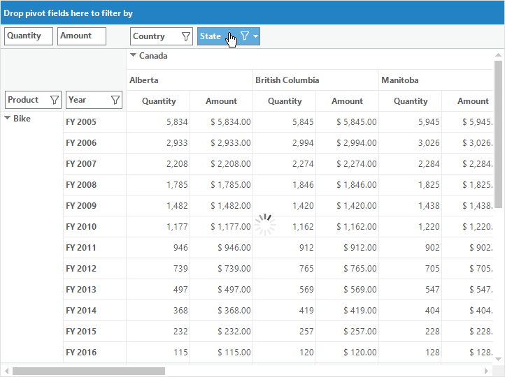

# Asynchronous Data Processing in Windows Forms Pivot Grid

Pivot grid control provides support for loading the data in a unique UI thread i.e., the pivot grid control can perform long running operations asynchronously on a background thread. It also loads the data asynchronously for every layout related operation in the pivot grid.

## Enabling asynchronous loading

To enable the asynchronous loading support, the [EnableAsyncLoading](https://help.syncfusion.com/cr/windowsforms/Syncfusion.Windows.Forms.PivotAnalysis.PivotGridControl.html#Syncfusion_Windows_Forms_PivotAnalysis_PivotGridControl_EnableAsyncLoading) property of pivot grid control is used.

Refer to the below code sample to enable the asynchronous loading support in pivot grid.





this.pivotGridControl1.EnableAsyncLoading = true;





Me.pivotGridControl1.EnableAsyncLoading = True





N> It is possible to find whether the pivot grid control is in asynchronous mode or not by using the [InAsyncMode](https://help.syncfusion.com/cr/windowsforms/Syncfusion.Windows.Forms.PivotAnalysis.PivotGridControl.html#Syncfusion_Windows_Forms_PivotAnalysis_PivotGridControl_InAsyncMode) property of pivot grid.

## Asynchronous operations

Pivot grid control provides support for asynchronous loading for every layout changes such as filtering, sorting, drag and drop operations that manipulate the pivot table field list.

The below screenshot illustrates the asynchronous data processing while sorting the pivot column item "State".

## Customizing loading icon

The loading icon can be customized by using the [BusyAnimationIcon](https://help.syncfusion.com/cr/windowsforms/Syncfusion.Windows.Forms.PivotAnalysis.PivotGridControl.html#Syncfusion_Windows_Forms_PivotAnalysis_PivotGridControl_BusyAnimationIcon) property of pivot grid control.

Refer to the below code sample to change the default loading icon that is used to denote asynchronous loading.





this.pivotGridControl1.BusyAnimationIcon = Image.FromFile(@"Loading.gif");





Me.pivotGridControl1.BusyAnimationIcon = Image.FromFile("Loading.gif")





## Disabling loading icon

During asynchronous loading, an icon will be displayed at the center of the grid by default. This can be disabled by setting the [BusyAnimationIcon](https://help.syncfusion.com/cr/windowsforms/Syncfusion.Windows.Forms.PivotAnalysis.PivotGridControl.html#Syncfusion_Windows_Forms_PivotAnalysis_PivotGridControl_BusyAnimationIcon) property as null.





this.pivotGridControl1.BusyAnimationIcon = null;





Me.pivotGridControl1.BusyAnimationIcon = Nothing





## Events

Following are the events that are available to indicate the status of asynchronous loading operations in pivot grid control.

* The **[AsyncLoadStarted](https://help.syncfusion.com/cr/windowsforms/Syncfusion.Windows.Forms.PivotAnalysis.PivotGridControl.html)** event will be fired whenever the asynchronous operation gets started.
* The **[AsyncLoadCompleted](https://help.syncfusion.com/cr/windowsforms/Syncfusion.Windows.Forms.PivotAnalysis.PivotGridControl.html)** event will be fired whenever the asynchronous operation gets completed.

Refer to the following code sample for handling asynchronous events.





public Form1()
{
    InitializeComponent();
    this.pivotGridControl1.AsyncLoadStarted += new Syncfusion.Windows.Forms.PivotAnalysis.AsyncStartingEventHandler(PivotGrid1_AsyncLoadStarted);
    this.pivotGridControl1.AsyncLoadCompleted += new AsyncCompletedEventHandler(PivotGrid1_AsyncLoadCompleted);
}

private void PivotGridControl1_AsyncLoadStarted(object sender, CancelEventArgs e)
{
    // Required code can be added.
    MessageBox.Show("Asynchronous mode has been started.");
}

private void PivotGridControl1_AsyncLoadCompleted(object sender, AsyncCompletedEventArgs e)
{
    // Required code can be added.
    MessageBox.Show("Asynchronous mode has been completed.");
}





Public Sub Form1()
    InitializeComponent()
    Me.pivotGridControl1.AsyncLoadStarted += New Syncfusion.Windows.Forms.PivotAnalysis.AsyncStartingEventHandler(PivotGrid1_AsyncLoadStarted)
    Me.pivotGridControl1.AsyncLoadCompleted += New AsyncCompletedEventHandler(PivotGrid1_AsyncLoadCompleted)
End Sub

Private Sub PivotGridControl1_AsyncLoadStarted(ByVal sender As Object, ByVal e As CancelEventArgs)
    MessageBox.Show("Asynchronous mode has been started.")
End Sub

Private Sub PivotGridControl1_AsyncLoadCompleted(ByVal sender As Object, ByVal e As AsyncCompletedEventArgs)
    MessageBox.Show("Asynchronous mode has been completed.")
End Sub





A demo sample is available in the following location.

&lt;Installed Drive&gt;\Users\Public\Documents\Syncfusion\Windows\\&lt;Version Number&gt;\PivotGrid.Windows\Samples\Product Showcase\Asynchronous Data Demo
