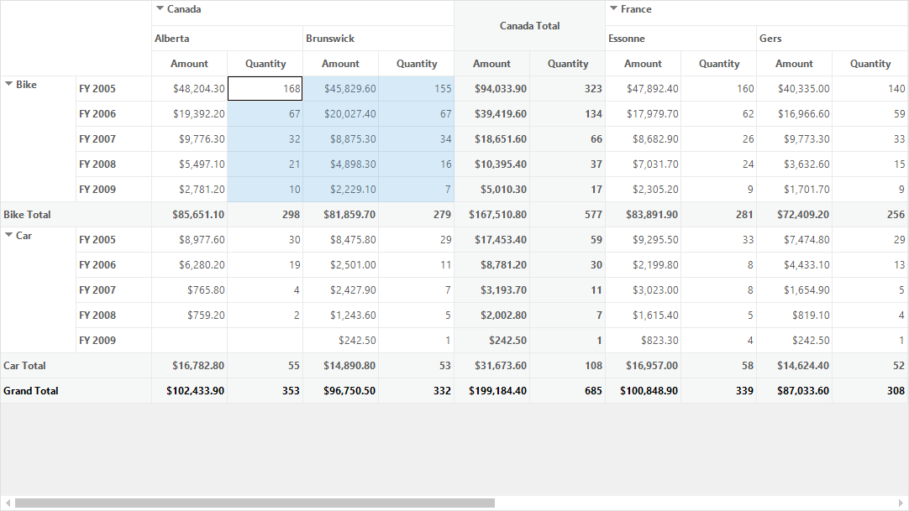
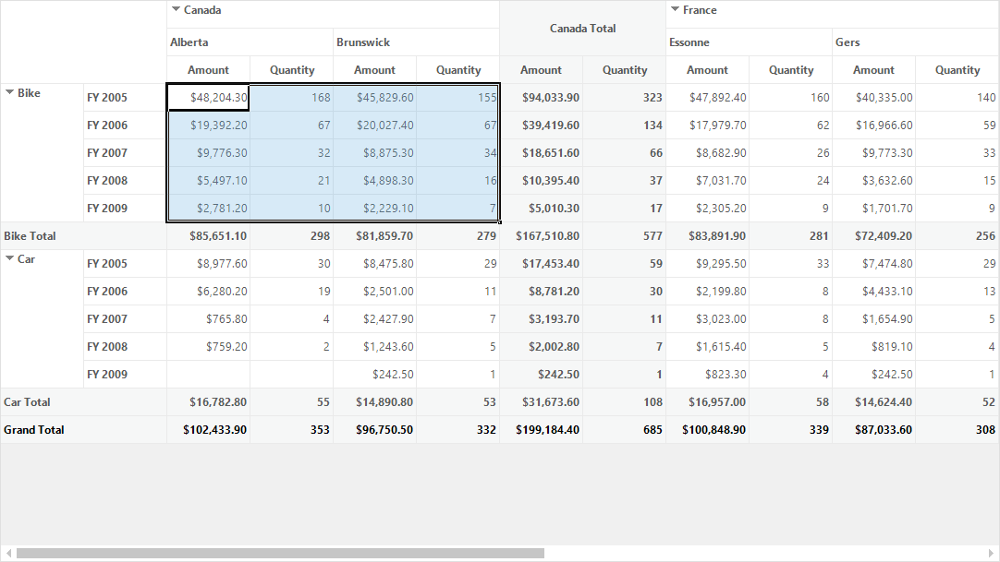
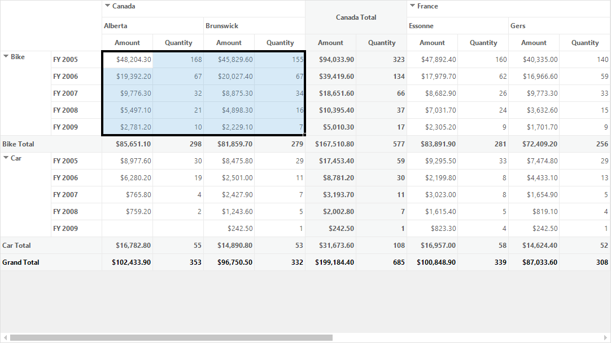

# Cell Selection in Windows Forms Pivot Grid

The pivot grid supports cell selection where you can select grid value cells similar to Microsoft Excel. Using this support, selected cells can be copied to clipboard or notepad. The custom operations can be performed on cell selection and also any control can be bound to the pivot grid based on its selected cell values.

## Enabling cell selection

The cell selection support can be enabled in the pivot grid by using the property of [AllowSelection](https://help.syncfusion.com/cr/windowsforms/Syncfusion.Windows.Forms.PivotAnalysis.PivotGridControlBase.html#Syncfusion_Windows_Forms_PivotAnalysis_PivotGridControlBase_AllowSelection) property. Also the [AllowSelection](https://help.syncfusion.com/cr/windowsforms/Syncfusion.Windows.Forms.Grid.GridModelOptions.html#Syncfusion_Windows_Forms_Grid_GridModelOptions_AllowSelection) property in grid model's options should be set as "Any" to select multiple cells in the pivot grid.

Refer to the below code sample to allow multi cell selection in pivot grid control.





this.pivotGridControl1.TableControl.AllowSelection = true;
this.pivotGridControl1.TableModel.Options.AllowSelection = GridSelectionFlags.Any;





Me.pivotGridControl1.TableControl.AllowSelection = True
Me.pivotGridControl1.TableModel.Options.AllowSelection = GridSelectionFlags.Any





## Excel like selection frame

Pivot grid provides support for Excel like selection and the Excel like selection frame can be enabled by setting the properties of [ExcelLikeSelectionFrame](https://help.syncfusion.com/cr/windowsforms/Syncfusion.Windows.Forms.Grid.GridModelOptions.html#Syncfusion_Windows_Forms_Grid_GridModelOptions_ExcelLikeSelectionFrame) and [ExcelLikeCurrentCell](https://help.syncfusion.com/cr/windowsforms/Syncfusion.Windows.Forms.Grid.GridModelOptions.html#Syncfusion_Windows_Forms_Grid_GridModelOptions_ExcelLikeCurrentCell) to `true`.





this.pivotGridControl1.TableModel.Options.ExcelLikeSelectionFrame = true;
this.pivotGridControl1.TableModel.Options.ExcelLikeCurrentCell = true;





Me.pivotGridControl1.TableModel.Options.ExcelLikeSelectionFrame = True
Me.pivotGridControl1.TableModel.Options.ExcelLikeCurrentCell = True





### Excel 2016 like selection frame

Pivot grid provides support to display the selection frame like Excel 2016 by using the [SelectionFrameOption](https://help.syncfusion.com/cr/windowsforms/Syncfusion.Windows.Forms.Grid.GridModelOptions.html#Syncfusion_Windows_Forms_Grid_GridModelOptions_SelectionFrameOption) property. By default, the selection frame is set as `Excel2016`.

Refer to the below code sample to set the Excel 2016 like selection frame for selecting cells in the pivot grid.





this.pivotGridControl1.TableControl.AllowSelection = true;
this.pivotGridControl1.TableModel.Options.AllowSelection = GridSelectionFlags.Any;
this.pivotGridControl1.TableModel.Options.ExcelLikeSelectionFrame = true;
this.pivotGridControl1.TableModel.Options.ExcelLikeCurrentCell = true;
this.pivotGridControl1.TableModel.Options.SelectionFrameOption = SelectionFrameOption.Excel2016;





Me.pivotGridControl1.TableControl.AllowSelection = True
Me.pivotGridControl1.TableModel.Options.AllowSelection = GridSelectionFlags.Any
Me.pivotGridControl1.TableModel.Options.ExcelLikeSelectionFrame = True
Me.pivotGridControl1.TableModel.Options.ExcelLikeCurrentCell = True
Me.pivotGridControl1.TableModel.Options.SelectionFrameOption = SelectionFrameOption.Excel2016





### Excel 2003 like selection frame

Pivot grid provides support to display the selection frame like Excel 2003 by using the [SelectionFrameOption](https://help.syncfusion.com/cr/windowsforms/Syncfusion.Windows.Forms.Grid.GridModelOptions.html#Syncfusion_Windows_Forms_Grid_GridModelOptions_SelectionFrameOption) property.

Refer to the below code sample to set the Excel 2003 like selection frame for selecting cells in the pivot grid.





this.pivotGridControl1.TableControl.AllowSelection = true;
this.pivotGridControl1.TableModel.Options.AllowSelection = GridSelectionFlags.Any;
this.pivotGridControl1.TableModel.Options.ExcelLikeSelectionFrame = true;
this.pivotGridControl1.TableModel.Options.ExcelLikeCurrentCell = true;
this.pivotGridControl1.TableModel.Options.SelectionFrameOption = SelectionFrameOption.Excel2003;





Me.pivotGridControl1.TableControl.AllowSelection = True
Me.pivotGridControl1.TableModel.Options.AllowSelection = GridSelectionFlags.Any
Me.pivotGridControl1.TableModel.Options.ExcelLikeSelectionFrame = True
Me.pivotGridControl1.TableModel.Options.ExcelLikeCurrentCell = True
Me.pivotGridControl1.TableModel.Options.SelectionFrameOption = SelectionFrameOption.Excel2003





## Customizing selection border

The pivot grid control provides support to customize the default appearance of selection border in Excel-2016 like selection frame.

N> The selection border appearance of Excel 2003 like selection frame cannot be modified.

## Changing selection border brush

The selection border brush of Excel 2016 like selection frame can be customized by the [SelectionBorderBrush](https://help.syncfusion.com/cr/windowsforms/Syncfusion.Windows.Forms.Grid.GridModelOptions.html#Syncfusion_Windows_Forms_Grid_GridModelOptions_SelectionBorderBrush) property.

Refer to the below code sample to change the selection border color.





this.pivotGridControl1.TableModel.Options.SelectionBorderBrush = new SolidBrush(Color. DodgerBlue);





Me.pivotGridControl1.TableModel.Options.SelectionBorderBrush = New SolidBrush(Color. DodgerBlue)





N> The selection border color of Excel 2003 like selection frame is always black and it cannot be modified.

### Changing selection border thickness

The selection border thickness of Excel 2016 like selection frame can be customized by the [SelectionBorderThickness](https://help.syncfusion.com/cr/windowsforms/Syncfusion.Windows.Forms.Grid.GridModelOptions.html#Syncfusion_Windows_Forms_Grid_GridModelOptions_SelectionBorderThickness) property.





this.pivotGridControl1.TableModel.Options.SelectionBorderThickness = 4;





Me.pivotGridControl1.TableModel.Options.SelectionBorderThickness = 4





N> The selection border thickness of Excel 2003 like selection frame is always 2 and it cannot be customized.

## Events

* The **[SelectionChanged](https://help.syncfusion.com/cr/windowsforms/Syncfusion.Windows.Forms.PivotAnalysis.PivotGridControlBase.html)** event occurs when the cells get selected in the pivot grid control. This event receives an argument namely [PivotGridSelectionChangedEventArgs](https://help.syncfusion.com/cr/windowsforms/Syncfusion.Windows.Forms.PivotAnalysis.PivotGridSelectionChangedEventArgs.html), which returns an  IEnumerable collection of selected items. Each selected item contains the information about selected cell like column, row and value details.

* The **[SelectionFrameChanging](https://help.syncfusion.com/cr/windowsforms/Syncfusion.Windows.Forms.Grid.GridControlBase.html)** event occurs while changing the Excel like selection frame.

* The **[SelectionFrameChanged](https://help.syncfusion.com/cr/windowsforms/Syncfusion.Windows.Forms.Grid.GridControlBase.html)** event occurs when the Excel like selection frame gets changed.

A demo sample is available in the following location.

&lt;Installed Drive&gt;\Users\Public\Documents\Syncfusion\Windows\\&lt;Version Number&gt;\PivotGrid.Windows\Samples\Selection\Cell Selection Demo
