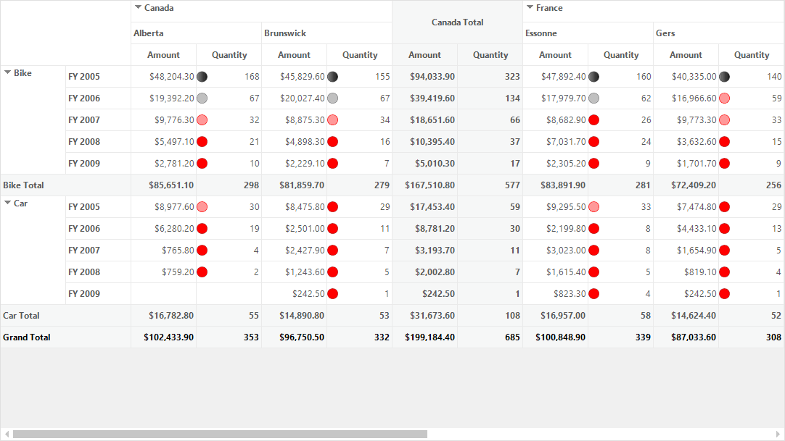
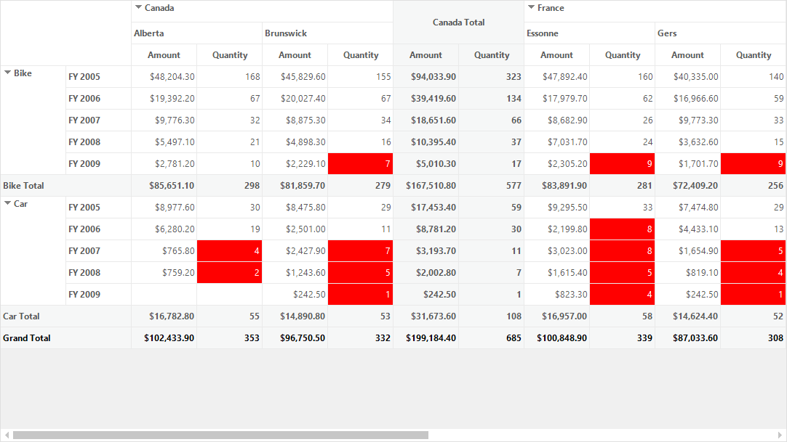

# Conditional Formatting in Windows Forms Pivot Grid

Conditional formatting is a process of applying customized styles to the cells of pivot grid based on conditions specified by the users.

## Adding conditional formats

Conditional formats can be created by using the instance of [NewRuleConditionalFormat](https://help.syncfusion.com/cr/windowsforms/Syncfusion.Windows.Forms.PivotAnalysis.NewRuleConditionalFormat.html) and add it to the [NewRuleCollections](https://help.syncfusion.com/cr/windowsforms/Syncfusion.Windows.Forms.PivotAnalysis.PivotGridNewRuleConditionalFormat.html#Syncfusion_Windows_Forms_PivotAnalysis_PivotGridNewRuleConditionalFormat_NewRuleCollections) property of [PivotGridNewRuleConditionalFormat](https://help.syncfusion.com/cr/windowsforms/Syncfusion.Windows.Forms.PivotAnalysis.PivotGridNewRuleConditionalFormat.html). Then, the created instance of `PivotGridNewRuleConditionalFormat` needs to be added to the [NewRuleConditionalFormat](https://help.syncfusion.com/cr/windowsforms/Syncfusion.Windows.Forms.PivotAnalysis.PivotGridControlBase.html#Syncfusion_Windows_Forms_PivotAnalysis_PivotGridControlBase_NewRuleConditionalFormat) collection.

Refer to the below code sample to add conditional format in the pivot grid control.





NewRuleConditionalFormat newRule1 = new NewRuleConditionalFormat();
newRule1.FormatStyle = FormatStyle.IconSets;
newRule1.SummaryElement = "Quantity";
newRule1.Image = BitMapImageName.ThreeArrowsColored;
PivotGridNewRuleConditionalFormat newRuleFormat1 = new PivotGridNewRuleConditionalFormat();
newRuleFormat1.NewRuleCollections.Add(newRule1);
this.pivotGridControl1.TableControl.NewRuleConditionalFormat.Add(newRuleFormat1);





Dim newRule1 As New NewRuleConditionalFormat()
newRule1.FormatStyle = FormatStyle.IconSets
newRule1.SummaryElement = "Quantity"
newRule1.Image = BitMapImageName.ThreeArrowsColored
Dim newRuleFormat1 As New PivotGridNewRuleConditionalFormat()
newRuleFormat1.NewRuleCollections.Add(newRule1)
Me.pivotGridControl1.TableControl.NewRuleConditionalFormat.Add(newRuleFormat1)





## Rule types

Following are the rule types that are supported by the pivot grid to apply conditional formats based on value cell ranges or conditions specified for a particular summary element.

### Formatting all value cells based on their value range

This type classifies the data into three, four or five groups, each represented by a threshold value that expresses the range. The users can define an icon set, in which each icon represents a particular range. The icons are applied to the value cells based on their corresponding range.

Refer to the below code sample to format cell values of "Quantity" element based on their value range.





NewRuleConditionalFormat newRule1 = new NewRuleConditionalFormat();
newRule1.RuleType = RuleType.FormatAllCellsBasedOnTheirValues;
newRule1.SummaryElement = "Quantity";
newRule1.FormatStyle = FormatStyle.IconSets;
newRule1.Image = BitMapImageName.RedToBlack;
newRule1.ValueType1 = ValueType.Number;
newRule1.Value1 = 30;
newRule1.ValueType2 = ValueType.Number;
newRule1.Value2 = 60;
newRule1.ValueType3 = ValueType.Number;
newRule1.Value3 = 90;
newRule1.ValueType4 = ValueType.Number;
newRule1.Value4 = 120;
PivotGridNewRuleConditionalFormat newRuleFormat1 = new PivotGridNewRuleConditionalFormat();
newRuleFormat1.NewRuleCollections.Add(newRule1);
this.pivotGridControl1.TableControl.NewRuleConditionalFormat.Add(newRuleFormat1);





Dim newRule1 As New NewRuleConditionalFormat()
newRule1.RuleType = RuleType.FormatAllCellsBasedOnTheirValues
newRule1.SummaryElement = "Quantity"
newRule1.FormatStyle = FormatStyle.IconSets
newRule1.Image = BitMapImageName.RedToBlack
newRule1.ValueType1 = ValueType.Number
newRule1.Value1 = 30
newRule1.ValueType2 = ValueType.Number
newRule1.Value2 = 60
newRule1.ValueType3 = ValueType.Number
newRule1.Value3 = 90
newRule1.ValueType4 = ValueType.Number
newRule1.Value4 = 120
Dim newRuleFormat1 As New PivotGridNewRuleConditionalFormat()
newRuleFormat1.NewRuleCollections.Add(newRule1)
Me.pivotGridControl1.TableControl.NewRuleConditionalFormat.Add(newRuleFormat1)





### Formatting only value cells based on certain criteria

This type applies specified format to value cells that meet the defined criteria only.

Refer to the below code sample to format only cell values of "Quantity" element that contain value between "30" and "60".





NewRuleConditionalFormat newRule1 = new NewRuleConditionalFormat();
newRule1.RuleType = RuleType.FormatOnlyCellsThatContain;
newRule1.SummaryElement = "Quantity";

ConditionalFormat condition1 = new ConditionalFormat();
condition1.PredicateType = PredicateType.And;
condition1.ConditionType = PivotGridDataConditionType.Between;
condition1.StartValue = 30;
condition1.EndValue = 60;
newRule1.Conditions.Add(condition1);

PivotGridNewRuleConditionalFormat newRuleFormat1 = new PivotGridNewRuleConditionalFormat();
newRuleFormat1.NewRuleCollections.Add(newRule1);
newRuleFormat1.PivotCellStyle.BackColor = Color.Red;
newRuleFormat1.PivotCellStyle.TextColor = Color.White;
this.pivotGridControl1.TableControl.NewRuleConditionalFormat.Add(newRuleFormat1);





Dim newRule1 As New NewRuleConditionalFormat()
newRule1.RuleType = RuleType.FormatOnlyCellsThatContain
newRule1.SummaryElement = "Quantity"

Dim condition1 As New ConditionalFormat()
condition1.PredicateType = PredicateType.And
condition1.ConditionType = PivotGridDataConditionType.Between
condition1.StartValue = 30
condition1.EndValue = 60
newRule1.Conditions.Add(condition1)

Dim newRuleFormat1 As New PivotGridNewRuleConditionalFormat()
newRuleFormat1.NewRuleCollections.Add(newRule1)
newRuleFormat1.PivotCellStyle.BackColor = Color.Red
newRuleFormat1.PivotCellStyle.TextColor = Color.White
Me.pivotGridControl1.TableControl.NewRuleConditionalFormat.Add(newRuleFormat1)





### Formatting top or bottom ranked value cells

This type applies specified format to the highest or lowest values in the value cells based on the specified value.

Refer to the below code sample to format the bottom ranked values of "Quantity" element based on rank value of "20".





NewRuleConditionalFormat newRule1 = new NewRuleConditionalFormat();
newRule1.RuleType = RuleType.FormatTopOrBottomRankedValues;
newRule1.SummaryElement = "Quantity";
newRule1.FormateValuesRankType = FormateValuesRankType.Bottom;
newRule1.RankValue = 20;

PivotGridNewRuleConditionalFormat newRuleFormat1 = new PivotGridNewRuleConditionalFormat();
newRuleFormat1.NewRuleCollections.Add(newRule1);
newRuleFormat1.PivotCellStyle.BackColor = Color.Red;
newRuleFormat1.PivotCellStyle.TextColor = Color.White;
this.pivotGridControl1.TableControl.NewRuleConditionalFormat.Add(newRuleFormat1);





Dim newRule1 As New NewRuleConditionalFormat()
newRule1.RuleType = RuleType.FormatTopOrBottomRankedValues
newRule1.SummaryElement = "Quantity"
newRule1.FormateValuesRankType = FormateValuesRankType.Bottom
newRule1.RankValue = 20

Dim newRuleFormat1 As New PivotGridNewRuleConditionalFormat()
newRuleFormat1.NewRuleCollections.Add(newRule1)
newRuleFormat1.PivotCellStyle.BackColor = Color.Red
newRuleFormat1.PivotCellStyle.TextColor = Color.White
Me.pivotGridControl1.TableControl.NewRuleConditionalFormat.Add(newRuleFormat1)





### Formatting only above or below average value cells

This type applies format to value cells whose values are more or less than the average value of specified summary element.

Refer to the below code sample to format only the above average values of "Quantity" element.





NewRuleConditionalFormat newRule1 = new NewRuleConditionalFormat();
newRule1.RuleType = RuleType.FormatOnlyValuesThatAreAboveOrBelowAverage;
newRule1.SummaryElement = "Quantity";
newRule1.FormateSelectedAverageValueType = FormateSelectedAverageValueType.Above;

PivotGridNewRuleConditionalFormat newRuleFormat1 = new PivotGridNewRuleConditionalFormat();
newRuleFormat1.NewRuleCollections.Add(newRule1);
newRuleFormat1.PivotCellStyle.BackColor = Color.Red;
newRuleFormat1.PivotCellStyle.TextColor = Color.White;
this.pivotGridControl1.TableControl.NewRuleConditionalFormat.Add(newRuleFormat1);





Dim newRule1 As New NewRuleConditionalFormat()
newRule1.RuleType = RuleType.FormatOnlyValuesThatAreAboveOrBelowAverage
newRule1.SummaryElement = "Quantity"
newRule1.FormateSelectedAverageValueType = FormateSelectedAverageValueType.Above

Dim newRuleFormat1 As New PivotGridNewRuleConditionalFormat()
newRuleFormat1.NewRuleCollections.Add(newRule1)
newRuleFormat1.PivotCellStyle.BackColor = Color.Red
newRuleFormat1.PivotCellStyle.TextColor = Color.White
Me.pivotGridControl1.TableControl.NewRuleConditionalFormat.Add(newRuleFormat1)





### Formatting only unique or duplicate value cells

Applies formatting to value cells whose values are either identical or different from the other values in a range or summary element.

Refer to the below code sample to format only the above average values of "Quantity" element.





NewRuleConditionalFormat newRule1 = new NewRuleConditionalFormat();
newRule1.RuleType = RuleType.FormatOnlyUniqueOrDuplicateValues;
newRule1.SummaryElement = "Quantity";
newRule1.FormatAllType = FormatAllType.Unique;

PivotGridNewRuleConditionalFormat newRuleFormat1 = new PivotGridNewRuleConditionalFormat();
newRuleFormat1.NewRuleCollections.Add(newRule1);
newRuleFormat1.PivotCellStyle.BackColor = Color.Red;
newRuleFormat1.PivotCellStyle.TextColor = Color.White;
this.pivotGridControl1.TableControl.NewRuleConditionalFormat.Add(newRuleFormat1);





Dim newRule1 As New NewRuleConditionalFormat()
newRule1.RuleType = RuleType.FormatOnlyUniqueOrDuplicateValues
newRule1.SummaryElement = "Quantity"
newRule1.FormatAllType = FormatAllType.Unique

Dim newRuleFormat1 As New PivotGridNewRuleConditionalFormat()
newRuleFormat1.NewRuleCollections.Add(newRule1)
newRuleFormat1.PivotCellStyle.BackColor = Color.Red
newRuleFormat1.PivotCellStyle.TextColor = Color.White
Me.pivotGridControl1.TableControl.NewRuleConditionalFormat.Add(newRuleFormat1)





A demo sample is available in the following location.

&lt;Installed Drive&gt;\Users\Public\Documents\Syncfusion\Windows\\&lt;Version Number&gt;\PivotGrid.Windows\Samples\Appearance\Conditional Formatting Demo
