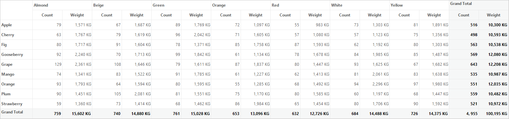

# Data Binding in Windows Forms Pivot Grid

Pivot grid control is designed to display the bounded data in a tabular format. The data binding can be achieved by assigning data sources through [ItemSource](https://help.syncfusion.com/cr/windowsforms/Syncfusion.Windows.Forms.PivotAnalysis.PivotGridControl.html#Syncfusion_Windows_Forms_PivotAnalysis_PivotGridControl_ItemSource) property.

## Binding data from IEnumerable list

Pivot grid allows to bind a list based collection as its data source. Refer to the below code sample to bind the list collection to the pivot grid control.





using System;
using System.Collections.Generic;
using System.Windows.Forms;
using Syncfusion.PivotAnalysis.Base;
using Syncfusion.Windows.Forms;

namespace PivotGridDemo
{
    public partial class Form1 : Form
    {
        public Form1()
        {
            InitializeComponent();
            pivotGridControl1.GridVisualStyles = GridVisualStyles.Metro;

            // Adding ItemSource to the control
            pivotGridControl1.ItemSource = ProductSalesData.GetSalesData();
            pivotGridControl1.PivotRows.Add(new PivotItem { FieldMappingName = "Product", TotalHeader = "Total" });
            pivotGridControl1.PivotRows.Add(new PivotItem { FieldMappingName = "Date", TotalHeader = "Total" });
            pivotGridControl1.PivotColumns.Add(new PivotItem { FieldMappingName = "Country", TotalHeader = "Total" });
            pivotGridControl1.PivotCalculations.Add(new PivotComputationInfo { FieldName = "Amount", Format = "C", SummaryType = SummaryType.DoubleTotalSum });
            pivotGridControl1.PivotCalculations.Add(new PivotComputationInfo { FieldName = "Quantity", Format = "#,##0" });
        }
    }

    public class ProductSalesData
    {
        public static ProductSalesCollection GetSalesData()
        {
            // Geography
            string[] countries = { "Australia", "Canada", "France", "Germany", "United Kingdom", "United States" };
            string[] state1 = { "New South Wales", "Queensland", "South Australia" };
            string[] state2 = { "Alberta", "British Columbia", "Brunswick", "Manitoba", "Ontario", "Quebec" };
            string[] state3 = { "Charente Maritime", "Essonne", "Garonne (Haute)", "Gers" };
            string[] state4 = { "Bayern", "Brandenburg", "Hamburg", "Hessen", "Nordrhein Westfalen", "Saarland" };
            string[] state5 = { "England" };
            string[] state6 = { "New York", "North Carolina", "Alabama", "California", "Colorado", "New Mexico", "South Carolina" };

            // Time
            string[] dates = { "FY 2005", "FY 2006", "FY 2007", "FY 2008", "FY 2009" };

            // Products
            string[] products = { "Bike", "Car" };
            Random r = new Random(123345345);

            ProductSalesCollection listOfProductSales = new ProductSalesCollection();
            for (int i = 0; i < 2000; i++)
            {
                ProductSales sales = new ProductSales();
                sales.Country = countries[r.Next(1, countries.GetLength(0))];
                sales.Quantity = r.Next(1, 12);
                // 1 percent discount for 1 quantity
                double discount = (30 * sales.Quantity) * (double.Parse(sales.Quantity.ToString()) / 100);
                sales.Amount = (50 * sales.Quantity) - discount;
                sales.TotalPrice = sales.Amount * sales.Quantity;
                sales.UnitPrice = sales.Amount / sales.Quantity;
                sales.Date = dates[r.Next(r.Next(dates.GetLength(0) + 1))];
                sales.Product = products[r.Next(r.Next(products.GetLength(0) + 1))];
                switch (sales.Country)
                {
                    case "Australia":
                        {
                            sales.State = state1[r.Next(state1.GetLength(0))];
                            break;
                        }
                    case "Canada":
                        {
                            sales.State = state2[r.Next(state2.GetLength(0))];
                            break;
                        }
                    case "France":
                        {
                            sales.State = state3[r.Next(state3.GetLength(0))];
                            break;
                        }
                    case "Germany":
                        {
                            sales.State = state4[r.Next(state4.GetLength(0))];
                            break;
                        }
                    case "United Kingdom":
                        {
                            sales.State = state5[r.Next(state5.GetLength(0))];
                            break;
                        }
                    case "United States":
                        {
                            sales.State = state6[r.Next(state6.GetLength(0))];
                            break;
                        }
                }
                listOfProductSales.Add(sales);
            }

            return listOfProductSales;
        }
    }

    public class ProductSales
    {
        public string Product { get; set; }
        public string Date { get; set; }
        public string Country { get; set; }
        public string State { get; set; }
        public int Quantity { get; set; }
        public double Amount { get; set; }
        public double UnitPrice { get; set; }
        public double TotalPrice { get; set; }
    }

    public class ProductSalesCollection : List<ProductSales>
    {
    }
}





Imports System
Imports System.Collections.Generic
Imports System.Windows.Forms
Imports Syncfusion.PivotAnalysis.Base
Imports Syncfusion.Windows.Forms

Namespace PivotGridDemo
    Partial Public Class Form1
        Inherits Form
        Public Sub New()
            InitializeComponent()
            pivotGridControl1.GridVisualStyles = GridVisualStyles.Metro

            ' Adding ItemSource to the control
            pivotGridControl1.ItemSource = ProductSalesData.GetSalesData()
            pivotGridControl1.PivotRows.Add(New PivotItem With {.FieldMappingName = "Product", .TotalHeader = "Total"})
            pivotGridControl1.PivotRows.Add(New PivotItem With {.FieldMappingName = "Date", .TotalHeader = "Total"})
            pivotGridControl1.PivotColumns.Add(New PivotItem With {.FieldMappingName = "Country", .TotalHeader = "Total"})
            pivotGridControl1.PivotCalculations.Add(New PivotComputationInfo With {.FieldName = "Amount", .Format = "C", .SummaryType = SummaryType.DoubleTotalSum})
            pivotGridControl1.PivotCalculations.Add(New PivotComputationInfo With {.FieldName = "Quantity", .Format = "#,##0"})
        End Sub
    End Class

    Public Class ProductSalesData
        Public Shared Function GetSalesData() As ProductSalesCollection
            ' Geography
            Dim countries() As String = { "Australia", "Canada", "France", "Germany", "United Kingdom", "United States" }
            Dim state1() As String = { "New South Wales", "Queensland", "South Australia" }
            Dim state2() As String = { "Alberta", "British Columbia", "Brunswick", "Manitoba", "Ontario", "Quebec" }
            Dim state3() As String = { "Charente Maritime", "Essonne", "Garonne (Haute)", "Gers" }
            Dim state4() As String = { "Bayern", "Brandenburg", "Hamburg", "Hessen", "Nordrhein Westfalen", "Saarland" }
            Dim state5() As String = { "England" }
            Dim state6() As String = { "New York", "North Carolina", "Alabama", "California", "Colorado", "New Mexico", "South Carolina" }

            ' Time
            Dim dates() As String = { "FY 2005", "FY 2006", "FY 2007", "FY 2008", "FY 2009" }

            ' Products
            Dim products() As String = { "Bike", "Car" }
            Dim r As New Random(123345345)

            Dim listOfProductSales As New ProductSalesCollection()
            For i As Integer = 0 To 1999
                Dim sales As New ProductSales()
                sales.Country = countries(r.Next(1, countries.GetLength(0)))
                sales.Quantity = r.Next(1, 12)
                ' 1 percent discount for 1 quantity
                Dim discount As Double = (30 * sales.Quantity) * (Double.Parse(sales.Quantity.ToString()) / 100)
                sales.Amount = (50 * sales.Quantity) - discount
                sales.TotalPrice = sales.Amount * sales.Quantity
                sales.UnitPrice = sales.Amount / sales.Quantity
                sales.Date = dates(r.Next(r.Next(dates.GetLength(0) + 1)))
                sales.Product = products(r.Next(r.Next(products.GetLength(0) + 1)))
                Select Case sales.Country
                    Case "Australia"
                            sales.State = state1(r.Next(state1.GetLength(0)))
                            Exit Select
                    Case "Canada"
                            sales.State = state2(r.Next(state2.GetLength(0)))
                            Exit Select
                    Case "France"
                            sales.State = state3(r.Next(state3.GetLength(0)))
                            Exit Select
                    Case "Germany"
                            sales.State = state4(r.Next(state4.GetLength(0)))
                            Exit Select
                    Case "United Kingdom"
                            sales.State = state5(r.Next(state5.GetLength(0)))
                            Exit Select
                    Case "United States"
                            sales.State = state6(r.Next(state6.GetLength(0)))
                            Exit Select
                End Select
                listOfProductSales.Add(sales)
            Next i

            Return listOfProductSales
        End Function
    End Class

    Public Class ProductSales
        Public Property Product() As String
        Public Property [Date]() As String
        Public Property Country() As String
        Public Property State() As String
        Public Property Quantity() As Integer
        Public Property Amount() As Double
        Public Property UnitPrice() As Double
        Public Property TotalPrice() As Double
    End Class

    Public Class ProductSalesCollection
        Inherits List(Of ProductSales)
    End Class
End Namespace





## Binding data from data table

Pivot grid allows to bind a data set from the data table as its data source. Refer to the below code sample to bind the data table to the pivot grid control.





using System;
using System.Collections.Generic;
using System.ComponentModel;
using System.Data;
using System.Windows.Forms;
using Syncfusion.PivotAnalysis.Base;
using Syncfusion.Windows.Forms;

namespace PivotGridDemo
{
    public partial class Form1 : Form
    {
        public Form1()
        {
            InitializeComponent();
            pivotGridControl1.GridVisualStyles = GridVisualStyles.Metro;

            // Adding ItemSource to the Control
            pivotGridControl1.ItemSource = BusinessObjectsDataView.GetDataTable();
            pivotGridControl1.PivotRows.Add(new PivotItem { FieldMappingName = "Fruit", TotalHeader = "Total" });
            pivotGridControl1.PivotColumns.Add(new PivotItem { FieldMappingName = "Color", TotalHeader = "Total" });
            pivotGridControl1.PivotCalculations.Add(new PivotComputationInfo { FieldName = "Count", Format = "#, ##0", SummaryType = SummaryType.DoubleTotalSum });
            pivotGridControl1.PivotCalculations.Add(new PivotComputationInfo { FieldName = "Weight", Format = "#,##0 KG", SummaryType = SummaryType.DecimalTotalSum });
        }
    }

    public class BusinessObjectsDataView : DataView
    {
        public static DataView GetDataTable()
        {
            DataTable dt = new DataTable("BusinessObjectsDataTable");
            PropertyDescriptorCollection propertyDescriptorCollection = TypeDescriptor.GetProperties(typeof(BusinessObject));
            foreach (PropertyDescriptor propertyDescriptor in propertyDescriptorCollection)
            {
                dt.Columns.Add(new DataColumn(propertyDescriptor.Name, propertyDescriptor.PropertyType));
            }
            BusinessObjectCollection businessObjectCollection = BusinessObjectCollection.GetList();
            foreach (BusinessObject businessObject in businessObjectCollection)
            {
                DataRow dataRow = dt.NewRow();
                foreach (PropertyDescriptor propertyDescriptor in propertyDescriptorCollection)
                {
                    dataRow[propertyDescriptor.Name] = propertyDescriptor.GetValue(businessObject);
                }
                dt.Rows.Add(dataRow);
            }
            return dt.DefaultView;
        }
    }

    public class BusinessObjectCollection : List<BusinessObject>
    {
        public static BusinessObjectCollection GetList()
        {
            BusinessObjectCollection list = new BusinessObjectCollection();

            List<string> Fruits = new List<string>(new string[] { "Cherry", "Mango", "Orange", "Grape", "Plum", "Fig", "Apple", "Gooseberry", "Strawberry" });
            List<string> Colors = new List<string>(new string[] { "Red", "Green", "Yellow", "Orange", "Almond", "White", "Beige" });

            int count = 2000;

            Random r = new Random(123345345);
            for (int i = 0; i < count; ++i)
            {
                BusinessObject businessObject = new BusinessObject()
                {
                    Fruit = Fruits[r.Next(Fruits.Count)],
                    Color = Colors[r.Next(Colors.Count)],
                    Weight = (int)(r.NextDouble() * 1000) / 10d,
                    Count = r.Next(4) + 1,
                };
                list.Add(businessObject);
            }
            return list;
        }
    }

    public class BusinessObject
    {
        public string Fruit { get; set; }
        public string Color { get; set; }
        public double Weight { get; set; }
        public int Count { get; set; }
    }
}





Imports Microsoft.VisualBasic
Imports System
Imports System.Collections.Generic
Imports System.ComponentModel
Imports System.Data
Imports System.Windows.Forms
Imports Syncfusion.PivotAnalysis.Base
Imports Syncfusion.Windows.Forms

Namespace PivotGridDemo
    Partial Public Class Form1
        Inherits Form
        Public Sub New()
            InitializeComponent()
            pivotGridControl1.GridVisualStyles = GridVisualStyles.Metro

            ' Adding ItemSource to the Control
            pivotGridControl1.ItemSource = BusinessObjectsDataView.GetDataTable()
            pivotGridControl1.PivotRows.Add(New PivotItem With {.FieldMappingName = "Fruit", .TotalHeader = "Total"})
            pivotGridControl1.PivotColumns.Add(New PivotItem With {.FieldMappingName = "Color", .TotalHeader = "Total"})
            pivotGridControl1.PivotCalculations.Add(New PivotComputationInfo With {.FieldName = "Count", .Format = "#, ##0", .SummaryType = SummaryType.DoubleTotalSum})
            pivotGridControl1.PivotCalculations.Add(New PivotComputationInfo With {.FieldName = "Weight", .Format = "#,##0 KG", .SummaryType = SummaryType.DecimalTotalSum})
        End Sub
    End Class

    Public Class BusinessObjectsDataView
        Inherits DataView
        Public Shared Function GetDataTable() As DataView
            Dim dt As New DataTable("BusinessObjectsDataTable")
            Dim propertyDescriptorCollection As PropertyDescriptorCollection = TypeDescriptor.GetProperties(GetType(BusinessObject))
            For Each propertyDescriptor As PropertyDescriptor In propertyDescriptorCollection
                dt.Columns.Add(New DataColumn(propertyDescriptor.Name, propertyDescriptor.PropertyType))
            Next propertyDescriptor
            Dim businessObjectCollection As BusinessObjectCollection = BusinessObjectCollection.GetList()
            For Each businessObject As BusinessObject In businessObjectCollection
                Dim dataRow As DataRow = dt.NewRow()
                For Each propertyDescriptor As PropertyDescriptor In propertyDescriptorCollection
                    dataRow(propertyDescriptor.Name) = propertyDescriptor.GetValue(businessObject)
                Next propertyDescriptor
                dt.Rows.Add(dataRow)
            Next businessObject
            Return dt.DefaultView
        End Function
    End Class

    Public Class BusinessObjectCollection
        Inherits List(Of BusinessObject)
        Public Shared Function GetList() As BusinessObjectCollection
            Dim list As New BusinessObjectCollection()

            Dim Fruits As New List(Of String)(New String() { "Cherry", "Mango", "Orange", "Grape", "Plum", "Fig", "Apple", "Gooseberry", "Strawberry" })
            Dim Colors As New List(Of String)(New String() { "Red", "Green", "Yellow", "Orange", "Almond", "White", "Beige" })

            Dim count As Integer = 2000

            Dim r As New Random(123345345)
            For i As Integer = 0 To count - 1
                Dim businessObject As New BusinessObject() With {.Fruit = Fruits(r.Next(Fruits.Count)), .Color = Colors(r.Next(Colors.Count)), .Weight = CInt(Fix(r.NextDouble() * 1000)) / 10R, .Count = r.Next(4) + 1}
                list.Add(businessObject)
            Next i
            Return list
        End Function
    End Class

    Public Class BusinessObject
        Public Property Fruit() As String
        Public Property Color() As String
        Public Property Weight() As Double
        Public Property Count() As Integer
    End Class
End Namespace





## Refreshing pivot grid

Using the [Refresh](https://help.syncfusion.com/cr/windowsforms/Syncfusion.Windows.Forms.PivotAnalysis.PivotGridControlBase.html#Syncfusion_Windows_Forms_PivotAnalysis_PivotGridControlBase_Refresh_System_Boolean_) method of [TableControl](https://help.syncfusion.com/cr/windowsforms/Syncfusion.Windows.Forms.PivotAnalysis.PivotGridControl.html#Syncfusion_Windows_Forms_PivotAnalysis_PivotGridControl_TableControl) property in pivot grid, the pivot grid control can be refreshed with or without repopulating the pivot engine.

Refer to the below code sample for refreshing the pivot grid without repopulating the pivot engine.





this.pivotGridControl1.TableControl.Refresh(false);





Me.pivotGridControl1.TableControl.Refresh(False)





## Events

* The **[ItemSourceChanged](https://help.syncfusion.com/cr/windowsforms/Syncfusion.Windows.Forms.PivotAnalysis.PivotGridControlBase.html)** event occurs when the data source is changed by using the **ItemSource** property of pivot grid. This event receives two arguments namely sender, that handles the pivot grid and [ItemSourceChangedEventArgs](https://help.syncfusion.com/cr/windowsforms/Syncfusion.Windows.Forms.PivotAnalysis.ItemSourceChangedEventArgs.html), that contains the event arguments. The ItemSourceChangedEventArgs object contains the following properties:

    * [OldValue](https://help.syncfusion.com/cr/windowsforms/Syncfusion.Windows.Forms.PivotAnalysis.ItemSourceChangedEventArgs.html#Syncfusion_Windows_Forms_PivotAnalysis_ItemSourceChangedEventArgs_OldValue) - gets the value of old data source.
    * [NewValue](https://help.syncfusion.com/cr/windowsforms/Syncfusion.Windows.Forms.PivotAnalysis.ItemSourceChangedEventArgs.html#Syncfusion_Windows_Forms_PivotAnalysis_ItemSourceChangedEventArgs_NewValue) - gets the value of new data source.

* The **[DataRefreshing](https://help.syncfusion.com/cr/windowsforms/Syncfusion.Windows.Forms.PivotAnalysis.PivotGridControlBase.html)** event occurs while starting to refresh the values of pivot grid control. This event receives two arguments namely sender, that handles the pivot grid and [DataRefreshingEventArgs](https://help.syncfusion.com/cr/windowsforms/Syncfusion.Windows.Forms.PivotAnalysis.DataRefreshingEventArgs.html), that contains the event arguments.

* The **[DataRefreshed](https://help.syncfusion.com/cr/windowsforms/Syncfusion.Windows.Forms.PivotAnalysis.PivotGridControlBase.html)** event occurs when the refreshing gets completed by populating its values. This event receives two arguments namely sender, that handles the pivot grid and [DataRefreshedEventArgs](https://help.syncfusion.com/cr/windowsforms/Syncfusion.Windows.Forms.PivotAnalysis.DataRefreshedEventArgs.html), that contains the event arguments.
