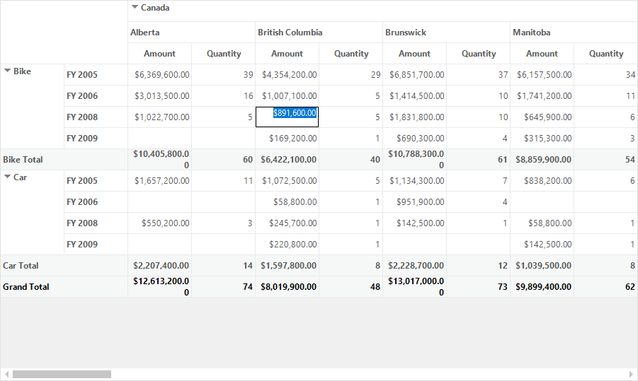
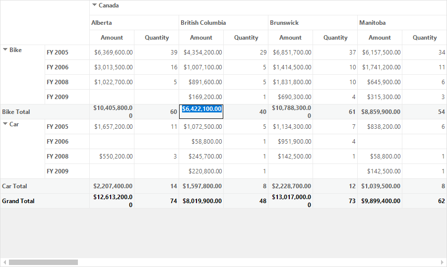
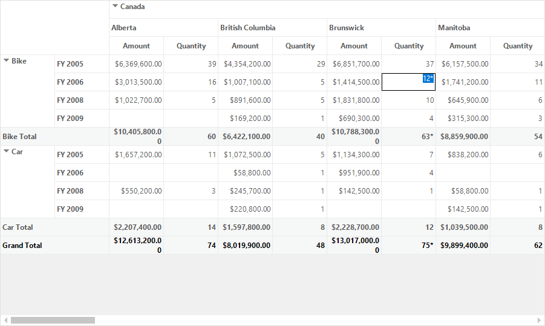

# Editing Values in Windows Forms Pivot Grid

[WinForms Pivot Grid](https://www.syncfusion.com/winforms-ui-controls/pivot-grid) provides support to edit the values of both value cells and total cells. This support is useful when users need to edit the cell values at run time and save their changes to the underlying data source, thereby the changes will be reflected in the total cells based on the modified data.

## Editing value cells

Value cells can be edited by enabling the [EnableValueEditing](https://help.syncfusion.com/cr/windowsforms/Syncfusion.Windows.Forms.PivotAnalysis.PivotGridControl.html#Syncfusion_Windows_Forms_PivotAnalysis_PivotGridControl_EnableValueEditing) property of pivot grid control. While handling the editing operations, the modified values will be calculated and automatically reflected in the total cell values.

Refer to the below code sample to enable editing in total cells of pivot grid.





this.pivotGrid1.EnableValueEditing = true;





Me.pivotGrid1.EnableValueEditing = True





## Editing total cells

Values of total cells can also be edited by using the [AllowEditingOfTotalCells](https://help.syncfusion.com/cr/windowsforms/Syncfusion.Windows.Forms.PivotAnalysis.PivotEditingManager.html#Syncfusion_Windows_Forms_PivotAnalysis_PivotEditingManager_AllowEditingOfTotalCells) property of [EditManager](https://help.syncfusion.com/cr/windowsforms/Syncfusion.Windows.Forms.PivotAnalysis.PivotGridControl.html#Syncfusion_Windows_Forms_PivotAnalysis_PivotGridControl_EditManager).

Refer to the below code sample to enable editing in total cells of pivot grid.





this.pivotGrid1.EnableValueEditing = true;
this.pivotGridControl1.EditManager.AllowEditingOfTotalCells = true;





‘To enable editing in the pivot grid control.
Me.pivotGrid1.EnableValueEditing = True
Me.pivotGrid1.EditManager.AllowEditingOfTotalCells = True





## Customizing editing using custom editing manager

After editing the value, we can further customize the edited value through custom editing manager. The custom editing manager is used to format the value using the pivot cell information.

To customize the default editing, a class need to be created by deriving the [PivotEditingManager](https://help.syncfusion.com/cr/windowsforms/Syncfusion.Windows.Forms.PivotAnalysis.PivotEditingManager.html) class. Then, override the [ChangeValue](https://help.syncfusion.com/cr/windowsforms/Syncfusion.Windows.Forms.PivotAnalysis.PivotEditingManager.html#Syncfusion_Windows_Forms_PivotAnalysis_PivotEditingManager_ChangeValue_System_Object_System_Object_System_Int32_System_Int32_Syncfusion_PivotAnalysis_Base_PivotCellInfo_) method in the derived class to customize the edited value as per your requirement.

Refer to the below code sample to append * symbol in the end of edited values using custom editing manager.





public partial class Form1 : Form
{
    public Form1()
    {
        ......
        this.pivotGridControl1.EditManager = new CustomEditingManager(this.pivotGridControl1.TableControl);
        ......
    }
}

public class CustomEditingManager : PivotEditingManager
{
    public CustomEditingManager(PivotGridControlBase pivotGridControlBase) : base(pivotGridControlBase)
    {
    }

    protected override void ChangeValue(object oldValue, object newValue, int row1, int col1, PivotCellInfo pi)
    {
        //do the base change
        base.ChangeValue(oldValue, newValue, row1, col1, pi);
        //mark all the adjusted cell contents
        pi.FormattedText += "*";
    }
}





Partial Public Class Form1
    Inherits Form
    Public Sub New()
        ......
        Me.pivotGridControl1.EditManager = New CustomEditingManager(Me.pivotGridControl1.TableControl)
        ......
    End Sub
End Class

Public Class CustomEditingManager
    Inherits PivotEditingManager
    Public Sub New(ByVal pivotGridControlBase As PivotGridControlBase)
        MyBase.New(pivotGridControlBase)
    End Sub

    Protected Overrides Sub ChangeValue(ByVal oldValue As Object, ByVal newValue As Object, ByVal row1 As Integer, ByVal col1 As Integer, ByVal pi As PivotCellInfo)
        'do the base change
        MyBase.ChangeValue(oldValue, newValue, row1, col1, pi)
        'mark all the adjusted cell contents
        pi.FormattedText &= "*"
    End Sub
End Class
  


  

A demo sample is available in the following location.

&lt;Installed Drive&gt;\Users\Public\Documents\Syncfusion\Windows\\&lt;Version Number&gt;\PivotGrid.Windows\Samples\Interactive Features\Editing Demo
