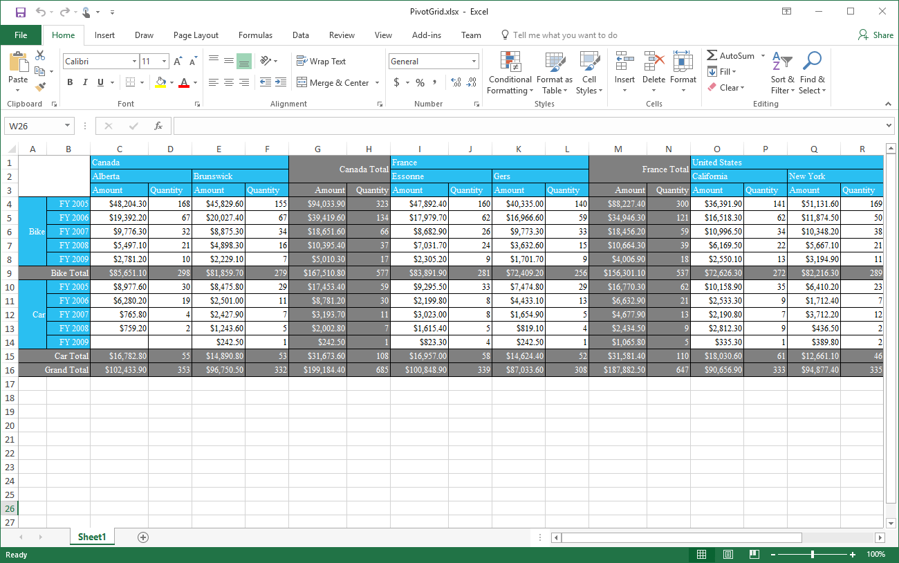
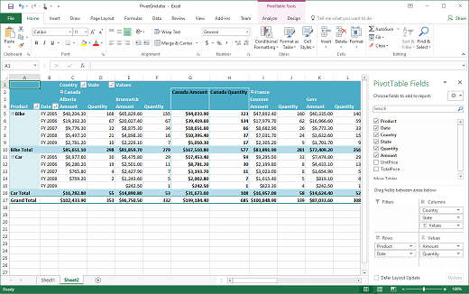
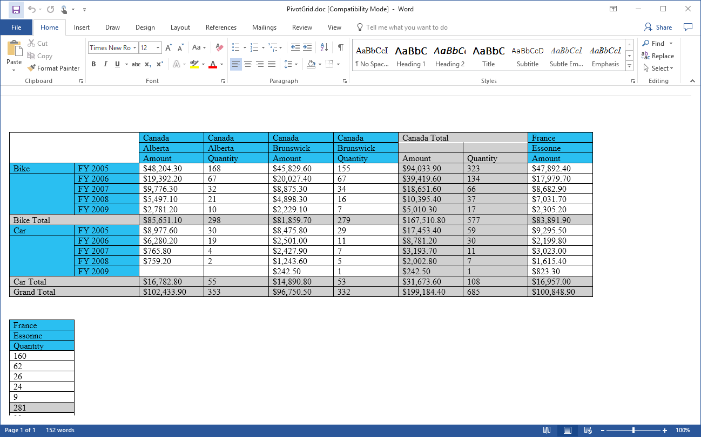
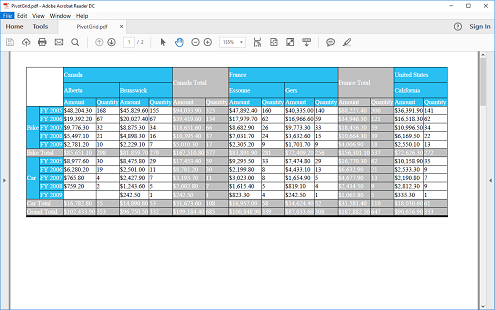

# Exporting in Windows Forms Pivot Grid

[WinForms Pivot Grid](https://www.syncfusion.com/winforms-ui-controls/pivot-grid) provides support to export its data into following formats.

1. Excel
2. Word
3. PDF

## Exporting to Excel

Exporting data to an Excel is one of the most commonly preferred features in the .NET world. The contents of pivot grid can be exported to an Excel document for future archival, references and analysis purposes.

The following references need to be added to the application to achieve this support.

* Syncfusion.PivotConverter.Windows
* Syncfusion.XlsIO.Base

N> Refer the [Getting Started](https://help.syncfusion.com/windowsforms/pivot-grid/getting-started) section of the documentation for creating the pivot grid control.

The [ExcelExport](https://help.syncfusion.com/cr/windowsforms/Syncfusion.PivotConverter.ExcelExport.html) class is a helper class that provides the support for exporting the data from the pivot grid control to the Excel document.

Refer to the below code sample to export the pivot grid contents to an Excel document.





ExcelExport excelExport = new ExcelExport(this.pivotGridControl1, Syncfusion.XlsIO.ExcelVersion.Excel2010);
excelExport.Export(@"D:\PivotGrid.xlsx");





Dim excelExport As New ExcelExport(Me.pivotGridControl1, Syncfusion.XlsIO.ExcelVersion.Excel2010)
excelExport.Export("D:\PivotGrid.xlsx")





## Exporting mode

Pivot grid consists of two exporting modes that are explained below. It is possible to switch the exporting modes using the [ExportMode](https://help.syncfusion.com/cr/windowsforms/Syncfusion.PivotConverter.ExcelExport.html#Syncfusion_PivotConverter_ExcelExport_ExportMode) property of excel export class.

### Cell by cell export

In the cell-by-cell export mode, the contents of pivot grid control are exported cell by cell with all the formats applied on it.

Refer to the below code sample to export cell by cell content of pivot grid control.





ExcelExport excelExport = new ExcelExport(this.pivotGridControl1, Syncfusion.XlsIO.ExcelVersion.Excel2010);
excelExport.ExportMode = ExportModes.Cell;
excelExport.Export(@"D:\PivotGrid.xlsx");





Dim excelExport As New ExcelExport(Me.pivotGridControl1, Syncfusion.XlsIO.ExcelVersion.Excel2010)
excelExport.ExportMode = ExportModes.Cell
excelExport.Export("D:\PivotGrid.xlsx")





### Pivot table export

In the pivot table export mode, the contents of pivot grid control are exported along with its functionalities such as sorting and filtering. The pivot grid provides support to pivot the data via drag and drop in the pivot table.

Refer to the below code sample to export the content of pivot grid control in pivot table mode.





ExcelExport excelExport = new ExcelExport(this.pivotGridControl1, Syncfusion.XlsIO.ExcelVersion.Excel2010);
excelExport.ExportMode = ExportModes.PivotTable;
excelExport.Export(@"D:\PivotGrid.xlsx");





Dim excelExport As New ExcelExport(Me.pivotGridControl1, Syncfusion.XlsIO.ExcelVersion.Excel2010)
excelExport.ExportMode = ExportModes.PivotTable
excelExport.Export("D:\PivotGrid.xlsx")





## Exporting to Word

Pivot grid provides support to export its contents to Word. Users can export the data from the pivot grid control to the Word document for offline verification and/or computation.

The following reference needs to be added to the application to achieve this support.

* Syncfusion.PivotConverter.Windows

N> Refer the [Getting Started](https://help.syncfusion.com/windowsforms/pivot-grid/getting-started) section of the documentation for creating the pivot grid control.

The [PivotWordExport](https://help.syncfusion.com/cr/windowsforms/Syncfusion.PivotConverter.PivotWordExport.html) class is a helper class that provides the support for exporting the data from the pivot grid control to the Word document.

Refer to the below code sample to export the pivot grid contents to a Word document.





PivotWordExport wordExport = new PivotWordExport(this.pivotGridControl1);
wordExport.pivotGridToWord(@"D:\PivotGrid.doc");





Dim wordExport As New PivotWordExport(Me.pivotGridControl1)
wordExport.pivotGridToWord("D:\PivotGrid.doc")





## Exporting to PDF

Pivot grid provides support to export its content to a PDF file. The data in the pivot grid control can be converted to a PDF document for offline verification and/or computation.

The following reference needs to be added to the application to achieve this support.

* Syncfusion.PivotConverter.Windows

N> Refer the [Getting Started](https://help.syncfusion.com/windowsforms/pivot-grid/getting-started) section of the documentation for creating the pivot grid control.

The [PivotPdfExport](https://help.syncfusion.com/cr/windowsforms/Syncfusion.PivotConverter.PivotPdfExport.html) class is a helper class that provides the support for exporting the data from the pivot grid control to the PDF document.

Refer to the below code sample to export the pivot grid contents to a PDF document.





PivotPdfExport pdfExport = new PivotPdfExport(this.pivotGridControl1);
pdfExport.Export(@"D:\PivotGrid.pdf");





Dim pdfExport As New PivotPdfExport(Me.pivotGridControl1)
pdfExport.Export("D:\PivotGrid.pdf")





A demo sample is available in the following location.

&lt;Installed Drive&gt;\Users\Public\Documents\Syncfusion\Windows\\&lt;Version Number&gt;\PivotGrid.Windows\Samples\Exporting\Exporting Demo
