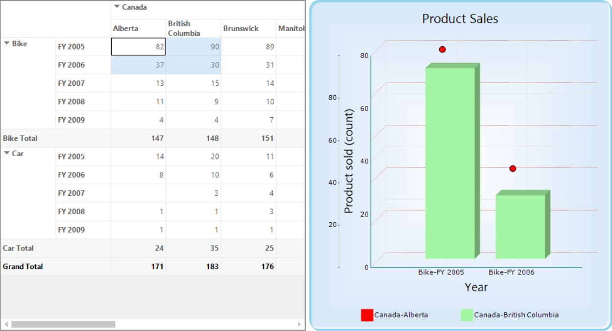

# How to Bind Pivot Grid with Chart

The [PivotGridChartHelper](https://help.syncfusion.com/cr/windowsforms/Syncfusion.GridHelperClasses.PivotGridChartHelper.html) class acts as an interface to bind the values of pivot grid control with the chart control. Based on selected ranges or values of the pivot grid control, the chart control is rendered. To achieve this support, the [WireGrid](https://help.syncfusion.com/cr/windowsforms/Syncfusion.GridHelperClasses.PivotGridChartHelper.html#Syncfusion_GridHelperClasses_PivotGridChartHelper_WireGrid_Syncfusion_Windows_Forms_PivotAnalysis_PivotGridControl_Syncfusion_Windows_Forms_Chart_ChartControl_) method of the PivotGridChartHelper class should be used.

Refer to the following code sample to bind the pivot grid control with chart control.





PivotGridChartHelper helper = new PivotGridChartHelper();
helper.WireGrid(this.pivotGridControl1, this.chartControl1);





Dim helper As New PivotGridChartHelper()
helper.WireGrid(Me.pivotGridControl1, Me.chartControl1)





## Customizing style and type of chart series

The style and type of chart series can be customized at runtime by using the context menu of the chart control. To show the context menu in the chart control, the [ShowContextMenu](https://help.syncfusion.com/cr/windowsforms/Syncfusion.Windows.Forms.Chart.ChartControl.html#Syncfusion_Windows_Forms_Chart_ChartControl_ShowContextMenu) property of chart control should be set to `true`.

Refer to the following code sample to view the context menu of chart control integrated with the pivot grid control.





this.chartControl1.ShowContextMenu = true;





Me.chartControl1.ShowContextMenu = True





## Persisting style and type of chart series

By default, the style and type of chart series modified at runtime are not persisted in the chart control, and the chart control is rendered with default series type and style while selecting the values in the pivot grid control.

To persist the series type and style of the chart control, the [WireGrid](https://help.syncfusion.com/cr/windowsforms/Syncfusion.GridHelperClasses.PivotGridChartHelper.html#Syncfusion_GridHelperClasses_PivotGridChartHelper_WireGrid_Syncfusion_Windows_Forms_PivotAnalysis_PivotGridControl_Syncfusion_Windows_Forms_Chart_ChartControl_) method of [PivotGridChartHelper](https://help.syncfusion.com/cr/windowsforms/Syncfusion.GridHelperClasses.PivotGridChartHelper.html) class should be invoked with `true` parameter as specified in the following code sample.





PivotGridChartHelper helper = new PivotGridChartHelper();
helper.WireGrid(this.pivotGridControl1, this.chartControl1, true);





Dim helper As New PivotGridChartHelper()
helper.WireGrid(Me.pivotGridControl1, Me.chartControl1, True)





For example, the type and color of the first series is changed as scatter and red at runtime as follows.

Using this support, the type and color of the chart series can be maintained in the chart control after selecting the new ranges in the pivot grid control as follows.

A demo sample is available in the following location.

&lt;Installed Drive&gt;\Users\Public\Documents\Syncfusion\Windows\\&lt;Version Number&gt;\PivotGrid.Windows\Samples\Product Showcase\Pivotal Chart Demo
