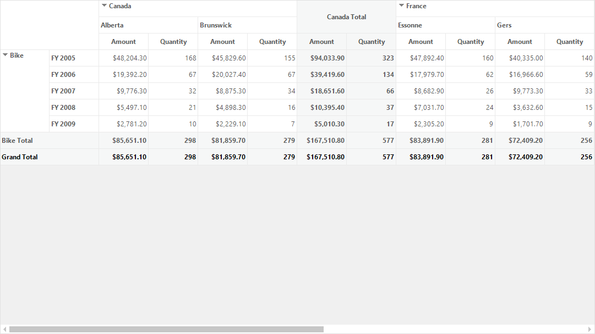
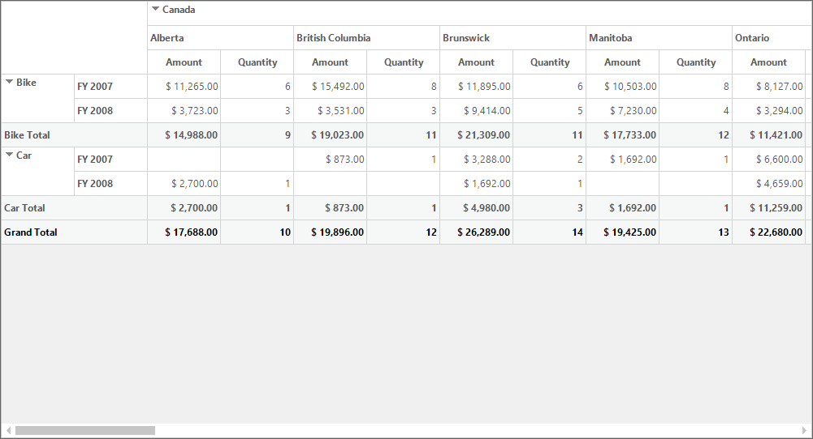
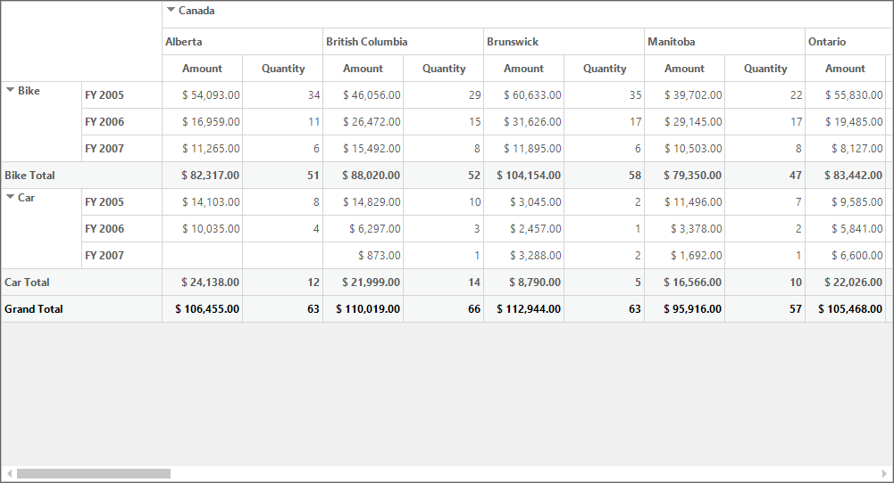

# Filtering in Windows Forms Pivot Grid

The filtered data displays only a subset of data that meets a specific criteria and hides the data that you do not want to display. The filters are automatically re-applied every time when the pivot grid is refreshed or updated until you remove those filters. In the pivot grid, filters are additive, which means that each additional filter is based on the current filter and further reduces the subset of data. At a time, 'n' number of filtering conditions can be applied to the pivot grid.

In the pivot grid control, the filtering operation can be performed by any of the following ways:

## Using filter expression programmatically

The [FilterExpression](https://help.syncfusion.com/cr/windowsforms/Syncfusion.PivotAnalysis.Base.FilterExpression.html) class is used to encapsulate the information required to define a filter and it contains the following properties.

* **Expression** - Specifies the well-formed logical expression that defines the filter.
* **Name** - Specifies the name of the filter expression.
* **DimensionName** - Specifies the dimension name for filter expression.
* **DimensionHeader** - Specifies the dimension header for filter expression.
* **Format** - Specifies the format of filter expression.
* **Evaluator** - Evaluates the specified value.

Set the FieldMappingName property value into the DimensionName and DimensionHeader properties. Because it must be in the ItemProperties collection. If the DimensionHeader value is not defined in the FilterExpression,the DimensionName value is assigned to the DimensionHeader property automatically.

### Defining filter expressions

To define a filter, create an instance of [FilterExpression](https://help.syncfusion.com/cr/windowsforms/Syncfusion.PivotAnalysis.Base.FilterExpression.html) class and add that instance to [Filters](https://help.syncfusion.com/cr/windowsforms/Syncfusion.Windows.Forms.PivotAnalysis.PivotGridControl.html#Syncfusion_Windows_Forms_PivotAnalysis_PivotGridControl_Filters) collection of pivot grid control.

Refer to the code sample to define filter expressions in the pivot grid control.





FilterExpression filterExpression1 = new FilterExpression()
{
    DimensionHeader = "Product",
    Name = "Product",
    DimensionName = "Product",
    Expression = "Product = Bike"
};
this.pivotGridControl1.Filters.Add(filterExpression1);





Dim m_FilterExpression As filterExpression1 = New FilterExpression() With
{
    .DimensionHeader = "Product",
    .Name = "Product",
    .DimensionName = "Product",
    .Expression = "Product = Bike"
}
pivotGridControl1.Filters.Add(filterExpression1)





Refer to the code sample to define a filter expression in the pivot grid control by using the 'OR' operator.





FilterExpression filterExpression1 = new FilterExpression() 
{ 
    DimensionHeader = "Date", 
    Name = "Date", 
    DimensionName = "Date", 
    Expression = "Date = FY 2007 OR Date = FY 2008" 
}; 
this.pivotGridControl1.Filters.Add(filterExpression1);





Dim m_FilterExpression As filterExpression1 = New FilterExpression() With
{
    .DimensionHeader = "Date",
    .Name = "Date",
    .DimensionName = "Date",
    .Expression = "Date = FY 2007 OR Date = FY 2008"
}
pivotGridControl1.Filters.Add(filterExpression1)





Refer to the code sample to define a filter expression in the pivot grid control by using the 'IN' operator.





FilterExpression filterExpression1 = new FilterExpression() 
{ 
    DimensionHeader = "Date", 
    Name = "Date", 
    DimensionName = "Date", 
    Expression = "Date IN FY 2005,FY 2006,FY 2007" 
}; 
this.pivotGridControl1.Filters.Add(filterExpression1);





Dim m_FilterExpression As filterExpression1 = New FilterExpression() With
{
    .DimensionHeader = "Date",
    .Name = "Date",
    .DimensionName = "Date",
    .Expression = "Date IN FY 2005,FY 2006,FY 2007"
}
pivotGridControl1.Filters.Add(filterExpression1)





## Using grouping bar's built-in popup

The filtering operation can also be performed by using the built-in popup integrated with the filter, row and column header areas of [grouping bar](https://help.syncfusion.com/windowsforms/pivot-grid/grouping-bar).

While clicking on the filter icon present in the header item of row or column or filter header area, a filter popup will be opened by displaying its corresponding list of values. By selecting and unselecting the required values in the list, filtering will be applied to particular header item.

