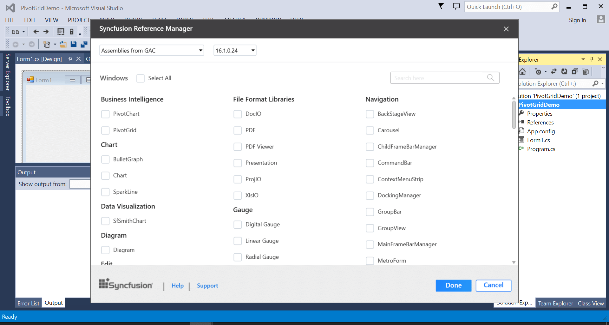
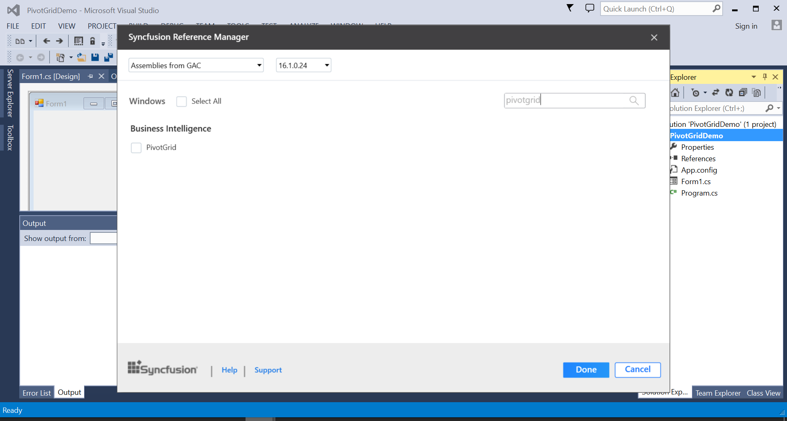
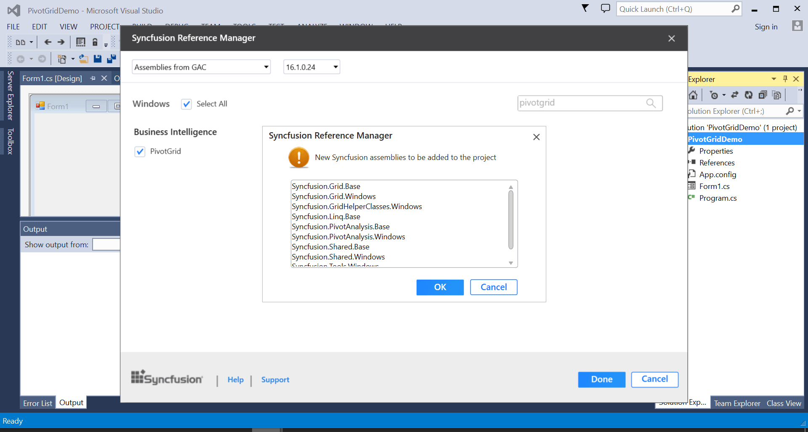
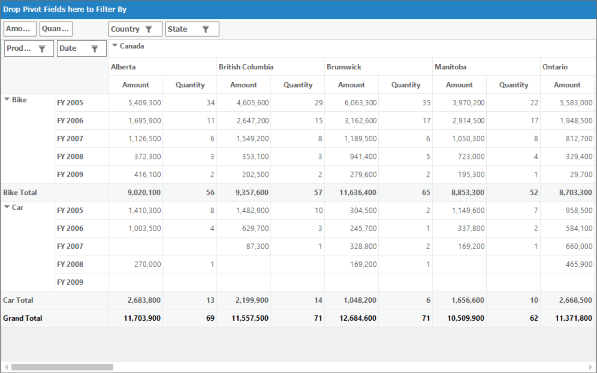
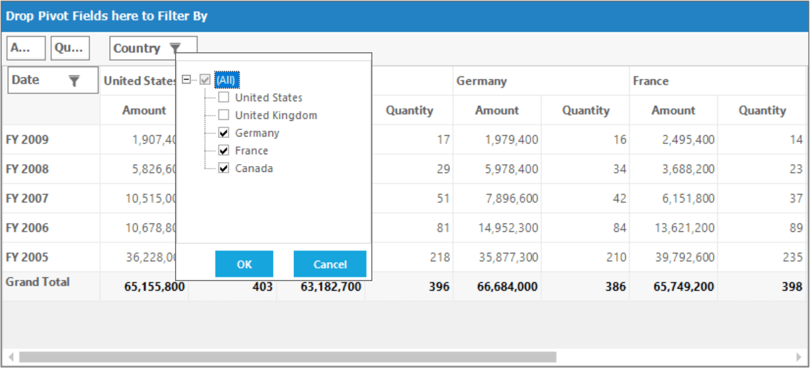
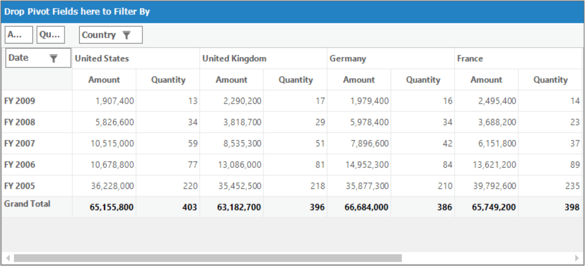

# Getting Started with Windows Forms Pivot Grid

>**Important**
Starting with v16.2.0.x, if you refer to Syncfusion assemblies from trial setup or from the NuGet feed, include a license key in your projects. Refer to this [link](https://help.syncfusion.com/common/essential-studio/licensing/license-key) to learn about registering Syncfusion license key in your Windows Forms application to use our components.

This section provides a quick overview for working with the pivot grid for WinForms. Walk through the entire process of creating a simple pivot grid.

## Assembly deployment

Refer [control dependencies](https://help.syncfusion.com/windowsforms/control-dependencies#pivot-grid) section to get the list of assemblies or NuGet package needs to be added as reference to use the pivot grid control in any application.

## Creating application with pivot grid

This section explains how to add the pivot grid control in Windows Forms application.

### Adding control via designer

The pivot grid control can be added through designer by following the below steps.

1.Create a new **Windows Forms Application** in Visual Studio.

2.Drag and drop the pivot grid control from the toolbox into the designer page.

3.Then, the pivot grid control will be successfully added into the application along with the required libraries.

### Adding control via code

The pivot grid control can be added through code-behind by following the below steps.

1.Create a new **Windows Forms Application** in Visual Studio.

2.Add the following assembly references to the project.

* Syncfusion.Grid.Windows.dll
* Syncfusion.PivotAnalysis.Base.dll
* Syncfusion.PivotAnalysis.Windows.dll
* Syncfusion.Shared.Base.dll

3.Then initialize the pivot grid control by creating an instance and add it to the form using the code specified below.





//Initialize a new pivot grid.
Syncfusion.Windows.Forms.PivotAnalysis.PivotGridControl pivotGridControl1 = new Syncfusion.Windows.Forms.PivotAnalysis.PivotGridControl();

// Add required size for the pivot grid control
pivotGridControl1.Size = new System.Drawing.Size(344, 250);

// Add the pivot grid control to the parent control.
this.Controls.Add(pivotGridControl1);





'Initialize a new pivot grid.
Dim pivotGridControl1 As New Syncfusion.Windows.Forms.PivotAnalysis.PivotGridControl()

' Add required size for the pivot grid control
pivotGridControl1.Size = New System.Drawing.Size(344, 250)

' Add the pivot grid control to the parent control.
Me.Controls.Add(pivotGridControl1)





### Adding control via Syncfusion reference manager

[Syncfusion reference manager](https://help.syncfusion.com/extension/syncfusion-reference-manager/overview) is a Visual Studio Add-In that helps to add Syncfusion controls. The pivot grid control can be added through Syncfusion reference manager by following the below steps.

1.Create a new **Windows Forms Application** in Visual Studio.

2.Then right-click on the project and select Syncfusion Reference Manager.

3.The Syncfusion Reference Manager wizard will be opened as shown below.

4.Select the pivot grid control by searching it using search box. Then click on done button to add the selected pivot grid control.

5.The required assemblies will be automatically added to the project by clicking ok button.

6.Add the following code sample in code behind to create a simple pivot grid control.





//Initialize a new pivot grid.
Syncfusion.Windows.Forms.PivotAnalysis.PivotGridControl pivotGridControl1 = new Syncfusion.Windows.Forms.PivotAnalysis.PivotGridControl();

// Add required size for the pivot grid control
pivotGridControl1.Size = new System.Drawing.Size(344, 250);

// Add the pivot grid control to the parent control.
this.Controls.Add(pivotGridControl1);





'Initialize a new pivot grid.
Dim pivotGridControl1 As New Syncfusion.Windows.Forms.PivotAnalysis.PivotGridControl()

' Add required size for the pivot grid control
pivotGridControl1.Size = New System.Drawing.Size(344, 250)

' Add the pivot grid control to the parent control.
Me.Controls.Add(pivotGridControl1)





N>
Syncfusion reference manager supports for specific framework which is shipped (assemblies) in our Syncfusion Essential Studio setup. So, if you try to add Syncfusion assemblies in project and framework which is not supported with selected Syncfusion version assemblies, then the dialog will be appeared by specifying that “Current build v{version} is not supported this framework v{Framework Version}”.

## Binding data

This section guides you on how to bind data source and its appropriate fields to a pivot grid control. The data source assigned to the pivot grid control should either be an [IEnumerable](https://docs.microsoft.com/en-us/dotnet/api/system.collections.generic.ienumerable-1?redirectedfrom=MSDN&view=net-5.0) list or a [DataView](https://docs.microsoft.com/en-us/dotnet/api/system.data.dataview?redirectedfrom=MSDN&view=net-5.0).

In this example, `IEnumerable` list is used as data source for the pivot grid control and the sample data source contains properties like Product, Date, Country, State, Quantity, Amount, UnitPrice and TotalPrice for demonstration purpose.





public class ProductSales
{
    public string Product { get; set; }

    public string Date { get; set; }

    public string Country { get; set; }

    public string State { get; set; }

    public int Quantity { get; set; }

    public double Amount { get; set; }

    public double UnitPrice { get; set; }

    public double TotalPrice { get; set; }

    public static ProductSalesCollection GetSalesData()
    {
        // Geography
        string[] countries = new string[] { "Australia", "Canada", "France", "Germany", "United Kingdom", "United States" };

        string[] states1 = new string[] { "New South Wales", "Queensland", "South Australia", "Tasmania", "Victoria" };

        string[] states2 = new string[] { "Alberta", "British Columbia", "Brunswick", "Manitoba", "Ontario", "Quebec" };

        string[] states3 = new string[] { "Charente Maritime", "Essonne", "Garonne (Haute)", "Gers", };

        string[] states4 = new string[] { "Munich", "Brandenburg", "Hamburg", "Hessen", "Nordrhein Westfalen", "Saarland" };

        string[] states5 = new string[] { "England" };

        string[] states6 = new string[] { "New York", "North Carolina", "Alabama", "California", "Colorado", "New Mexico", "South Carolina" };

        // Time
        string[] dates = new string[] { "FY 2005", "FY 2006", "FY 2007", "FY 2008", "FY 2009" };

        // Products
        string[] products = new string[] { "Bike", "Car" };

        Random r = new Random(123345345);
        int numberOfRecords = 2000;
        ProductSalesCollection listOfProductSales = new ProductSalesCollection();
        for (int i = 0; i < numberOfRecords; i++)
        {
            ProductSales sales = new ProductSales();
            sales.Country = countries[r.Next(1, countries.GetLength(0))];
            sales.Quantity = r.Next(1, 12);

            /// 1 percent discount for 1 quantity
            double discount = (30000 * sales.Quantity) * (double.Parse(sales.Quantity.ToString()) / 100);
            sales.Amount = (30000 * sales.Quantity) - discount;
            sales.TotalPrice = sales.Amount * sales.Quantity;
            sales.UnitPrice = sales.Amount / sales.Quantity;
            sales.Date = dates[r.Next(r.Next(dates.GetLength(0) + 1))];
            sales.Product = products[r.Next(r.Next(products.GetLength(0) + 1))];
            switch (sales.Country)
            {
                case "Australia":
                    {
                        sales.State = states1[r.Next(states1.GetLength(0))];
                        break;
                    }
                case "Canada":
                    {
                        sales.State = states2[r.Next(states2.GetLength(0))];
                        break;
                    }
                case "France":
                    {
                        sales.State = states3[r.Next(states3.GetLength(0))];
                        break;
                    }
                case "Germany":
                    {
                        sales.State = states4[r.Next(states4.GetLength(0))];
                        break;
                    }
                case "United Kingdom":
                    {
                        sales.State = states5[r.Next(states5.GetLength(0))];
                        break;
                    }
                case "United States":
                    {
                        sales.State = states6[r.Next(states6.GetLength(0))];
                        break;
                    }
            }
            listOfProductSales.Add(sales);
        }
        return listOfProductSales;
    }

    //Retrieve the item source from the ProductSalesCollection
    public class ProductSalesCollection : List<ProductSales>
    {
    }
}





Public Class ProductSales

    Public Property Product As String

    Public Property Date As String

    Public Property Country As String

    Public Property State As String

    Public Property Quantity As Integer

    Public Property Amount As Double

    Public Property UnitPrice As Double

    Public Property TotalPrice As Double

    Public Shared Function GetSalesData() As ProductSalesCollection
        Dim countries As String() = New String() {"Australia", "Canada", "France", "Germany", "United Kingdom", "United States"}
        Dim states1 As String() = New String() {"New South Wales", "Queensland", "South Australia", "Tasmania", "Victoria"}
        Dim states2 As String() = New String() {"Alberta", "British Columbia", "Brunswick", "Manitoba", "Ontario", "Quebec"}
        Dim states3 As String() = New String() {"Charente Maritime", "Essonne", "Garonne (Haute)", "Gers"}
        Dim states4 As String() = New String() {"Munich", "Brandenburg", "Hamburg", "Hessen", "Nordrhein Westfalen", "Saarland"}
        Dim states5 As String() = New String() {"England"}
        Dim states6 As String() = New String() {"New York", "North Carolina", "Alabama", "California", "Colorado", "New Mexico", "South Carolina"}
        Dim dates As String() = New String() {"FY 2005", "FY 2006", "FY 2007", "FY 2008", "FY 2009"}
        Dim products As String() = New String() {"Bike", "Car"}
        Dim r As Random = New Random(123345345)
        Dim numberOfRecords As Integer = 2000
        Dim listOfProductSales As ProductSalesCollection = New ProductSalesCollection()
        For i As Integer = 0 To numberOfRecords - 1
            Dim sales As ProductSales = New ProductSales()
            sales.Country = countries(r.[Next](1, countries.GetLength(0)))
            sales.Quantity = r.[Next](1, 12)
            Dim discount As Double =(30000 * sales.Quantity) * (Double.Parse(sales.Quantity.ToString()) / 100)
            sales.Amount =(30000 * sales.Quantity) - discount
            sales.TotalPrice = sales.Amount * sales.Quantity
            sales.UnitPrice = sales.Amount / sales.Quantity
            sales.Date = dates(r.[Next](r.[Next](dates.GetLength(0) + 1)))
            sales.Product = products(r.[Next](r.[Next](products.GetLength(0) + 1)))
            Select Case sales.Country
                Case "Australia"
                    sales.State = states1(r.[Next](states1.GetLength(0)))
                    Exit Select
                Case "Canada"
                    sales.State = states2(r.[Next](states2.GetLength(0)))
                    Exit Select
                Case "France"
                    sales.State = states3(r.[Next](states3.GetLength(0)))
                    Exit Select
                Case "Germany"
                    sales.State = states4(r.[Next](states4.GetLength(0)))
                    Exit Select
                Case "United Kingdom"
                    sales.State = states5(r.[Next](states5.GetLength(0)))
                    Exit Select
                Case "United States"
                    sales.State = states6(r.[Next](states6.GetLength(0)))
                    Exit Select
            End Select

            listOfProductSales.Add(sales)
        Next

        Return listOfProductSales
    End Function

    Public Class ProductSalesCollection
        Inherits List(Of ProductSales)

    End Class
End Class





N>
`ProductSales` is a class that consists of `IList` data. For more information, refer the *Getting Started* demo sample which is located in the following location.
&lt;Installed Drive&gt;\Users\Public\Documents\Syncfusion\Windows\\&lt;Version Number&gt;\PivotGrid.Windows\Samples\Getting Started\Getting Started Demo

The pivot grid control requires the following information in order to populate the data from the data source.

* [ItemSource](https://help.syncfusion.com/cr/windowsforms/Syncfusion.Windows.Forms.PivotAnalysis.PivotGridControl.html#Syncfusion_Windows_Forms_PivotAnalysis_PivotGridControl_ItemSource) - The data source for the pivot table. This object should be either an    [IEnumerable](https://docs.microsoft.com/en-us/dotnet/api/system.collections.generic.ienumerable-1?redirectedfrom=MSDN&view=net-5.0) list or a [DataTable](https://docs.microsoft.com/en-us/dotnet/api/system.data.dataview?redirectedfrom=MSDN&view=net-5.0).
* [PivotRows](https://help.syncfusion.com/cr/windowsforms/Syncfusion.Windows.Forms.PivotAnalysis.PivotGridControl.html#Syncfusion_Windows_Forms_PivotAnalysis_PivotGridControl_PivotRows) - Elements that need to be added in rows of pivot grid control.
* [PivotColumns](https://help.syncfusion.com/cr/windowsforms/Syncfusion.Windows.Forms.PivotAnalysis.PivotGridControl.html#Syncfusion_Windows_Forms_PivotAnalysis_PivotGridControl_PivotColumns) - Elements that need to be added in columns of pivot grid control.
* [PivotCalculations](https://help.syncfusion.com/cr/windowsforms/Syncfusion.Windows.Forms.PivotAnalysis.PivotGridControl.html#Syncfusion_Windows_Forms_PivotAnalysis_PivotGridControl_PivotCalculations) - Calculation values that need to be added as value cells in pivot grid control.

The below code sample illustrates how to bind data source to the pivot grid control.





this.pivotGridControl1.ItemSource = ProductSales.GetSalesData();





Me.pivotGridControl1.ItemSource = ProductSales.GetSalesData()





## Defining pivot rows

The below code sample illustrates how to define pivot row items for the pivot grid control.





this.pivotGridControl1.PivotRows.Add(new PivotItem { FieldMappingName = "Product", TotalHeader = "Total" });
this.pivotGridControl1.PivotRows.Add(new PivotItem { FieldMappingName = "Year", TotalHeader = "Total" });





Me.pivotGridControl1.PivotRows.Add(New PivotItem With {.FieldMappingName = "Product", .TotalHeader = "Total"})
Me.pivotGridControl1.PivotRows.Add(New PivotItem With {.FieldMappingName = "Year", .TotalHeader = "Total"})





## Defining pivot columns

The below code sample illustrates how to define pivot column items for the pivot grid control.





this.pivotGridControl1.PivotColumns.Add(new PivotItem { FieldMappingName = "Country", TotalHeader = "Total" });
this.pivotGridControl1.PivotColumns.Add(new PivotItem { FieldMappingName = "State", TotalHeader = "Total" });





Me.pivotGridControl1.PivotColumns.Add(New PivotItem With {.FieldMappingName = "Country", .TotalHeader = "Total"})
Me.pivotGridControl1.PivotColumns.Add(New PivotItem With {.FieldMappingName = "State", .TotalHeader = "Total"})





## Defining pivot calculations

The below code sample illustrates how to define pivot calculation information for the pivot grid control.





this.pivotGridControl1.PivotCalculations.Add(new PivotComputationInfo { FieldName = "Amount", Format = "C", SummaryType = SummaryType.DoubleTotalSum });
this.pivotGridControl1.PivotCalculations.Add(new PivotComputationInfo { FieldName = "Quantity", Format = "#,##0" });





Me.pivotGridControl1.PivotCalculations.Add(New PivotComputationInfo With {.FieldName = "Amount", .Format = "C", .SummaryType = SummaryType.DoubleTotalSum})
Me.pivotGridControl1.PivotCalculations.Add(New PivotComputationInfo With {.FieldName = "Quantity", .Format = "#,##0"})





Finally, run the application to obtain the following output.

## Pivot schema designer

Pivot schema designer is a layout which is designed to perform like as Microsoft Excel's pivot table field list. It allows you to drag-and-drop fields between different areas, including column, row, value and filter. This pivot schema designer can be enabled in pivot grid control by setting the [ShowPivotTableFieldList](https://help.syncfusion.com/cr/windowsforms/Syncfusion.Windows.Forms.PivotAnalysis.PivotGridControl.html#Syncfusion_Windows_Forms_PivotAnalysis_PivotGridControl_ShowPivotTableFieldList) property to `true`.





// Shows the pivot schema designer.
this.pivotGridControl1.ShowPivotTableFieldList = true;





' Shows the pivot schema designer.
Me.pivotGridControl1.ShowPivotTableFieldList = True





For more information, refer the [pivot schema designer](https://help.syncfusion.com/windowsforms/pivot-grid/pivot-schema-designer) topic.

## Grouping bar

Grouping bar which allows you  to drag and drop fields between different areas such as column, row, value and filter. For enabling the grouping bar, you have to make use of the [ShowGroupBar](https://help.syncfusion.com/cr/windowsforms/Syncfusion.Windows.Forms.PivotAnalysis.PivotGridControl.html#Syncfusion_Windows_Forms_PivotAnalysis_PivotGridControl_ShowGroupBar) property.





// Enables grouping bar.
this.pivotGridControl1.ShowGroupBar = true;





' Enables grouping bar.
Me.pivotGridControl1.ShowGroupBar = True





For more information, refer the [grouping bar](https://help.syncfusion.com/windowsforms/pivot-grid/grouping-bar) topic.

## Filtering

Filtering can be enabled or disabled in pivot grid control by using the [AllowFiltering](https://help.syncfusion.com/cr/windowsforms/Syncfusion.Windows.Forms.PivotAnalysis.PivotGridControl.html#Syncfusion_Windows_Forms_PivotAnalysis_PivotGridControl_AllowFiltering) property. You can apply filters to one or more columns.





// Enables filtering in pivot grid control.
this.pivotGridControl1.AllowFiltering = true;





' Enables filtering in pivot grid control.
Me.pivotGridControl1.AllowFiltering = True





## Sorting

Sorting can be enabled or disabled by using the [AllowSorting](https://help.syncfusion.com/cr/windowsforms/Syncfusion.Windows.Forms.PivotAnalysis.PivotGridControl.html#Syncfusion_Windows_Forms_PivotAnalysis_PivotGridControl_AllowSorting) property. By default, the pivot grid control populates the data in ascending order.





// Enables sorting in pivot grid control.
this.pivotGridControl1.AllowSorting = true;





' Enables sorting in pivot grid control.
Me.pivotGridControl1.AllowSorting = True





