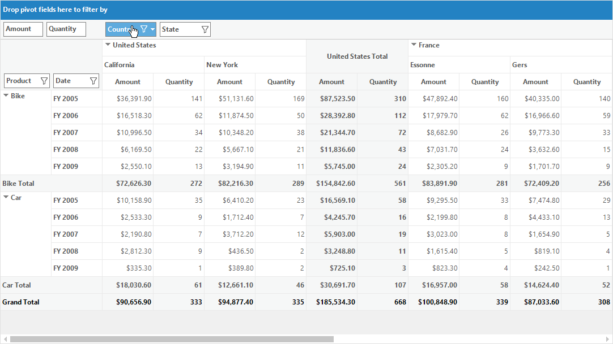
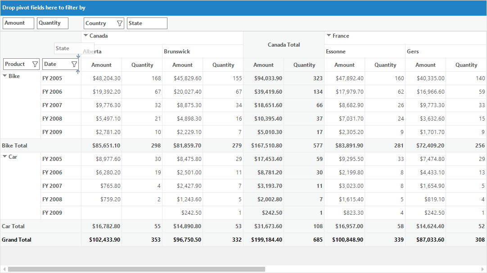
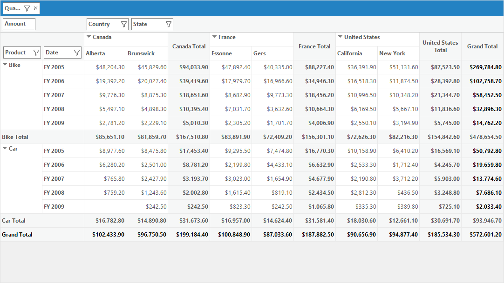

# Grouping Bar in Windows Forms Pivot Grid

The grouping bar allows users to slice and dice the pivot fields between column, row, value and filter header areas. It also allows to add, rearrange or remove the fields to show the data in the pivot grid exactly the way you want.

## Enabling grouping bar

By default, the grouping bar is disabled in the pivot grid control. The [ShowGroupBar](https://help.syncfusion.com/cr/windowsforms/Syncfusion.Windows.Forms.PivotAnalysis.PivotGridControl.html#Syncfusion_Windows_Forms_PivotAnalysis_PivotGridControl_ShowGroupBar) property of pivot grid should be set as true to enable the grouping bar in the pivot grid control.

Refer to the below code sample to enable the grouping bar in pivot grid.





this.pivotGridControl1.ShowGroupBar = true;





Me.pivotGridControl1.ShowGroupBar = True





N>
If [row pivots only mode](https://help.syncfusion.com/windowsforms/pivot-grid/layouts#enabling-flat-layout) is enabled in the pivot grid control, then the grouping bar will be disabled automatically.

## Grouping bar areas

The grouping bar consists of four header areas. The headers of all visible pivot fields are placed within their corresponding header areas.

### Filter header area

The filter header area holds the filter items of pivot grid control and it can be accessed by using the property of [FilterArea](https://help.syncfusion.com/cr/windowsforms/Syncfusion.Windows.Forms.PivotAnalysis.PivotGridControlBase.html#Syncfusion_Windows_Forms_PivotAnalysis_PivotGridControlBase_FilterArea). The headers of pivot filter fields are displayed within the filter header area.

### Data header area

The data header area holds the calculation items of pivot grid control and it can be accessed by using the property of [GroupDropArea](https://help.syncfusion.com/cr/windowsforms/Syncfusion.Windows.Forms.PivotAnalysis.PivotGridControlBase.html#Syncfusion_Windows_Forms_PivotAnalysis_PivotGridControlBase_GroupDropArea). The headers of pivot calculation fields are displayed within the data header area.

### Column header area

The column header area holds the pivot column items of pivot grid control and it can be accessed by using the property of [GroupDropArea](https://help.syncfusion.com/cr/windowsforms/Syncfusion.Windows.Forms.PivotAnalysis.PivotGridControlBase.html#Syncfusion_Windows_Forms_PivotAnalysis_PivotGridControlBase_GroupDropArea). The headers of pivot column fields are displayed within the column header area.

### Row header area

The row header area holds the pivot row items of pivot grid control and it is accessed by using the property of [RowGroupDropArea](https://help.syncfusion.com/cr/windowsforms/Syncfusion.Windows.Forms.PivotAnalysis.PivotGridControlBase.html#Syncfusion_Windows_Forms_PivotAnalysis_PivotGridControlBase_RowGroupDropArea). The headers of pivot row fields are displayed within the row header area.

## Interactive features

Using the grouping bar, the following operations can be performed dynamically in the pivot grid control.

### Filtering values

The grouping bar provides support to display only a subset of data that meets specific criteria and to hide the data that you don’t want to get displayed in the pivot grid with the help of filtering option.

The items present in the header areas except the data header area are supported with the run time filtering option. While clicking on the filter icon present in the header item of row or column or filter header area, a filter popup will be opened by displaying its corresponding list of values. By selecting and unselecting the required values in the list, filtering will be applied to particular header item.

By default, the filtering option is enabled in the grouping bar. In order to disable the filtering option available in the grouping bar, [AllowFiltering](https://help.syncfusion.com/cr/windowsforms/Syncfusion.Windows.Forms.PivotAnalysis.PivotGridControl.html#Syncfusion_Windows_Forms_PivotAnalysis_PivotGridControl_AllowFiltering) property of pivot grid is used.

Refer to the below code sample to disable the filtering option in grouping bar.





this.pivotGridControl1.AllowFiltering = false;





Me.pivotGridControl1.AllowFiltering = False





N>
Filter option is not available for header items present in the data header area of the grouping bar.

### Sorting values

The grouping bar provides support to sort the pivot field values by clicking on the header items present in row header area and column header area.

By default, the pivot field values are sorted in the ascending order. On clicking the same header item once again will reverse the sorting direction. The sort indicator present at the right corner of the header item denotes the type of sorting applied to the pivot field such as ascending order or descending order.

The following screenshot illustrates the "Country" field header which is sorted in descending order.

The following screenshot illustrates the "Country" field header which is sorted in ascending order.

By default, the sorting option is enabled in the grouping bar. In order to disable the sorting option available in the grouping bar, [AllowSorting](https://help.syncfusion.com/cr/windowsforms/Syncfusion.Windows.Forms.PivotAnalysis.PivotGridControl.html#Syncfusion_Windows_Forms_PivotAnalysis_PivotGridControl_AllowSorting) property of pivot grid is used.





this.pivotGridControl1.AllowSorting = false;





Me.pivotGridControl1.AllowSorting = False





N>
Sort option is not available for header items present in the data header area and filter header area of the grouping bar.

### Reordering fields

The grouping bar provides support to reorder or alter its header items at run time. The header items can be dragged and dropped from one header area to other header area. While reordering the header items, the pivot grid control and the pivot schema designer will be updated based on the changes done on grouping bar.

### Removing fields

The grouping bar provides support to remove only the filter items present in the filter header area. Using the remove icon present at the right corner of corresponding header item, the filter field can be removed.

N>
Remove option is not available for header items present in the column header area, row header area and data header area of the grouping bar.

A demo sample is available in the following location.

&lt;Installed Drive&gt;\Users\Public\Documents\Syncfusion\Windows\\&lt;Version Number&gt;\PivotGrid.Windows\Samples\Group Bar\Group Bar Demo
