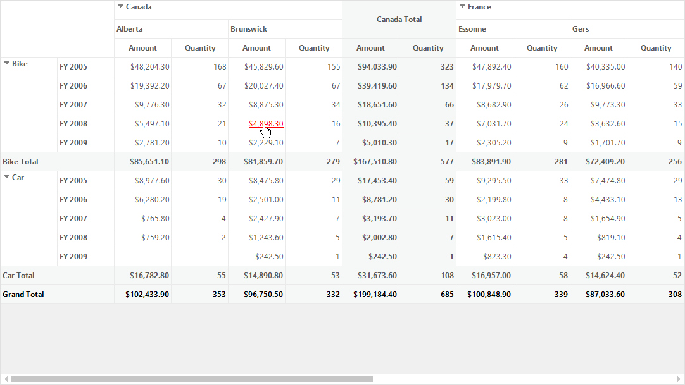
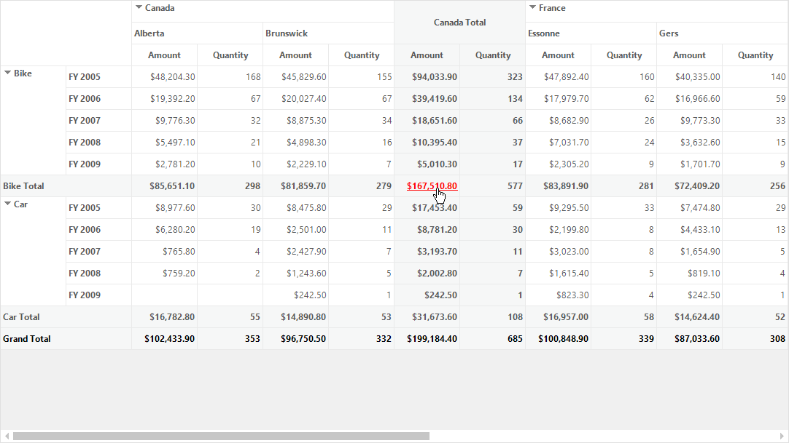

# Hyperlink Cells in Windows Forms Pivot Grid

Pivot grid allows hyperlinking of cells to retrieve a detailed information about a particular cell. Hyperlink cell can be enabled to the following types of cells.

* Row header cells
* Column header cells
* Summary cells
* Value cells

## Hyperlink Cells in Windows Forms Pivot Grid control

To enable the hyperlink in pivot grid cells, the [CellType](https://help.syncfusion.com/cr/windowsforms/Syncfusion.Windows.Forms.Grid.GridStyleInfo.html#Syncfusion_Windows_Forms_Grid_GridStyleInfo_CellType) property of required cells should be set as `HyperlinkCell`. If you want to disable the hyperlink, then the cell type should be set as `TextBox`.

Refer to the below code sample to enable hyperlink for value cells and summary cells.





public Form1()
{
    .....
    this.pivotGridControl1.TableModel.QueryCellInfo += TableModel_QueryCellInfo;
}

private void TableModel_QueryCellInfo(object sender, Syncfusion.Windows.Forms.Grid.GridQueryCellInfoEventArgs e)
{
    if (e.RowIndex > this.pivotGridControl1.PivotColumns.Count + (this.pivotGridControl1.PivotCalculations.Count > 1 ? 1 : 0) && e.ColIndex > this.pivotGridControl1.PivotRows.Count && e.Style.CellValue != null)
    {
        e.Style.CellType = "HyperlinkCell";
        e.Style.Tag = null;
    }
}





Public Sub New()
    .....
    Me.pivotGridControl1.TableModel.QueryCellInfo += TableModel_QueryCellInfo
End Sub

Private Sub TableModel_QueryCellInfo(ByVal sender As Object, ByVal e As Syncfusion.Windows.Forms.Grid.GridQueryCellInfoEventArgs)
    If e.RowIndex > Me.pivotGridControl1.PivotColumns.Count + (If(Me.pivotGridControl1.PivotCalculations.Count > 1, 1, 0)) AndAlso e.ColIndex > Me.pivotGridControl1.PivotRows.Count AndAlso e.Style.CellValue IsNot Nothing Then
        e.Style.CellType = If(Me.checkBox1.Checked, "HyperlinkCell", "TextBox")
        e.Style.Tag = Nothing
    End If
End Sub





_Pivot grid containing hyperlinked value cells_

_Pivot grid containing hyperlinked summary cells_

## Setting hyperlink information to cells

Using the [Tag](https://help.syncfusion.com/cr/windowsforms/Syncfusion.Windows.Forms.Grid.GridStyleInfo.html#Syncfusion_Windows_Forms_Grid_GridStyleInfo_Tag) property of particular cell style, the hyperlink information can be set to the required cells of pivot grid control.

Refer to the below code sample to set hyperlink information to row header cells.





private void TableModel_QueryCellInfo(object sender, Syncfusion.Windows.Forms.Grid.GridQueryCellInfoEventArgs e)
{
    if (e.ColIndex < this.pivotGridControl1.PivotRows.Count && e.Style.CellValue != null)
    {
        e.Style.CellType = "HyperlinkCell";
        if (e.Style.CellValue.ToString().Contains("Bike"))
            e.Style.Tag = "https://en.wikipedia.org/wiki/Types_of_motorcycles";
        else if (e.Style.CellValue.ToString().Contains("Car"))
            e.Style.Tag = "https://en.wikipedia.org/wiki/Car_classification";
    }
}





Public Sub New()
    .....
    Me.pivotGridControl1.TableModel.QueryCellInfo += TableModel_QueryCellInfo
End Sub

Private Sub TableModel_QueryCellInfo(ByVal sender As Object, ByVal e As Syncfusion.Windows.Forms.Grid.GridQueryCellInfoEventArgs)
    If e.ColIndex < Me.pivotGridControl1.PivotRows.Count AndAlso e.Style.CellValue IsNot Nothing Then
        e.Style.CellType = "HyperlinkCell"
        If e.Style.CellValue.ToString().Contains("Bike") Then
            e.Style.Tag = "https://en.wikipedia.org/wiki/Types_of_motorcycles"
        ElseIf e.Style.CellValue.ToString().Contains("Car") Then
            e.Style.Tag = "https://en.wikipedia.org/wiki/Car_classification"
        End If
    End If
End Sub





## Events

The **[HyperlinkCellClick](https://help.syncfusion.com/cr/windowsforms/Syncfusion.Windows.Forms.PivotAnalysis.PivotGridControlBase.html)** event occurs when the hyperlink cell gets clicked in the pivot grid control. This event receives an argument namely [HyperlinkCellClickEventArgs](https://help.syncfusion.com/cr/windowsforms/Syncfusion.Windows.Forms.PivotAnalysis.HyperlinkCellClickEventArgs.html), that contains the information about the hyperlink cell which is clicked.

A demo sample is available in the following location.

&lt;Installed Drive&gt;\Users\Public\Documents\Syncfusion\Windows\\&lt;Version Number&gt;\PivotGrid.Windows\Samples\Appearance\Hyperlink Cell Demo
