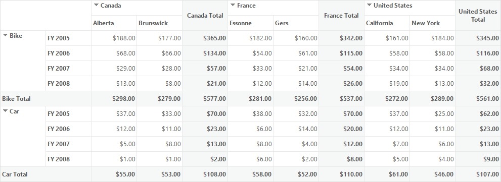
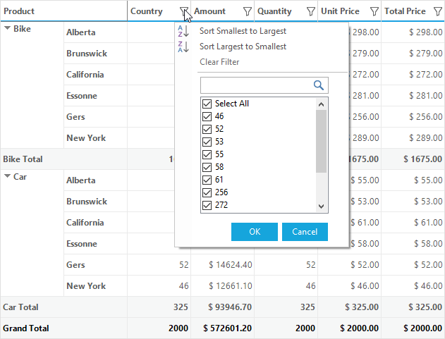
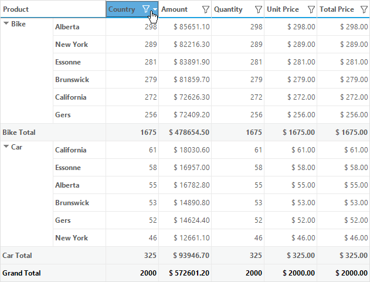
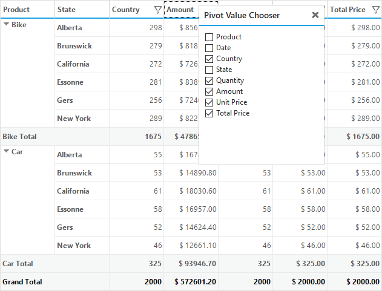

# Layouts in Windows Forms Pivot Grid

[Windows Forms Pivot Grid](https://www.syncfusion.com/winforms-ui-controls/pivot-grid) provides support for the following types of layout in order to display the values of pivot fields.

* Normal Layout
* Flat Layout

## Normal layout

Normal layout allows the pivot grid control to display both the row field values and column field values along with computational field values added to it. By default, the normal layout is displayed in pivot grid control.

### Hiding subtotals

This feature allows users to have an abstract view of the data by hiding the subtotal values of pivot grid control. The [ShowSubTotals](https://help.syncfusion.com/cr/windowsforms/Syncfusion.Windows.Forms.PivotAnalysis.PivotGridControl.html#Syncfusion_Windows_Forms_PivotAnalysis_PivotGridControl_ShowSubTotals) property of pivot grid control is used to show or hide the subtotals based on the requirement.

Refer to the below code sample to hide all the subtotals in the pivot grid.





this.pivotGridControl1.ShowSubTotals = false;





Me.pivotGridControl1.ShowSubTotals = False





### Hiding grand totals

By default, the pivot grid displays grand total values for both column values and row values. In order to customize the display of grand total in pivot grid, the [ShowGrandTotals](https://help.syncfusion.com/cr/windowsforms/Syncfusion.Windows.Forms.PivotAnalysis.PivotGridControl.html#Syncfusion_Windows_Forms_PivotAnalysis_PivotGridControl_ShowGrandTotals) property is used.

Refer to the below code sample to hide all the grand totals in the pivot grid.





this.pivotGridControl1.ShowGrandTotals = false;





Me.pivotGridControl1.ShowGrandTotals = False





## Flat layout

Flat layout also called as "row pivots only mode", allows the pivot grid control to display only the row field values along with computational field values added to it. In this layout, the pivot grid displays the computational values as column values.

### Enabling flat layout

The [RowPivotsOnly](https://help.syncfusion.com/cr/windowsforms/Syncfusion.Windows.Forms.PivotAnalysis.PivotGridControl.html#Syncfusion_Windows_Forms_PivotAnalysis_PivotGridControl_RowPivotsOnly) property of pivot grid control is used to enable or disable the feature of row pivots only mode or flat layout.

Refer to the below code sample to enable the row pivots only mode in the pivot grid.





// Adding PivotRows to the Control
pivotGridControl1.PivotRows.Add(new PivotItem { FieldMappingName = "Product", TotalHeader = "Total" });
pivotGridControl1.PivotRows.Add(new PivotItem { FieldMappingName = "State", TotalHeader = "Total" });
//pivotGridControl1.PivotRows.Add(new PivotItem { FieldMappingName = "Date", TotalHeader = "Total" });

// Adding PivotCalculations to the Control
pivotGridControl1.PivotCalculations.Add(new PivotComputationInfo { FieldName = "Country" });
pivotGridControl1.PivotCalculations.Add(new PivotComputationInfo { FieldName = "Amount", Format = "$ ##0.00", SummaryType = SummaryType.DoubleTotalSum });
pivotGridControl1.PivotCalculations.Add(new PivotComputationInfo { FieldName = "Quantity", Format = @",##0", AllowSort = true });
pivotGridControl1.PivotCalculations.Add(new PivotComputationInfo { FieldName = "UnitPrice", Format = "$ ##0.00", FieldHeader = "Unit Price" });
pivotGridControl1.PivotCalculations.Add(new PivotComputationInfo { FieldName = "TotalPrice", Format = "$ ##0.00", FieldHeader = "Total Price" });
this.pivotGridControl1.RowPivotsOnly = true;





Me.pivotGridControl1.RowPivotsOnly = True





### Interactive features

Pivot grid control provides support for the following interactive options in row pivots only mode.

#### Filtering

Filtering options are available to restrict the display of records in the pivot grid control. This feature enables users to extract a subset of records that meet certain criteria by using the [AllowRowPivotFiltering](https://help.syncfusion.com/cr/windowsforms/Syncfusion.Windows.Forms.PivotAnalysis.PivotGridControlBase.html#Syncfusion_Windows_Forms_PivotAnalysis_PivotGridControlBase_AllowFiltering) property.

Refer to the below code sample to enable filtering in row pivots only mode.





this.pivotGridControl1.TableControl.AllowRowPivotFiltering = true;





Me.pivotGridControl1.TableControl.AllowRowPivotFiltering = True





#### Sorting

To sort the calculation columns in pivot grid, the pivot grid provides sorting options in the flat layout. Sorting option can be enabled or disabled using [AllowSort](https://help.syncfusion.com/cr/windowsforms/Syncfusion.Windows.Forms.PivotAnalysis.PivotGridControl.html#Syncfusion_Windows_Forms_PivotAnalysis_PivotGridControl_AllowSorting) property of pivot grid.





this.pivotGridControl1.AllowSorting = true;





Me.pivotGridControl1.AllowSorting = True





#### Pivot value chooser

The pivot value chooser is the popup used to list all the pivot fields available in the data source while enabling the row pivots only mode. This popup enables users to add or remove pivot fields at run time by checking and unchecking its appropriate check boxes.

To enable this feature programmatically, the [ShowPivotValueChooser](https://help.syncfusion.com/cr/windowsforms/Syncfusion.Windows.Forms.PivotAnalysis.PivotGridControl.html#Syncfusion_Windows_Forms_PivotAnalysis_PivotGridControl_ShowPivotValueChooser) property of pivot grid must be set as true.





this.pivotGridControl1.ShowPivotValueChooser = true;





Me.pivotGridControl1.ShowPivotValueChooser = True





In order to view the pivot value chooser at run time, right click on any column field's header to open the context menu. Then, click on "Pivot Value Chooser" option to view the pivot fields available in the data source of pivot grid.

A demo sample is available in the following location.

&lt;Installed Drive&gt;\Users\Public\Documents\Syncfusion\Windows\\&lt;Version Number&gt;\PivotGrid.Windows\Samples\Product Showcase\RowPivotsOnly Demo
